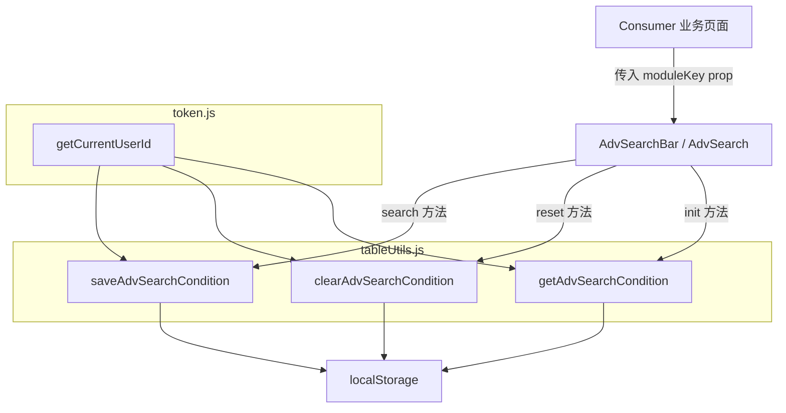

# 设计文档：高级搜索条件记忆功能

## 概述

本功能为 MeterSphere 的两个高级搜索组件（`MsTableAdvSearchBar` 和 `MsTableAdvSearch`）增加搜索条件记忆能力。采用纯前端 localStorage 方案，在用户点击"查询"时自动保存搜索条件，下次打开高级搜索时自动回填。通过 `ADV_SEARCH_{userId}_{moduleKey}` 格式的存储键实现用户隔离和模块隔离。

核心设计决策：
- 工具函数集中在 `tableUtils.js`，与现有 localStorage 工具函数风格一致
- 两个组件共享同一套序列化格式和工具函数
- `moduleKey` 作为可选 prop，未传入时完全保持原有行为
- 所有 localStorage 操作均包裹 try-catch，确保异常不影响正常功能

## 架构



### 数据流

1. **保存流程**：用户点击"查询" → `search()` 方法执行 → 调用 `saveAdvSearchCondition()` → 序列化 `optional.components` → 写入 localStorage
2. **回填流程**：组件首次 `init()` → 调用 `getAdvSearchCondition()` → 从 localStorage 读取 → 反序列化 → 匹配当前模板字段 → 回填 operator 和 value
3. **重置流程**：用户点击"重置" → `reset()` 方法执行 → 调用 `clearAdvSearchCondition()` → 删除 localStorage 记录

## 组件与接口

### 1. 工具函数（tableUtils.js）

```javascript
/**
 * 生成高级搜索条件的 localStorage 存储键
 * @param {string} userId - 用户 ID
 * @param {string} moduleKey - 模块标识符
 * @returns {string} 存储键
 */
function _buildAdvSearchStorageKey(userId, moduleKey) {
  return `ADV_SEARCH_${userId}_${moduleKey}`;
}

/**
 * 保存高级搜索条件到 localStorage
 * @param {string} userId - 用户 ID
 * @param {string} moduleKey - 模块标识符
 * @param {Array} components - 搜索组件数组（optional.components）
 */
export function saveAdvSearchCondition(userId, moduleKey, components) {
  // 序列化每个组件的 key、operator.value、value
  // try-catch 包裹，存储失败静默忽略
}

/**
 * 从 localStorage 读取高级搜索条件
 * @param {string} userId - 用户 ID
 * @param {string} moduleKey - 模块标识符
 * @returns {Array|null} 搜索条件数组，解析失败返回 null
 */
export function getAdvSearchCondition(userId, moduleKey) {
  // 读取并反序列化，JSON 解析失败返回 null
}

/**
 * 清除 localStorage 中的高级搜索条件
 * @param {string} userId - 用户 ID
 * @param {string} moduleKey - 模块标识符
 */
export function clearAdvSearchCondition(userId, moduleKey) {
  // try-catch 包裹，删除失败静默忽略
}
```

### 2. 组件改动（MsTableAdvSearchBar 和 MsTableAdvSearch）

两个组件的改动逻辑完全一致：

**新增 prop**：
```javascript
props: {
  // ... 现有 props
  moduleKey: {
    type: String,
    default: '',  // 默认为空，不启用记忆功能
  },
}
```

**search() 方法改动**：
在现有 `search()` 方法末尾、`this.visible = false` 之前，增加保存逻辑：
```javascript
// 保存搜索条件到 localStorage
if (this.moduleKey) {
  const userId = getCurrentUserId();
  if (userId) {
    saveAdvSearchCondition(userId, this.moduleKey, this.optional.components);
  }
}
```

**reset() 方法改动**：
在现有 `reset()` 方法末尾增加清除逻辑：
```javascript
// 清除 localStorage 中的搜索条件
if (this.moduleKey) {
  const userId = getCurrentUserId();
  if (userId) {
    clearAdvSearchCondition(userId, this.moduleKey);
  }
}
```

**init() 方法改动**：
在 `init()` 方法中，`slice` 截取默认显示条件之后、设置 `disable` 状态之前，增加回填逻辑：
```javascript
// 从 localStorage 回填搜索条件
if (this.moduleKey) {
  const userId = getCurrentUserId();
  if (userId) {
    const saved = getAdvSearchCondition(userId, this.moduleKey);
    if (saved) {
      this._restoreSearchConditions(saved);
    }
  }
}
```

**新增 _restoreSearchConditions() 方法**：
```javascript
_restoreSearchConditions(savedConditions) {
  // 遍历 savedConditions
  // 对每个保存的条件，在 this.optional.components 中查找匹配的 key
  // 如果找到，恢复 operator.value 和 value
  // 如果未找到（字段已不存在），跳过
}
```

## 数据模型

### SearchMemoryData（localStorage 存储格式）

```json
[
  {
    "key": "name",
    "operator": "like",
    "value": "登录测试"
  },
  {
    "key": "status",
    "operator": "in",
    "value": ["Prepare", "Pass"]
  },
  {
    "key": "custom_field_id_xxx",
    "operator": "equals",
    "value": "高"
  }
]
```

每个元素对应一个搜索项，包含：
- `key`：搜索字段标识符（与 `component.key` 对应）
- `operator`：操作符值（与 `component.operator.value` 对应）
- `value`：搜索值（与 `component.value` 对应，可以是字符串、数组等）

### StorageKey 格式

```
ADV_SEARCH_{userId}_{moduleKey}
```

示例：
- `ADV_SEARCH_user123_ISSUE_LIST` — 用户 user123 在缺陷列表的搜索条件
- `ADV_SEARCH_user456_TEST_CASE_LIST` — 用户 user456 在用例列表的搜索条件

### 序列化规则

`saveAdvSearchCondition` 从 `optional.components` 数组中提取每个组件的 `key`、`operator.value`、`value`，过滤掉空值（与 `search()` 方法中判断有效值的逻辑一致），序列化为 JSON 字符串存入 localStorage。

`getAdvSearchCondition` 从 localStorage 读取 JSON 字符串，解析为数组。解析失败返回 `null`。


## 正确性属性

*正确性属性是指在系统所有有效执行中都应成立的特征或行为——本质上是对系统应做什么的形式化陈述。属性是人类可读规范与机器可验证正确性保证之间的桥梁。*

### Property 1: 保存-读取往返一致性（Round-trip）

*For any* 有效的 userId、moduleKey 和搜索组件数组（每个组件包含 key、operator.value、value），调用 `saveAdvSearchCondition` 保存后，再调用 `getAdvSearchCondition` 读取，返回的数组中每个元素的 key、operator、value 应与原始组件数组中对应元素完全一致。

**Validates: Requirements 1.1, 1.2, 2.1, 2.2**

### Property 2: 存储隔离性

*For any* 两组不同的 (userId, moduleKey) 对，对其中一组调用 `saveAdvSearchCondition` 保存条件 A，对另一组保存条件 B，随后分别读取，每组返回的数据应与各自保存的数据一致，互不干扰。

**Validates: Requirements 3.1, 3.2**

### Property 3: 清除有效性

*For any* 有效的 userId 和 moduleKey，先调用 `saveAdvSearchCondition` 保存任意条件，再调用 `clearAdvSearchCondition`，随后调用 `getAdvSearchCondition` 应返回 `null`。

**Validates: Requirements 1.3**

### Property 4: 回填仅恢复已知字段

*For any* 已保存的搜索条件数组和当前模板组件数组，回填操作后，被恢复值的组件集合应是已保存条件 key 集合与当前模板 key 集合的交集。不在当前模板中的已保存字段应被跳过，不影响其余字段的回填。

**Validates: Requirements 2.3, 5.3**

## 错误处理

| 场景 | 处理方式 | 对应需求 |
|------|---------|---------|
| localStorage JSON 解析失败 | `getAdvSearchCondition` 捕获异常，返回 `null`，组件按默认条件展示 | 5.1 |
| localStorage 写入失败（空间已满等） | `saveAdvSearchCondition` 捕获异常，静默忽略，不影响搜索执行 | 5.2 |
| localStorage 删除失败 | `clearAdvSearchCondition` 捕获异常，静默忽略 | 5.2 |
| 已保存字段在当前模板中不存在 | `_restoreSearchConditions` 跳过该字段，继续处理其余字段 | 2.3, 5.3 |
| `getCurrentUserId()` 返回空值 | 不执行任何存储/读取操作，保持原有行为 | 3.3, 4.2 |
| `moduleKey` 为空或未传入 | 不执行任何存储/读取操作，保持原有行为 | 4.1, 4.2 |

## 测试策略

### 属性测试（Property-Based Testing）

使用 [fast-check](https://github.com/dubzzz/fast-check) 作为属性测试库，配合 Jest 运行。

每个正确性属性对应一个独立的属性测试，最少运行 100 次迭代：

- **Property 1**：生成随机 userId、moduleKey 和搜索组件数组，验证 save → get 往返一致性
  - Tag: `Feature: adv-search-memory, Property 1: 保存-读取往返一致性`
- **Property 2**：生成两组不同的 (userId, moduleKey) 对和不同的条件数据，验证存储隔离
  - Tag: `Feature: adv-search-memory, Property 2: 存储隔离性`
- **Property 3**：生成随机 userId、moduleKey 和条件数据，验证 save → clear → get 返回 null
  - Tag: `Feature: adv-search-memory, Property 3: 清除有效性`
- **Property 4**：生成随机已保存条件和模板组件（部分 key 重叠），验证回填仅恢复交集字段
  - Tag: `Feature: adv-search-memory, Property 4: 回填仅恢复已知字段`

### 单元测试

单元测试覆盖具体示例和边界情况：

- localStorage 中存储损坏的 JSON 字符串时，`getAdvSearchCondition` 返回 `null`
- localStorage 抛出异常时（mock），`saveAdvSearchCondition` 不抛出错误
- `moduleKey` 为空时，组件不调用任何存储函数
- `getCurrentUserId()` 返回 `undefined` 时，组件不调用任何存储函数
- 空组件数组的保存和读取

### 测试文件位置

```
framework/sdk-parent/frontend/src/utils/__tests__/advSearchMemory.test.js
```

### 测试配置

- 使用 Jest + fast-check
- 属性测试每个 property 至少 100 次迭代
- 使用 `localStorage` mock（jest 内置的 jsdom 环境提供）
