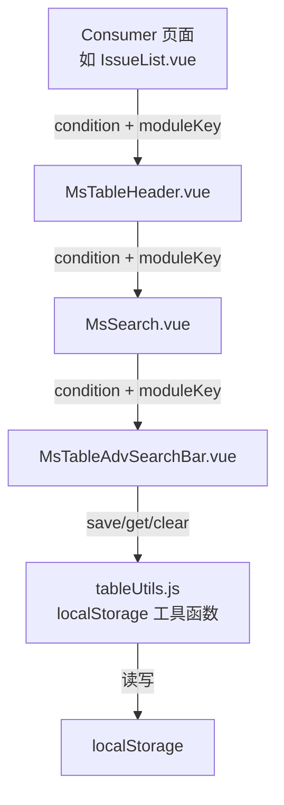
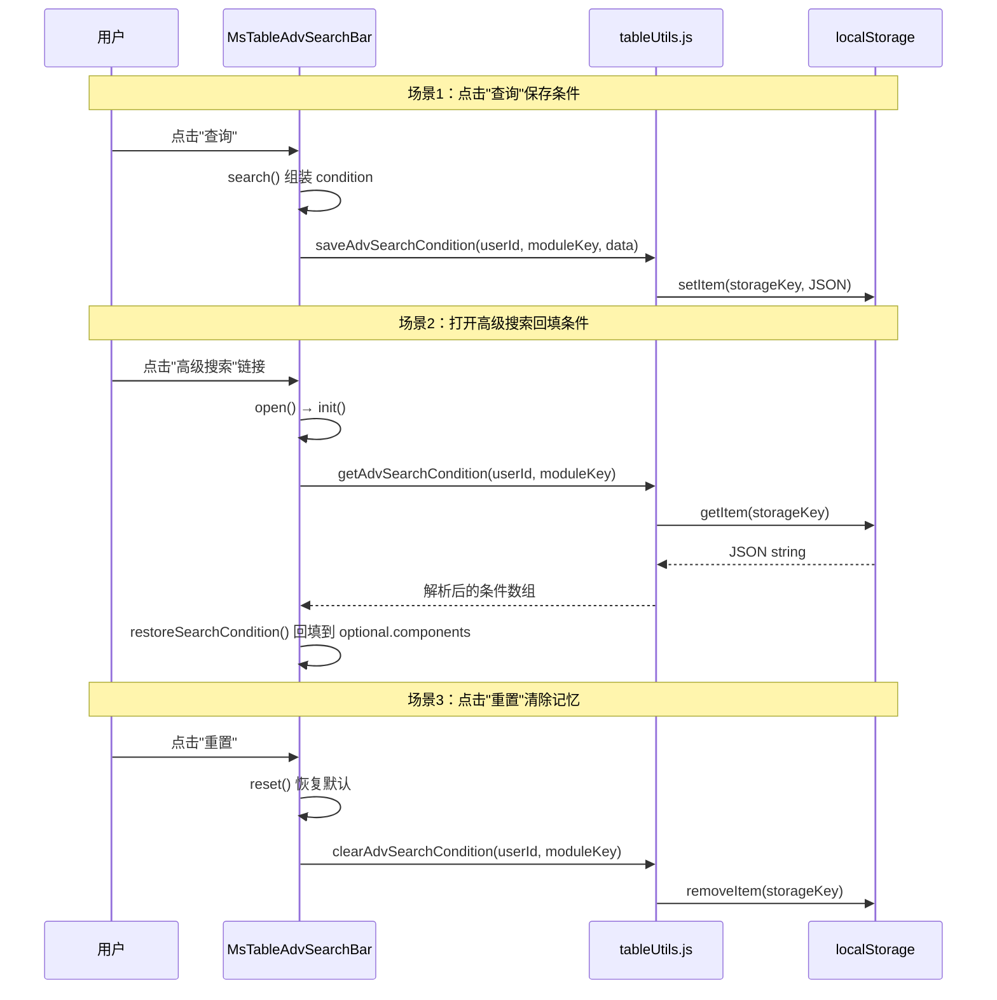

# 设计文档：高级搜索记忆功能

## 概述

本功能为 MeterSphere 高级搜索组件（`MsTableAdvSearchBar.vue`）增加搜索条件记忆能力。采用纯前端 localStorage 方案，在用户点击"查询"时自动保存搜索条件，在下次打开高级搜索时自动回填。通过 `moduleKey` 可选属性控制功能启用，确保对现有 20+ 页面完全向后兼容。

### 设计决策

1. **纯 localStorage 方案**：无需后端改动，符合二次开发"改动面小"原则，与项目现有 `saveLastTableSortField`、`saveCustomTableWidth` 等工具函数保持一致的技术路线
2. **moduleKey 可选属性**：未传入时不启用记忆功能，确保向后兼容
3. **工具函数集中在 tableUtils.js**：复用现有文件，不新增文件，降低维护成本
4. **仅存储用户输入的搜索值**：不存储组件模板定义（options、label 等），避免模板变更导致数据不一致

## 架构

### 组件调用链



### moduleKey 传递路径

`moduleKey` 从 Consumer 页面逐层透传到 `MsTableAdvSearchBar`：

```
Consumer (moduleKey="ISSUE_LIST")
  → MsTableHeader (新增 moduleKey prop)
    → MsSearch (新增 moduleKey prop)
      → MsTableAdvSearchBar (新增 moduleKey prop)
```

### 功能触发时机



## 组件与接口

### 1. tableUtils.js — 新增工具函数

```javascript
/**
 * 保存高级搜索条件到 localStorage
 * @param {string} userId - 当前用户 ID
 * @param {string} moduleKey - 模块标识符（如 "ISSUE_LIST"）
 * @param {Array} conditions - 搜索条件数组
 */
export function saveAdvSearchCondition(userId, moduleKey, conditions) { ... }

/**
 * 从 localStorage 读取高级搜索条件
 * @param {string} userId - 当前用户 ID
 * @param {string} moduleKey - 模块标识符
 * @returns {Array|null} 搜索条件数组，不存在或解析失败返回 null
 */
export function getAdvSearchCondition(userId, moduleKey) { ... }

/**
 * 清除 localStorage 中的高级搜索条件
 * @param {string} userId - 当前用户 ID
 * @param {string} moduleKey - 模块标识符
 */
export function clearAdvSearchCondition(userId, moduleKey) { ... }
```

StorageKey 格式：`ADV_SEARCH_{userId}_{moduleKey}`

### 2. MsTableAdvSearchBar.vue — 修改

新增 prop：

```javascript
props: {
  // ... 现有 props 保持不变
  moduleKey: {
    type: String,
    default: ''  // 为空时不启用记忆功能
  }
}
```

新增内部方法：

```javascript
methods: {
  /**
   * 判断是否启用搜索记忆功能
   * @returns {boolean}
   */
  isMemoryEnabled() {
    return !!this.moduleKey;
  },

  /**
   * 将当前搜索条件序列化为可存储的格式
   * @returns {Array} 搜索条件数组
   */
  serializeConditions() { ... },

  /**
   * 从存储的数据回填搜索条件到 optional.components
   * @param {Array} savedConditions - 存储的搜索条件
   */
  restoreSearchCondition(savedConditions) { ... }
}
```

修改现有方法：
- `search()`：在组装 condition 后，调用 `saveAdvSearchCondition()` 保存
- `reset()`：在重置后，调用 `clearAdvSearchCondition()` 清除
- `init()`：在初始化后，调用 `getAdvSearchCondition()` 并回填

### 3. MsSearch.vue — 修改

新增 prop 透传：

```javascript
props: {
  // ... 现有 props 保持不变
  moduleKey: {
    type: String,
    default: ''
  }
}
```

模板中透传给 `MsTableAdvSearchBar`：

```html
<ms-table-adv-search-bar
  :module-key="moduleKey"
  ...
/>
```

### 4. MsTableHeader.vue — 修改

新增 prop 透传：

```javascript
props: {
  // ... 现有 props 保持不变
  moduleKey: {
    type: String,
    default: ''
  }
}
```

模板中透传给 `MsSearch`：

```html
<ms-search
  :module-key="moduleKey"
  ...
/>
```

### 5. Consumer 页面 — 修改（以 IssueList.vue 为例）

在模板中传入 `moduleKey`：

```html
<ms-table-header
  :module-key="tableHeaderKey"
  ...
/>
```

由于 Consumer 页面已有 `tableHeaderKey` 属性（如 `"ISSUE_LIST"`），直接复用即可。

## 数据模型

### SearchMemoryData 存储结构

存储在 localStorage 中的 JSON 数据结构：

```json
{
  "version": 1,
  "items": [
    {
      "key": "name",
      "operator": "like",
      "value": "登录"
    },
    {
      "key": "createTime",
      "operator": "between",
      "value": ["2024-01-01", "2024-06-30"]
    },
    {
      "key": "custom_field_uuid_123",
      "operator": "in",
      "value": ["P0", "P1"],
      "custom": true
    }
  ]
}
```

字段说明：
- `version`：数据格式版本号，用于未来兼容性升级
- `items`：搜索条件数组
  - `key`：搜索字段标识符，对应 `component.key`
  - `operator`：运算符值，对应 `component.operator.value`
  - `value`：搜索值，对应 `component.value`（支持字符串、数组、日期范围等类型）
  - `custom`：可选，标记是否为自定义字段（`component.custom === true`）

### StorageKey 格式

```
ADV_SEARCH_{userId}_{moduleKey}
```

示例：
- `ADV_SEARCH_admin_ISSUE_LIST` — admin 用户在缺陷列表的搜索记忆
- `ADV_SEARCH_user1_TEST_CASE_LIST` — user1 在测试用例列表的搜索记忆

### 回填匹配逻辑

回填时，遍历 `savedConditions.items`，对每个 item：

1. 在当前 `condition.components` 中查找 `key` 匹配的组件定义
2. 如果找到：将该组件加入 `optional.components`，并设置其 `operator.value` 和 `value`
3. 如果未找到（字段已被删除）：跳过该 item，继续处理下一个
4. 如果存储的 items 数量超过当前可用组件数量：仅回填有效的部分


## 正确性属性

*正确性属性是一种在系统所有有效执行中都应成立的特征或行为——本质上是关于系统应该做什么的形式化陈述。属性是人类可读规范与机器可验证正确性保证之间的桥梁。*

### Property 1: 搜索条件存取往返一致性（Round-trip）

*For any* 有效的 userId、moduleKey 和搜索条件数组（包含任意数量的搜索项，每项含 key、operator、value），调用 `saveAdvSearchCondition` 保存后，再调用 `getAdvSearchCondition` 读取，应返回与原始条件等价的数据。

**Validates: Requirements 1.1, 1.2, 1.4, 2.1, 2.2**

### Property 2: 重置操作清除存储数据

*For any* 有效的 userId 和 moduleKey，先保存一组搜索条件，再调用 `clearAdvSearchCondition`，之后调用 `getAdvSearchCondition` 应返回 null。

**Validates: Requirements 1.3**

### Property 3: 不存在的字段在回填时被跳过

*For any* 存储的搜索条件集合和当前模板组件集合，当存储条件中包含模板中不存在的 key 时，回填结果应仅包含模板中存在的字段，且这些字段的 operator 和 value 与存储值一致。

**Validates: Requirements 2.3, 5.3**

### Property 4: 存储键隔离性

*For any* 两组不同的 (userId, moduleKey) 组合，对其中一组执行保存操作，不应影响另一组的存储数据。即分别保存不同条件后，各自读取应返回各自保存的条件。

**Validates: Requirements 3.1, 3.2**

### Property 5: 损坏的 JSON 数据安全降级

*For any* 非法 JSON 字符串被直接写入 localStorage 对应的 StorageKey，调用 `getAdvSearchCondition` 应返回 null 而不抛出异常。

**Validates: Requirements 5.1**

## 错误处理

| 场景 | 处理方式 | 对应需求 |
|------|---------|---------|
| localStorage 读取时 JSON 解析失败 | `getAdvSearchCondition` 捕获异常，返回 null，组件按默认条件展示 | 5.1 |
| localStorage 写入失败（空间已满等） | `saveAdvSearchCondition` 捕获异常，静默忽略，不影响搜索执行 | 5.2 |
| 存储的字段 key 在当前模板中不存在 | `restoreSearchCondition` 跳过该字段，继续回填其余字段 | 2.3, 5.3 |
| moduleKey 为空或未传入 | `isMemoryEnabled()` 返回 false，不执行任何存储/回填操作 | 3.3, 4.2 |
| userId 获取失败 | 不执行存储/回填操作，等同于 moduleKey 为空的行为 | — |
| 存储数据 version 不匹配 | 忽略该记录，返回 null，按默认条件展示 | — |

所有错误处理均采用静默降级策略：出错时回退到无记忆功能的原始行为，确保搜索功能本身不受影响。

## 测试策略

### 测试框架

- **单元测试**：Jest（项目前端已集成）
- **属性测试**：fast-check（JavaScript 属性测试库）
- 每个属性测试至少运行 100 次迭代

### 单元测试覆盖

1. **tableUtils.js 工具函数**
   - `saveAdvSearchCondition` 基本保存功能
   - `getAdvSearchCondition` 基本读取功能
   - `clearAdvSearchCondition` 基本清除功能
   - 边界情况：空条件数组、moduleKey 为空、localStorage 不可用

2. **MsTableAdvSearchBar.vue 组件逻辑**
   - `serializeConditions()` 序列化各类型搜索项（文本、日期、多选等）
   - `restoreSearchCondition()` 回填逻辑
   - `isMemoryEnabled()` 启用判断
   - 边界情况：无 moduleKey 时不触发存储、模板字段变更后的回填

### 属性测试覆盖

每个正确性属性对应一个独立的属性测试：

- **Feature: adv-search-memory, Property 1: 搜索条件存取往返一致性** — 验证 save → get 往返
- **Feature: adv-search-memory, Property 2: 重置操作清除存储数据** — 验证 save → clear → get 返回 null
- **Feature: adv-search-memory, Property 3: 不存在的字段在回填时被跳过** — 验证模板不匹配时的过滤
- **Feature: adv-search-memory, Property 4: 存储键隔离性** — 验证不同 key 互不干扰
- **Feature: adv-search-memory, Property 5: 损坏的 JSON 数据安全降级** — 验证异常 JSON 的容错

### 测试数据生成策略

使用 fast-check 的 arbitrary 生成器：
- `userId`：非空字符串（字母数字）
- `moduleKey`：非空字符串（大写字母 + 下划线，模拟 `ISSUE_LIST` 格式）
- `conditions`：数组，每项包含随机 key（字符串）、operator（从预定义列表中选取）、value（字符串或字符串数组）
- `corruptedJson`：非法 JSON 字符串（随机字符串，排除合法 JSON）
