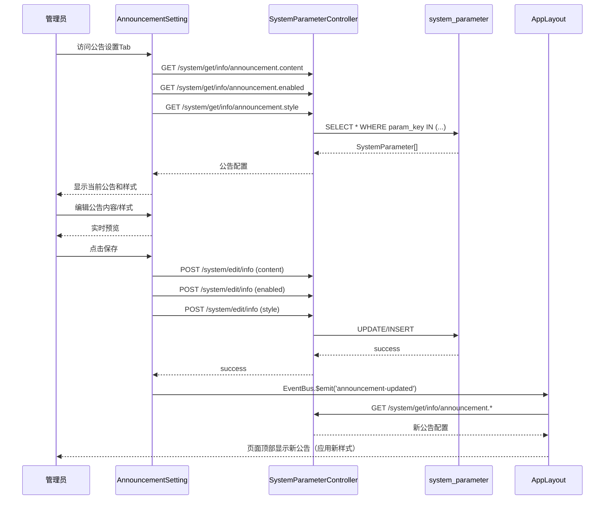

# 设计文档

## 概述

本设计实现公告栏配置功能，在 MeterSphere 系统参数设置页面添加"公告设置"Tab，允许管理员通过可视化界面配置页面顶部公告栏内容和样式。

设计遵循 MeterSphere 二次开发原则：
- **改动面小**：仅在 system-setting 模块添加新组件，不修改核心链路
- **边界清晰**：新增独立的 AnnouncementSetting.vue 组件
- **可回滚**：通过 Tab 页方式集成，易于移除

## 架构

### 整体架构

```
┌─────────────────────────────────────────────────────────────────────┐
│                        系统参数设置页面                               │
│  ┌─────────┬─────────┬─────────┬─────────┬─────────────────┐        │
│  │ 基础配置 │ 邮件设置 │ LDAP设置 │ 模块管理 │ 公告设置 (新增) │        │
│  └─────────┴─────────┴─────────┴─────────┴─────────────────┘        │
│                              │                                       │
│                              ▼                                       │
│  ┌─────────────────────────────────────────────────────────────────┐│
│  │                  AnnouncementSetting.vue                         ││
│  │  ┌─────────────────────────────────────────────────────────────┐││
│  │  │ 公告开关 (el-switch)                                        │││
│  │  └─────────────────────────────────────────────────────────────┘││
│  │  ┌─────────────────────────────────────────────────────────────┐││
│  │  │ 公告内容输入框 (el-input textarea)                          │││
│  │  └─────────────────────────────────────────────────────────────┘││
│  │  ┌─────────────────────────────────────────────────────────────┐││
│  │  │ 样式配置区域                                                │││
│  │  │  ├─ 预设样式选择 (el-radio-group)                           │││
│  │  │  │   ├─ 通知(蓝) ├─ 警告(橙) ├─ 紧急(红) ├─ 成功(绿) ├─ 自定义│││
│  │  │  └─ 自定义颜色选择器 (el-color-picker) [仅自定义模式]        │││
│  │  └─────────────────────────────────────────────────────────────┘││
│  │  ┌─────────────────────────────────────────────────────────────┐││
│  │  │ 实时预览区域 (announcement-preview)                         │││
│  │  └─────────────────────────────────────────────────────────────┘││
│  │  ┌─────────────────────────────────────────────────────────────┐││
│  │  │ 操作按钮 (编辑/保存/取消)                                   │││
│  │  └─────────────────────────────────────────────────────────────┘││
│  └─────────────────────────────────────────────────────────────────┘│
└─────────────────────────────────────────────────────────────────────┘
                              │
                              ▼
┌─────────────────────────────────────────────────────────────────────┐
│                          后端 API 层                                 │
│  GET  /system/get/info/{key}  - 获取公告配置                         │
│  POST /system/edit/info       - 保存公告配置                         │
└─────────────────────────────────────────────────────────────────────┘
                              │
                              ▼
┌─────────────────────────────────────────────────────────────────────┐
│                      数据库 system_parameter                         │
│  announcement.content  - 公告文本内容                             │
│  announcement.enabled  - 公告启用状态 (true/false)                │
│  announcement.style    - 样式配置 (JSON)                          │
└─────────────────────────────────────────────────────────────────────┘
```

### 数据流



## 组件和接口

### 预设样式定义

```javascript
// 预设样式配置
const PRESET_STYLES = {
  info: {
    name: '通知',
    backgroundColor: '#409EFF',  // Element UI primary blue
    textColor: '#FFFFFF'
  },
  warning: {
    name: '警告',
    backgroundColor: '#E6A23C',  // Element UI warning orange
    textColor: '#FFFFFF'
  },
  danger: {
    name: '紧急',
    backgroundColor: '#F56C6C',  // Element UI danger red
    textColor: '#FFFFFF'
  },
  success: {
    name: '成功',
    backgroundColor: '#67C23A',  // Element UI success green
    textColor: '#FFFFFF'
  },
  custom: {
    name: '自定义',
    backgroundColor: '#E6A23C',  // 默认同警告
    textColor: '#FFFFFF'
  }
};
```

### 前端组件

#### AnnouncementSetting.vue

更新公告配置组件，位于 `system-setting/frontend/src/business/system/setting/AnnouncementSetting.vue`

```vue
<template>
  <div v-loading="loading">
    <el-form :model="form" ref="form" :disabled="!isEditing" size="small" label-width="100px">
      <!-- 公告开关 -->
      <el-form-item :label="$t('announcement.enabled')">
        <el-switch v-model="form.enabled" />
      </el-form-item>
      
      <!-- 公告内容输入框 -->
      <el-form-item :label="$t('announcement.content')" prop="content">
        <el-input
          type="textarea"
          v-model="form.content"
          :rows="4"
          :placeholder="$t('announcement.content_placeholder')"
          maxlength="500"
          show-word-limit
        />
      </el-form-item>
      
      <!-- 样式选择 -->
      <el-form-item :label="$t('announcement.style')">
        <el-radio-group v-model="form.styleType" @change="onStyleTypeChange">
          <el-radio-button label="info">{{ $t('announcement.style_info') }}</el-radio-button>
          <el-radio-button label="warning">{{ $t('announcement.style_warning') }}</el-radio-button>
          <el-radio-button label="danger">{{ $t('announcement.style_danger') }}</el-radio-button>
          <el-radio-button label="success">{{ $t('announcement.style_success') }}</el-radio-button>
          <el-radio-button label="custom">{{ $t('announcement.style_custom') }}</el-radio-button>
        </el-radio-group>
      </el-form-item>
      
      <!-- 自定义颜色选择器（仅自定义模式显示） -->
      <el-form-item v-if="form.styleType === 'custom'" :label="$t('announcement.custom_colors')">
        <div class="color-picker-group">
          <span class="color-label">{{ $t('announcement.background_color') }}:</span>
          <el-color-picker v-model="form.backgroundColor" size="small" />
          <span class="color-label" style="margin-left: 20px;">{{ $t('announcement.text_color') }}:</span>
          <el-color-picker v-model="form.textColor" size="small" />
        </div>
      </el-form-item>
      
      <!-- 实时预览区域 -->
      <el-form-item :label="$t('announcement.preview')">
        <div 
          class="announcement-preview" 
          v-if="form.content && form.enabled"
          :style="previewStyle">
          {{ form.content }}
        </div>
        <div class="announcement-preview-empty" v-else-if="!form.enabled">
          {{ $t('announcement.disabled_hint') }}
        </div>
        <div class="announcement-preview-empty" v-else>
          {{ $t('announcement.no_content') }}
        </div>
      </el-form-item>
    </el-form>
    
    <!-- 操作按钮组 -->
    <div class="button-group">
      <el-button v-if="showEdit" @click="edit" size="small" 
                 v-permission="['SYSTEM_SETTING:READ+EDIT']">
        {{ $t('commons.edit') }}
      </el-button>
      <el-button v-if="showSave" type="success" @click="save" size="small">
        {{ $t('commons.save') }}
      </el-button>
      <el-button v-if="showCancel" type="info" @click="cancel" size="small">
        {{ $t('commons.cancel') }}
      </el-button>
    </div>
  </div>
</template>
```

**Data**:
```javascript
data() {
  return {
    form: {
      content: '',           // 公告内容
      enabled: true,         // 是否启用
      styleType: 'warning',  // 样式类型: info/warning/danger/success/custom
      backgroundColor: '#E6A23C',  // 背景色
      textColor: '#FFFFFF'   // 文字颜色
    },
    loading: false,
    isEditing: false,
    originalForm: null       // 原始表单（用于取消恢复）
  };
}
```

**Computed**:
```javascript
computed: {
  // 预览样式
  previewStyle() {
    const style = this.getStyleByType(this.form.styleType);
    return {
      backgroundColor: this.form.styleType === 'custom' 
        ? this.form.backgroundColor 
        : style.backgroundColor,
      color: this.form.styleType === 'custom' 
        ? this.form.textColor 
        : style.textColor
    };
  }
}
```

**Methods**:
- `loadAnnouncement()`: 从后端加载公告配置（内容、启用状态、样式）
- `onStyleTypeChange(type)`: 样式类型切换时更新颜色
- `getStyleByType(type)`: 根据类型获取预设样式
- `edit()`: 进入编辑模式
- `save()`: 保存公告配置到后端
- `cancel()`: 取消编辑，恢复原始配置
- `notifyAnnouncementUpdate()`: 通过 EventBus 通知页面顶部更新

#### SystemParameterSetting.vue 修改

无需修改，已集成。

### 后端接口

复用现有 API，无需新增后端代码：

| 接口 | 方法 | 路径 | 说明 |
|------|------|------|------|
| 获取公告内容 | GET | `/system/get/info/announcement.content` | 获取公告内容 |
| 获取启用状态 | GET | `/system/get/info/announcement.enabled` | 获取启用状态 |
| 获取样式配置 | GET | `/system/get/info/announcement.style` | 获取样式JSON |
| 保存参数 | POST | `/system/edit/info` | 保存任意参数 |

**样式配置 JSON 格式**:
```json
{
  "styleType": "warning",
  "backgroundColor": "#E6A23C",
  "textColor": "#FFFFFF"
}
```

### 前端 API 封装

在 `system-setting/frontend/src/api/system.js` 中更新：

```javascript
// 获取公告内容
export function getAnnouncementContent() {
  return get('/system/get/info/announcement.content');
}

// 获取公告启用状态
export function getAnnouncementEnabled() {
  return get('/system/get/info/announcement.enabled');
}

// 获取公告样式
export function getAnnouncementStyle() {
  return get('/system/get/info/announcement.style');
}

// 保存公告内容
export function saveAnnouncementContent(content) {
  return post('/system/edit/info', {
    paramKey: 'announcement.content',
    paramValue: content,
    type: 'text'
  });
}

// 保存公告启用状态
export function saveAnnouncementEnabled(enabled) {
  return post('/system/edit/info', {
    paramKey: 'announcement.enabled',
    paramValue: String(enabled),
    type: 'text'
  });
}

// 保存公告样式
export function saveAnnouncementStyle(style) {
  return post('/system/edit/info', {
    paramKey: 'announcement.style',
    paramValue: JSON.stringify(style),
    type: 'text'
  });
}
```

### AppLayout 更新

修改 `framework/sdk-parent/frontend/src/business/app-layout/index.vue`：

```vue
<template>
  <!-- 公告栏，应用动态样式 -->
  <el-row v-if="announcementContent && announcementEnabled">
    <el-col>
      <div class="announcement-tip" :style="announcementStyle">
        {{ announcementContent }}
      </div>
    </el-col>
  </el-row>
</template>

<script>
data() {
  return {
    announcementContent: '',
    announcementEnabled: true,
    announcementStyleConfig: {
      styleType: 'warning',
      backgroundColor: '#E6A23C',
      textColor: '#FFFFFF'
    }
  };
},
computed: {
  announcementStyle() {
    return {
      backgroundColor: this.announcementStyleConfig.backgroundColor,
      color: this.announcementStyleConfig.textColor
    };
  }
},
methods: {
  loadAnnouncement() {
    // 加载内容
    getSystemParameter('announcement.content').then(response => {
      if (response.data && response.data.paramValue) {
        this.announcementContent = response.data.paramValue;
      }
    });
    // 加载启用状态
    getSystemParameter('announcement.enabled').then(response => {
      if (response.data && response.data.paramValue) {
        this.announcementEnabled = response.data.paramValue === 'true';
      }
    });
    // 加载样式
    getSystemParameter('announcement.style').then(response => {
      if (response.data && response.data.paramValue) {
        try {
          this.announcementStyleConfig = JSON.parse(response.data.paramValue);
        } catch (e) {
          // 解析失败使用默认样式
        }
      }
    });
    this.updateHeaderHeight();
  }
}
</script>
```

## 数据模型

### system_parameter 表结构

复用现有表结构，无需修改：

| 字段 | 类型 | 说明 |
|------|------|------|
| param_key | VARCHAR(64) | 参数键，主键 |
| param_value | TEXT | 参数值 |
| type | VARCHAR(100) | 参数类型 |
| sort | INT | 排序 |

**公告相关参数**:

| param_key | 说明 | 示例值 |
|-----------|------|--------|
| `announcement.content` | 公告文本内容 | "系统将于今晚维护" |
| `announcement.enabled` | 公告启用状态 | "true" / "false" |
| `announcement.style` | 样式配置JSON | `{"styleType":"warning","backgroundColor":"#E6A23C","textColor":"#FFFFFF"}` |

### 状态管理

组件内部状态，无需 Vuex/Pinia：

```typescript
interface AnnouncementState {
  content: string;           // 公告内容
  enabled: boolean;          // 是否启用
  styleType: 'info' | 'warning' | 'danger' | 'success' | 'custom';  // 样式类型
  backgroundColor: string;   // 背景色（自定义模式）
  textColor: string;         // 文字颜色（自定义模式）
  isEditing: boolean;        // 是否处于编辑模式
  loading: boolean;          // 加载状态
}
```

## 国际化文本

在 `framework/sdk-parent/frontend/src/i18n/lang/` 下添加：

**zh-CN.js**:
```javascript
announcement: {
  setting: '公告设置',
  content: '公告内容',
  preview: '效果预览',
  content_placeholder: '请输入公告内容，最多500字',
  no_content: '无公告内容',
  enabled: '启用公告',
  disabled_hint: '公告已禁用',
  style: '公告样式',
  style_info: '通知',
  style_warning: '警告',
  style_danger: '紧急',
  style_success: '成功',
  style_custom: '自定义',
  custom_colors: '自定义颜色',
  background_color: '背景色',
  text_color: '文字颜色'
}
```

**en-US.js**:
```javascript
announcement: {
  setting: 'Announcement',
  content: 'Content',
  preview: 'Preview',
  content_placeholder: 'Enter announcement content, max 500 characters',
  no_content: 'No announcement',
  enabled: 'Enable',
  disabled_hint: 'Announcement is disabled',
  style: 'Style',
  style_info: 'Info',
  style_warning: 'Warning',
  style_danger: 'Danger',
  style_success: 'Success',
  style_custom: 'Custom',
  custom_colors: 'Custom Colors',
  background_color: 'Background',
  text_color: 'Text Color'
}
```

## 正确性属性

*正确性属性是系统在所有有效执行中应保持为真的特征或行为。属性作为人类可读规范与机器可验证正确性保证之间的桥梁。*

### Property 1: 公告内容保存 Round-Trip

*For any* 有效的公告内容字符串（包括空字符串），保存到后端后再读取，应返回相同的内容。

**Validates: Requirements 2.2, 2.3**

### Property 2: 预览内容同步

*For any* 输入到公告编辑框的内容，预览区域应实时显示完全相同的文本。

**Validates: Requirements 3.1**

### Property 3: 权限控制一致性

*For any* 用户权限配置，当用户不具有 `SYSTEM_SETTING:READ+EDIT` 权限时，编辑按钮和保存按钮应不可见或禁用，表单应处于只读状态。

**Validates: Requirements 1.3, 5.1, 5.2, 5.3**

### Property 4: 公告栏显示一致性

*For any* 保存成功的公告内容，页面顶部公告栏应显示与保存内容完全相同的文本；当内容为空或禁用时，公告栏应隐藏。

**Validates: Requirements 4.1, 4.2, 4.3, 4.4, 7.2, 7.3**

### Property 5: 样式配置一致性

*For any* 选择的预设样式或自定义颜色，预览区域和实际公告栏应应用完全相同的背景色和文字颜色。

**Validates: Requirements 3.4, 6.2, 6.5, 6.6**

### Property 6: 开关状态一致性

*For any* 开关状态变化，公告栏的显示/隐藏状态应与开关状态保持一致，且不影响已保存的公告内容。

**Validates: Requirements 7.1, 7.2, 7.3, 7.4**

## 错误处理

| 错误场景 | 处理方式 | 用户提示 |
|---------|---------|---------|
| 网络请求失败 | 捕获异常，保持当前状态 | 显示 `$error` 提示 |
| 后端返回错误 | 解析错误信息 | 显示具体错误原因 |
| 参数不存在 | 返回空内容/默认值 | 显示空预览或默认样式 |
| 保存超时 | 重试或提示用户 | 显示超时提示 |
| 样式JSON解析失败 | 使用默认样式 | 静默处理，不影响用户 |
| 颜色值无效 | 使用默认颜色 | 静默处理 |

## 生产环境部署问题总结

### 问题描述

在正式环境部署公告栏功能时遇到500错误，具体表现为：
- 测试环境正常运行
- 正式环境访问 `http://IP:8081/project/display/info` 接口返回500错误
- 错误日志显示Spring过滤器链中的NullPointerException

### 根本原因

**命名空间冲突**：公告配置参数使用了 `ui.announcement.*` 前缀，与系统UI显示配置的命名空间冲突。

**技术细节**：
1. `BaseDisplayService.uiInfo("ui")` 方法查询所有 `param_key LIKE 'ui.%'` 的参数
2. 公告配置 `ui.announcement.*` 被错误地包含在UI显示配置处理逻辑中
3. 公告配置被当作UI显示配置处理，触发了不适用的代码路径
4. 导致Spring过滤器链中出现NullPointerException

### 解决方案

**1. 修改参数命名空间**
```sql
-- 将公告配置参数前缀从 ui.announcement.* 改为 announcement.*
UPDATE system_parameter SET param_key = 'announcement.enabled' WHERE param_key = 'ui.announcement.enabled';
UPDATE system_parameter SET param_key = 'announcement.title' WHERE param_key = 'ui.announcement.title';
UPDATE system_parameter SET param_key = 'announcement.content' WHERE param_key = 'ui.announcement.content';
UPDATE system_parameter SET param_key = 'announcement.style' WHERE param_key = 'ui.announcement.style';
UPDATE system_parameter SET param_key = 'announcement.scroll' WHERE param_key = 'ui.announcement.scroll';
```

**2. 更新前端代码**
- 修改 `system-setting/frontend/src/api/system.js` 中所有API调用参数
- 修改 `framework/sdk-parent/frontend/src/business/app-layout/index.vue` 中的参数获取逻辑

**3. 涉及文件**
```
metersphere/system-setting/frontend/src/api/system.js
metersphere/framework/sdk-parent/frontend/src/business/app-layout/index.vue
```

### 预防措施

**1. 命名空间规范**
- `ui.*` 前缀专门用于UI显示配置（logo、loginImage等）
- 业务功能配置使用独立的命名空间
- 建议的命名空间：
  - `announcement.*` - 公告配置
  - `system.*` - 系统配置
  - `config.*` - 通用配置

**2. 开发规范**
- 新增系统参数前，先检查现有命名空间
- 避免在已有命名空间下添加不相关的配置
- 测试环境和正式环境保持数据一致性

**3. 部署检查**
- 部署前确认所有模块版本一致
- 验证数据库参数配置正确
- 进行完整的端到端测试

### 经验教训

1. **命名空间很重要**：看似无关的参数命名可能导致意外的代码执行路径
2. **测试环境一致性**：测试环境应尽可能模拟正式环境的数据状态
3. **错误日志分析**：Spring过滤器链异常往往指向更深层的业务逻辑问题
4. **二次开发边界**：在现有系统中添加功能时，要充分理解现有的命名约定和处理逻辑

## 测试策略

### 单元测试

1. **组件渲染测试**
   - 验证 AnnouncementSetting 组件正确渲染
   - 验证 Tab 页正确显示
   - 验证样式选择器正确渲染

2. **权限控制测试**
   - 模拟不同权限用户，验证按钮可见性
   - 验证表单禁用状态

3. **样式切换测试**
   - 验证预设样式切换正确应用颜色
   - 验证自定义模式显示颜色选择器
   - 验证颜色选择器值变化正确反映到预览

4. **边界情况测试**
   - 空字符串保存
   - 超长内容处理（500字符限制）
   - 特殊字符处理
   - 无效颜色值处理

### 属性测试

使用 fast-check 或类似库进行属性测试：

1. **Property 1 测试**: 生成随机字符串，验证保存-读取 round-trip
2. **Property 2 测试**: 生成随机输入，验证预览同步
3. **Property 3 测试**: 生成随机权限配置，验证 UI 状态
4. **Property 4 测试**: 生成随机公告内容，验证公告栏显示
5. **Property 5 测试**: 生成随机颜色值，验证样式应用
6. **Property 6 测试**: 生成随机开关状态，验证显示/隐藏

每个属性测试应运行至少 100 次迭代。

### 集成测试

1. 完整流程测试：加载 → 编辑 → 保存 → 验证公告栏更新
2. 样式流程测试：选择样式 → 预览 → 保存 → 验证公告栏样式
3. 开关流程测试：禁用 → 保存 → 验证隐藏 → 启用 → 验证显示
4. API 集成测试：验证前后端数据交互

