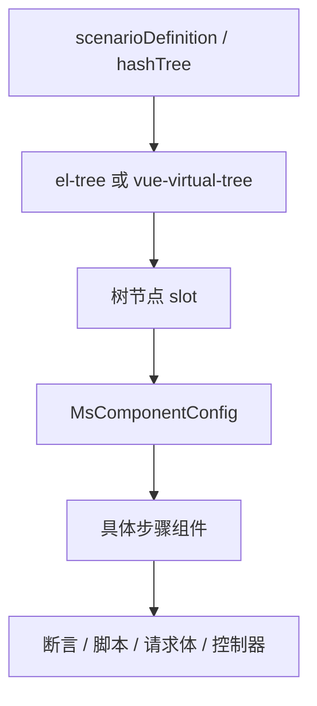
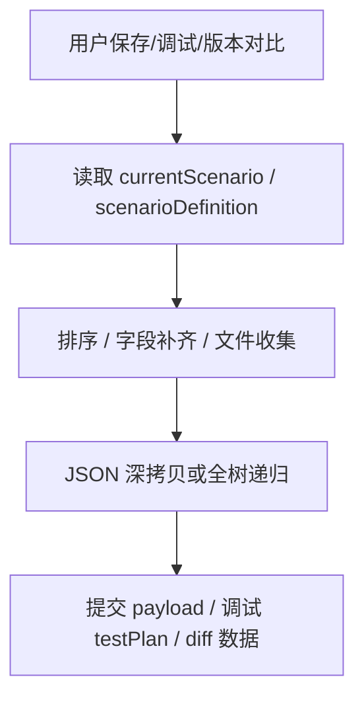

# 设计文档：接口测试前端性能优化

## 概述

本设计面向接口测试自动化大场景性能问题，优化重点从早期的“并行加载、延迟加载、防抖”扩展到“步骤树虚拟化、刷新链路收敛、深拷贝结构化、重组件按需挂载”。目标是在不重写业务模块、不引入大型依赖的前提下，逐步降低大 `scenarioDefinition` 场景下的 DOM、CPU、内存和重渲染成本。

## 设计目标

1. **降低 DOM 压力**：普通编辑器、最大化编辑器、版本对比页都应具备大场景虚拟滚动能力。
2. **减少无效重渲染**：去除全局 key 和 `push + splice` 等扩大刷新范围的做法。
3. **降低大对象处理成本**：保存、调试、版本对比按用途构造最小数据结构。
4. **控制单步组件成本**：复杂断言、脚本编辑器、请求体等重组件按需渲染。
5. **渐进式落地**：每个方向可独立提交、独立验证、独立回滚。

## 当前架构与瓶颈

### 步骤树渲染链路



瓶颈说明：

- `el-tree` 会为所有可见节点创建 DOM 和 Vue 组件。
- 左右版本对比页同时渲染两棵树，成本翻倍。
- `MsComponentConfig` 会根据步骤类型挂载重组件。
- 折叠节点、未编辑节点和不可视节点如果仍挂载重组件，会造成无效开销。

### 大对象处理链路



瓶颈说明：

- JSON 深拷贝会阻塞主线程，并产生临时内存峰值。
- 保存和调试需要的数据并不完全等于 UI 运行时对象。
- UI 临时状态字段进入 payload 会放大复制和序列化成本。

## 方案一：版本对比页步骤树虚拟化

### 现状

`ScenarioDiff.vue` 左右两侧仍使用 `el-tree` 渲染步骤树。普通编辑器和最大化编辑器已经具备大场景虚拟树能力，因此版本对比页是当前步骤树虚拟化的主要缺口。

### 设计

1. 增加 `countVisibleStepNodes(nodes, parent)`，递归统计实际可展示节点。
2. 增加 `useOldVirtualStepTree` 和 `useNewVirtualStepTree`。
3. 当任一侧可展示节点数超过 50 时，该侧切换为 `vue-virtual-tree`。
4. 小场景继续使用原 `el-tree`。
5. 抽出左右树的公共 slot 渲染逻辑，减少重复模板。

### 关键点

- 统计口径必须排除隐藏的 sampler 子节点。
- `node-key` 继续使用 `resourceId`。
- `default-expanded-keys` 继续使用 `oldExpandedNode`、`newExpandedNode`。
- `nodeExpand`、`nodeCollapse`、`nodeClick` 事件需要兼容虚拟树参数。
- diff 高亮依赖 DOM 对比，虚拟树模式下需要确认只对已渲染节点做高亮，或将高亮信息降级到数据状态。

### 风险

| 风险 | 处理 |
|------|------|
| 虚拟树只渲染可视 DOM，原 DOM diff 逻辑可能无法覆盖所有节点 | 优先保证页面可用和节点点击；diff 高亮作为专项兼容验证 |
| 左右树模板重复导致维护成本高 | 抽出公共方法或子组件 |
| 展开状态不同步 | 统一维护 expanded keys |

## 方案二：强制刷新链路重构

### 现状

存在两类强制刷新：

- `store.forceRerenderIndex = getUUID()` 通过全局 key 触发步骤头部重建。
- 向树数据临时 `push` 一个假节点再 `splice` 删除，触发树刷新。

这类逻辑能解决局部 UI 不刷新的问题，但会扩大重渲染范围，尤其在大树和虚拟树下风险更明显。

### 设计

1. 梳理刷新触发点：
   - 新增步骤。
   - 新增断言。
   - 批量处理模式切换。
   - 勾选状态刷新。
   - 节点隐藏/显示状态刷新。
2. 将刷新目标拆分为：
   - 步骤序号刷新。
   - 节点展开/折叠状态刷新。
   - 批量勾选状态刷新。
   - 选中节点样式刷新。
3. 用局部响应式字段替代全局刷新 key。
4. 用明确方法刷新树状态，替代 `push + splice`。

### 建议实现

```javascript
// 示例：用版本号表达树状态变化，而不是写假节点
data() {
  return {
    treeStateVersion: 0,
  };
},
methods: {
  markTreeStateChanged() {
    this.treeStateVersion += 1;
  },
}
```

实际落地时优先使用组件已有公开 API；只有没有 API 时再使用局部版本号。

## 方案三：保存/调试深拷贝结构化优化

### 现状

保存、调试、版本对比中仍存在对大对象的 JSON 深拷贝。虽然部分重复深拷贝已合并，但只要场景树足够大，完整序列化仍会造成主线程阻塞和内存峰值。

### 设计

1. 新增纯函数工具层，按用途构造数据：
   - `buildScenarioSavePayload(scenario, scenarioDefinition)`
   - `buildScenarioDebugPayload(scenario, selectedStep)`
   - `buildScenarioDiffPayload(oldScenario, newScenario)`
2. 明确字段分层：
   - 业务字段：保存/调试必需。
   - UI 字段：active、isBatchProcess、checkBox、临时选中状态等。
   - 运行结果字段：requestResult、debug 临时结果等。
3. 保存 payload 不携带 UI 临时字段。
4. 调试 payload 只构造运行所需的 testPlan/threadGroup/hashTree。
5. 版本 diff payload 只移除或规范化差异无关字段。

### 风险

| 风险 | 处理 |
|------|------|
| 字段遗漏导致保存或调试行为变化 | 先做字段白名单审计，再加样本回归 |
| 当前逻辑依赖原对象副作用 | 先把排序、文件收集等函数改为纯函数 |
| 历史数据字段不完整 | payload 构造时保留历史字段兜底 |

## 方案四：单步骤组件内部渲染成本优化

### 重点组件

| 类型 | 典型问题 | 优化方向 |
|------|----------|----------|
| 复杂断言 | 行增删、宽度测量、DOM 查询 | 稳定 key、组件内 ref、RAF 清理 |
| 脚本编辑器 | 编辑器实例重、初始化慢 | 折叠态不挂载，展开后异步挂载 |
| 请求体组件 | 参数表、文件列表多 | 减少深 watch，拆分行组件 |
| 控制器组件 | 嵌套步骤多 | 子步骤按展开状态挂载 |

### 设计

- `ComponentConfig.vue` 继续承担类型分发，但避免在不可见或折叠状态下挂载重组件。
- 重组件内部使用稳定 key，避免 index key 造成复用错乱。
- DOM 测量使用组件内 ref，不使用全局查询。
- 大列表优先拆成行组件，减少父组件重渲染成本。

## 方案五：按需展开与按需挂载

### 设计原则

1. 虚拟滚动解决“树节点数量”问题。
2. 按需挂载解决“单节点组件过重”问题。
3. 二者需要配合：虚拟树只渲染可视节点，可视节点内部也只挂载必要内容。

### 状态设计

| 状态 | 行为 |
|------|------|
| 折叠节点 | 只渲染标题、状态、操作入口 |
| 展开节点 | 挂载直接子节点 |
| 编辑态节点 | 挂载完整步骤组件 |
| 批量展开 | 超过阈值时分批挂载或仅展开树结构 |

### 验证重点

- 场景引用、循环、事务、If 控制器展开行为。
- 拖拽排序后展开状态是否正确。
- 批量启用/禁用是否影响未挂载子组件数据。
- 保存时未挂载组件的数据不能丢失。

## 实施顺序

| 优先级 | 方案 | 原因 |
|--------|------|------|
| P0 | 建立性能基线 | 没有基线无法证明收益 |
| P1 | `ScenarioDiff.vue` 左右树虚拟化 | 边界清晰，收益直接 |
| P2 | 强制刷新链路重构 | 影响树稳定性，需单独推进 |
| P3 | 保存/调试深拷贝结构化 | 收益明显但字段风险较高 |
| P4 | 单步骤组件成本优化 | 需要按组件逐个处理 |
| P5 | 按需展开/按需挂载 | 收益最大，改动面也最大 |

## 验证方案

### 自动验证

```bash
cd api-test/frontend
npm run lint
npm run build
```

### 性能验证

建议准备以下样本：

| 样本 | 用途 |
|------|------|
| 20 步 | 小场景兼容 |
| 50 步 | 阈值边界 |
| 100 步 | 常见大场景 |
| 200 步 | 极限压力 |

记录指标：

- 页面打开耗时。
- Chrome Performance 主线程长任务。
- DOM 节点数量。
- JS heap 峰值。
- 滚动帧率和明显卡顿点。
- 保存/调试按钮点击到请求发出耗时。

## 回滚策略

1. 每个方案单独提交。
2. 虚拟树保留小场景 `el-tree` 分支，可通过阈值快速降级。
3. 强制刷新链路改造保留旧调用点映射，便于定位回退。
4. 深拷贝结构化优化必须保留原始保存/调试样本对照。
