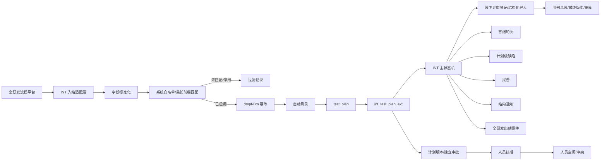

# INT 测试平台技术设计

> 本设计以同目录 `requirements.md` 为唯一业务需求基线。
> 历史 `.kiro/specs`、旧需求文档和现有代码仅用于字段、兼容性和技术实现参考；与 `requirements.md` 冲突时，以 `requirements.md` 为准。
> `requirements.md` 中仍标记为【待确认】或【待技术评估】的事项，本设计只给出可兼容的技术边界，不擅自改变业务规则。

---

## 1. 设计结论

本次继续以 MeterSphere 现有 `test_plan` 作为测试计划主对象，不再建设独立的 `test_workflow` 主流程。新版 INT 计划全部由全研发数据自动创建，并通过扩展表承载 INT 专属业务状态、需求信息、计划版本、人员排期、评审、用例版本、冒烟、通知和同步日志。

核心结论：

1. `test_plan.id` 继续作为 MeterSphere 内部稳定主键；全研发 `dmpNum` 是全局唯一的外部业务 ID，一个 `dmpNum` 永远只对应一个新版 INT 测试计划。
2. 全研发固定字段：`parentWfinstCode` = 总需求编号、`dmpNum` = 需求编号、`name1` = 需求名称。
3. 全研发不传所属系统；测试平台使用 `dmpNum` 最长前缀匹配本地已启用系统映射。
4. 只有匹配到已启用映射的数据进入 INT；未匹配或停用映射的数据只记过滤日志，不创建目录和测试计划。
5. 测试计划名称固定取最新 `name1`；负责人固定取系统映射中的测试团队负责人；创建人使用配置的系统服务账号。
6. INT 页面只展示并使用 INT 主状态；MeterSphere 原 `TestPlanStatus` 只允许作为内部兼容镜像，不能参与 INT 筛选、按钮、权限或流转判断。
7. 测试计划排期采用独立版本模型；V1、V2、V3 每个版本都必须提交并独立审批，调整版本审批过程中测试计划主状态不回退。
8. 评审后 Excel 必须结构化导入当前计划用例，并形成固定“首次评审后用例基线”；最终 Excel 必须基于稳定计划用例 ID 做差异比较和全量同步。
9. 冒烟测试不增加主状态，但需要独立轮次记录；需要冒烟时，最近一次冒烟未通过前禁止正式用例执行。
10. 缺陷继续复用现有 `issues`；办结判断读取缺陷“状态”自定义字段，只有 `closed/已关闭` 或 `cancelled/已取消` 允许办结。
11. 历史普通测试计划不迁移，不复用旧需求池的一对一计划流转逻辑。

---

## 2. 总体架构



### 2.1 后端模块建议

```text
test-track/backend/src/main/java/io/metersphere/inttest/
  controller/
    IntSystemMappingController.java
    IntInboundRecordController.java
    IntTestPlanController.java
    IntPlanVersionController.java
    IntPlanResourceController.java
    IntPlanReviewController.java
    IntPlanCaseController.java
    IntSmokeController.java
  service/
    IntSystemMappingService.java
    IntRequirementSyncService.java
    IntPlanDirectoryService.java
    IntTestPlanService.java
    IntPlanFlowService.java
    IntPlanVersionService.java
    IntPlanResourceService.java
    IntPlanReviewService.java
    IntPlanCaseService.java
    IntSmokeService.java
    IntPlanIssueService.java
    IntPlanCompletionService.java
    IntPlanNoticeService.java
    IntRequirementCallbackService.java
    IntIntegrationLogService.java
  integration/
    IntRequirementInboundGateway.java
    IntRequirementOutboundGateway.java
  job/
    IntPlanReminderJob.java
    IntIntegrationRetryJob.java
```

外部 MQ/HTTP、Topic、messageType 只存在于 `integration` 层；核心业务服务只接收内部标准字段。

---

## 3. 上游字段与内部语义

| 业务含义 | 全研发字段 | 内部字段 | 技术真值 |
|---|---|---|---|
| 总需求编号 | `parentWfinstCode` | `totalDemandNumber` | `int_test_plan_ext.total_demand_number` |
| 需求编号 | `dmpNum` | `demandNumber` | `int_test_plan_ext.demand_number` |
| 需求名称 | `name1` | `demandName` | `int_test_plan_ext.demand_name` |
| 所属系统 | 不传 | `systemMapping` | `int_system_mapping` |

固定约束：

1. `parentWfinstCode` 只能解释为总需求编号。
2. `dmpNum` 只能解释为需求编号，并作为新版 INT 的全局唯一外部业务 ID。
3. `name1` 作为需求名称，同时作为测试计划名称来源。
4. 所属系统只由 `dmpNum` 前缀映射得到。
5. `test_plan.requirement_number` 如需兼容现有页面，可镜像 `dmpNum`；不得承载 `parentWfinstCode`。
6. 核心业务代码不得直接使用 `parentWfinstCode/dmpNum/name1` 字段名，统一在入站/出站 Gateway 做转换。

### 3.1 幂等键

因为 `dmpNum` 已确认全局唯一，INT 主业务幂等键直接使用：

```text
UNIQUE(demand_number)
```

不再把 `workspace_id` 拼入业务唯一键。

同一 `dmpNum` 再次收到消息时：

- 不创建第二个测试计划；
- `name1` 等允许更新字段更新原计划；
- 规格说明书、开发计划预期完成时间、开发实际完成时间按字段补充/更新处理；
- 如果同一 `dmpNum` 携带不同 `parentWfinstCode`，视为上游归属一致性异常，记录同步失败，不自动迁移总需求目录。

---

## 4. 系统映射与接入白名单

### 4.1 `int_system_mapping`

建议字段：

| 字段 | 说明 |
|---|---|
| `id` | 主键 |
| `demand_prefix` | `dmpNum` 前缀 |
| `system_name` | 所属系统 |
| `test_group_id` | 测试组/用户组 |
| `team_leader_id` | 测试团队负责人 |
| `enabled` | 是否允许进入 INT |
| `target_project_id` | MeterSphere 技术承载项目，可空，最终关系待确认 |
| `target_workspace_id` | 技术承载工作空间，可空，最终关系待确认 |
| `system_node_id` | 一级所属系统目录节点 ID |
| `create_time/update_time` | 审计字段 |

精确相同的 `demand_prefix` 不允许重复；前缀包含关系允许存在，例如 `DR-INER` 与 `DR-INER-MT` 可以同时配置。

### 4.2 最长前缀匹配

解析步骤：

```text
取全部 enabled=true 映射
→ demandNumber.startsWith(demand_prefix)
→ 按前缀长度倒序
→ 取最长匹配项
```

例如：

```text
DR-INER-MT-001 → DR-INER-MT
CMS2.0-001     → CMS2.0
```

不得因为存在短前缀而提前匹配。

### 4.3 系统映射校验

启用映射前至少校验：

- 前缀非空；
- 所属系统非空；
- 测试组非空；
- 测试团队负责人非空且属于有效用户；
- 同一精确前缀不存在另一条启用记录。

工作空间/项目与所属系统的最终对应方式仍属于 requirements 的待确认事项，因此字段可预留，但不把当前假设写成业务唯一规则。

---

## 5. 过滤记录与人工重试

全研发会发送所有系统的数据，未匹配或映射停用的数据不进入 INT，但必须可追溯。

新增 `int_inbound_filter_record`：

| 字段 | 说明 |
|---|---|
| `id` | 主键 |
| `demand_number` | `dmpNum` |
| `total_demand_number` | `parentWfinstCode` |
| `demand_name` | `name1` |
| `matched_prefix` | 匹配到但停用时记录前缀，可空 |
| `reason` | NO_MAPPING / MAPPING_DISABLED / MAPPING_INVALID |
| `raw_payload` | 原始消息 |
| `status` | FILTERED / RETRYING / SUCCEEDED / FAILED |
| `retry_count` | 重试次数 |
| `last_error` | 最近错误 |
| `create_time/update_time` | 时间 |

人工补齐或启用映射后，可对过滤记录执行重试。重试必须重新走“最长前缀匹配 → dmpNum 幂等 → 自动目录 → 自动创建计划”完整流程，不能绕过校验直接插入计划。

---

## 6. 自动目录

业务目录：

```text
所属系统
└─ parentWfinstCode-name1
   └─ 测试计划
```

### 6.1 `int_demand_directory`

| 字段 | 说明 |
|---|---|
| `id` | 主键 |
| `system_mapping_id` | 所属系统映射 |
| `total_demand_number` | `parentWfinstCode` |
| `demand_name_snapshot` | 首次建目录时的 `name1` |
| `node_id` | 二级目录节点 ID |
| `create_time` | 创建时间 |

唯一约束：

```text
UNIQUE(system_mapping_id, total_demand_number)
```

### 6.2 目录创建规则

1. 通过 `dmpNum` 最长前缀确定系统映射。
2. 定位/创建一级所属系统目录。
3. 按 `(system_mapping_id, parentWfinstCode)` 定位二级目录绑定。
4. 不存在时使用创建时 `name1` 生成 `parentWfinstCode-name1` 目录。
5. 新测试计划使用绑定的 `node_id`。

### 6.3 目录保护

新版 INT 自动业务目录在标准页面中：

- 不提供修改名称入口；
- 不提供移动入口；
- 不提供删除入口；
- 不提供人工新增测试计划入口。

可以通过绑定表/目录扩展属性标记 `managed_type=INT_AUTO`，供前端隐藏相关操作。

如果目录被数据库脚本、旧接口等非标准方式修改或删除，本期不做自动修复、自动还原、名称兼容或数据纠错。

### 6.4 `name1` 后续变化

同一 `dmpNum` 收到新的 `name1`：

- 更新 `int_test_plan_ext.demand_name`；
- 更新 `test_plan.name`；
- 原二级目录保持创建时名称，不重命名；
- 不因名称变化创建第二个目录或第二个计划。

---

## 7. 自动创建测试计划

新版 INT 不允许人工创建测试计划。

自动创建时：

```text
test_plan.name              = name1
test_plan.requirementNumber = dmpNum（兼容镜像）
test_plan.nodeId            = 自动二级目录 nodeId
负责人                       = int_system_mapping.team_leader_id
创建人                       = 配置的系统服务账号
```

系统服务账号建议通过配置项，例如：

```text
int.test-plan.system-user-id
```

具体用户 ID 仍待业务配置确认；启动/接入前应做配置有效性检查，避免出现无法归属创建人的计划。

自动创建成功后同时插入 `int_test_plan_ext`，初始状态 `WAIT_INTERVENE`。

---

## 8. INT 计划扩展表

`int_test_plan_ext` 与 `test_plan` 一对一：

| 字段 | 说明 |
|---|---|
| `plan_id` | PK，关联 `test_plan.id` |
| `demand_number` | `dmpNum`，全局唯一 |
| `total_demand_number` | `parentWfinstCode` |
| `demand_name` | 最新 `name1` |
| `demand_type` | 需求类型 |
| `system_mapping_id` | 所属系统映射 |
| `business_zip_url` | 业务需求 ZIP |
| `spec_url` | 需求规格说明书 |
| `planned_dev_complete_time` | 开发计划预期完成时间 |
| `actual_dev_complete_time` | 开发实际完成时间 |
| `int_status` | INT 主状态 |
| `smoke_required` | 是否冒烟 |
| `current_plan_version_id` | 当前 EFFECTIVE 排期版本 |
| `actual_prep_start_time` | 实际准备开始 |
| `actual_prep_end_time` | 实际准备结束 |
| `actual_exec_start_time` | 实际执行开始 |
| `actual_exec_end_time` | 实际执行结束 |
| `revision` | 乐观锁 |
| `create_time/update_time` | 时间 |

索引：

```text
UNIQUE(demand_number)
INDEX(total_demand_number)
INDEX(system_mapping_id, int_status)
```

---

## 9. 入站字段更新与待介入自动流转

内部命令：

```text
DemandUpsertCommand
  totalDemandNumber
  demandNumber
  demandName
  demandType
  businessZipUrl
  sourceEventId
  sourceTime

SpecSyncCommand
  demandNumber
  specUrl

PlannedDevCompleteCommand
  demandNumber
  plannedDevCompleteTime

ActualDevCompleteCommand
  demandNumber
  actualDevCompleteTime
```

`DemandUpsertCommand` 先做系统白名单过滤，再按 `demandNumber=dmpNum` 幂等处理。

后续三个命令只更新同一 `dmpNum` 的既有计划，不新建第二条计划。

自动流转条件：

```text
int_status == WAIT_INTERVENE
AND spec_url != null
AND planned_dev_complete_time != null
```

满足后：

```text
WAIT_INTERVENE → PLANNING
```

并通知映射对应测试组成员。

`actual_dev_complete_time` 到达只更新字段，不自动进入测试执行。

---

## 10. INT 主状态机

```text
WAIT_INTERVENE          待介入
PLANNING                测试计划
PENDING_APPROVAL        待审批
PENDING_PREPARATION     待测试准备
PREPARATION             测试准备
PENDING_EXECUTION       待测试执行
EXECUTION               测试执行
COMPLETED               办结
```

### 10.1 V1 主链

| 当前状态 | 动作/条件 | 下一状态 |
|---|---|---|
| 待介入 | 规格书 + 开发计划预期完成时间齐全 | 测试计划 |
| 测试计划 | V1 提交审批 | 待审批 |
| 待审批 | V1 审批通过 | 待测试准备 |
| 待审批 | V1 审批驳回 | 测试计划 |
| 待测试准备 | 开始测试准备 | 测试准备 |
| 测试准备 | 评审通过且结构化导入成功 | 待测试执行 |
| 待测试执行 | 开始测试执行且开发实际完成时间存在 | 测试执行 |
| 测试执行 | 办结校验通过 | 办结 |

### 10.2 MeterSphere 原状态兼容

INT 主状态是唯一业务真值。原 `test_plan.status` 如现有报告/页面底层必须依赖，可只做兼容镜像：

```text
WAIT_INTERVENE / PLANNING / PENDING_APPROVAL /
PENDING_PREPARATION / PREPARATION / PENDING_EXECUTION
    → Prepare
EXECUTION
    → Underway
COMPLETED
    → Completed
```

但所有新版 INT：

- 列表筛选读取 `int_test_plan_ext.int_status`；
- 页面状态展示读取 `int_status`；
- `availableActions` 读取 `int_status + 权限`；
- 状态流转只走 INT API；
- 原状态下拉框和修改入口隐藏。

原状态镜像不能反向推动 INT 状态。

---

## 11. 角色、多人操作与权限

| 动作 | 允许角色/人员 |
|---|---|
| 编制、保存、提交计划 | 测试团队负责人 |
| V1/V2/V3 审批 | 测试总负责人 |
| 开始测试准备 | 当前准备阶段已分配人员或测试团队负责人 |
| 完成测试准备 | 测试团队负责人或具备 INT 准备完成权限的人员 |
| 开始测试执行 | 当前执行阶段已分配人员或测试团队负责人 |
| 正式用例执行 | 当前执行人员/具备执行权限人员，且满足冒烟门禁 |
| 办结 | 测试团队负责人或具备 INT 办结权限人员 |
| 系统映射维护 | 管理权限人员 |
| 过滤记录重试 | 管理权限人员 |

计划级“开始/完成”动作只执行一次，不要求每名参与人员分别确认；每次动作记录实际操作人和时间。

建议 INT 专用权限点：

```text
INT_PLAN_EDIT
INT_PLAN_SUBMIT
INT_PLAN_APPROVE
INT_PREPARATION_START
INT_PREPARATION_COMPLETE
INT_EXECUTION_START
INT_PLAN_COMPLETE
INT_SYSTEM_MAPPING_MANAGE
INT_INBOUND_RETRY
INT_RESOURCE_READ
INT_RESOURCE_EXPORT
```

现有缺陷权限继续复用。

---

## 12. 计划版本与独立审批

计划主状态和计划版本审批状态分离。

### 12.1 `int_plan_version`

| 字段 | 说明 |
|---|---|
| `id` | 主键 |
| `plan_id` | 稳定测试计划 |
| `version_no` | 1、2、3... |
| `version_type` | INITIAL / ADJUSTMENT |
| `version_status` | DRAFT / PENDING_APPROVAL / EFFECTIVE / REJECTED / SUPERSEDED |
| `adjustment_reason` | V2+ 必填 |
| `overall_start_date` | 最早准备开始 |
| `overall_end_date` | 最晚执行结束 |
| `creator_id` | 创建版本人员 |
| `effective_time` | 生效时间 |
| `create_time/update_time` | 时间 |

```text
UNIQUE(plan_id, version_no)
```

同一计划最多一个 `EFFECTIVE` 版本。

### 12.2 V1

```text
V1 DRAFT
→ 提交：V1 PENDING_APPROVAL，同时主状态 PLANNING → PENDING_APPROVAL
→ 通过：V1 EFFECTIVE，同时主状态 → PENDING_PREPARATION
→ 驳回：V1 REJECTED，同时主状态 → PLANNING
→ 修改：仍是 V1，回到 DRAFT
→ 再提交：V1 新审批轮次
```

### 12.3 V2/V3 调整

```text
当前 V1 EFFECTIVE
→ 创建 V2 DRAFT
→ 提交 V2 PENDING_APPROVAL
   （测试计划主状态保持当前状态）
→ 通过：V1 SUPERSEDED，V2 EFFECTIVE
→ 驳回：V1 仍 EFFECTIVE，V2 REJECTED
→ 修改 V2：V2 DRAFT，再提交新审批轮次
```

V2/V3 未审批通过前：

- 不参与正式人员占用统计；
- 不参与 09:00 提醒；
- 不对外同步计划调整；
- 当前 EFFECTIVE 版本继续生效；
- 但保存/提交草稿时仍执行冲突提示。

审批通过后才更新 `current_plan_version_id`、镜像整体计划周期并同步全研发。

### 12.4 审批记录

`int_plan_approval_record`：

| 字段 | 说明 |
|---|---|
| `id` | 主键 |
| `plan_id` | 测试计划 |
| `plan_version_id` | 计划版本 |
| `round_no` | 同一版本审批轮次 |
| `action` | SUBMIT / APPROVE / REJECT |
| `operator_id` | 提交人/审批人 |
| `comment` | 审批意见，可空；驳回意见按 requirements 规则处理 |
| `create_time` | 时间 |

每次提交、通过、驳回都新增记录，不覆盖历史。

---

## 13. 人员排期与冲突统计

`int_plan_assignment`：

| 字段 | 说明 |
|---|---|
| `id` | 主键 |
| `plan_version_id` | 计划版本 |
| `phase` | PREPARATION / EXECUTION |
| `user_id` | 人员 |
| `start_date` | 自然日开始 |
| `end_date` | 自然日结束 |
| `sort` | 页面顺序 |

日期区间为闭区间：

```text
占用天数 = end_date - start_date + 1
```

正式统计源只读取：

```text
未办结 INT 计划
+
各计划当前 EFFECTIVE 版本
+
全部 PREPARATION/EXECUTION assignment
```

保存/提交 DRAFT 时额外比较：

1. 当前草稿内部 assignment 互相重叠；
2. 当前草稿与其他计划 EFFECTIVE assignment 重叠。

冲突只提示，不阻止保存/提交。

人员汇总仍采用区间合并后计算占用天数，空闲日期 = 查询范围 - 合并后的占用日期；同一自然日并发 assignment 数 `>=2` 记冲突日。

Excel 导出建议：

```text
Sheet1 人员汇总
Sheet2 排期明细
```

---

## 14. 实际时间

| 字段 | 写入时机 |
|---|---|
| `actual_prep_start_time` | 第一次成功点击“开始测试准备” |
| `actual_prep_end_time` | 某一评审轮次“通过 + Excel 全量结构化导入成功” |
| `actual_exec_start_time` | 第一次成功点击“开始测试执行”且已有开发实际完成时间 |
| `actual_exec_end_time` | 办结全部校验和报告成功 |

重复请求不得覆盖首次真实时间。

为了兼容原 MeterSphere，可在开始测试执行时镜像 `test_plan.actual_start_time`，办结时镜像 `test_plan.actual_end_time`；准备阶段实际时间只保存在 INT 扩展表。

---

## 15. 测试准备评审轮次

INT 不复用 MeterSphere 原“用例评审”模块作为主流程入口，只在“完成测试准备”弹窗登记线下评审结果。

### 15.1 `int_plan_review_round`

| 字段 | 说明 |
|---|---|
| `id` | 主键 |
| `plan_id` | 测试计划 |
| `round_no` | 1、2、3... |
| `result` | PASS / FAIL |
| `reviewer_ids` | 评审人员关联或 JSON |
| `comment` | 评审意见 |
| `case_file_id` | 本轮 Excel，可空（不通过时允许为空） |
| `operator_id` | 操作人 |
| `create_time` | 时间 |

规则：

- 通过：评审人员必填、Excel 必填、意见可选；
- 不通过：评审人员必填、意见必填、Excel 可不传；
- 不通过只新增评审轮次，主状态保持 `PREPARATION`；
- 通过后先解析并结构化导入，只有全部成功才写实际准备结束时间并进入 `PENDING_EXECUTION`；
- 文件级或行级任意错误都视为失败，本轮记录可保留错误，但不能完成准备。

---

## 16. 用例稳定 ID、基线、最终版本与全量同步

该部分已从“可选技术评估”升级为业务必需能力，设计必须直接支持。

### 16.1 稳定计划用例 ID

为每条 INT 计划用例维护不随排序变化的 `stable_case_id`，推荐使用平台生成 UUID，并通过 Excel 导出列暴露给测试人员。

原则：

- Excel 行号、页面序号、排序不参与身份识别；
- 首次评审后 Excel 无稳定 ID 时，平台为每行生成；
- 平台结构化导入成功后提供“带计划用例 ID”的标准 Excel 导出，测试人员后续基于该文件维护；
- 最终 Excel 有 ID：必须属于当前计划且唯一；
- 最终 Excel 无 ID：按新增用例处理并生成新 ID；
- 重复 ID、其他计划 ID、未知格式 ID：整批失败，不做模糊匹配。

### 16.2 用例版本数据

建议新增：

`int_plan_case_version`

| 字段 | 说明 |
|---|---|
| `id` | 版本 ID |
| `plan_id` | 测试计划 |
| `version_type` | BASELINE / FINAL |
| `source_file_id` | 上传文件 |
| `import_round` | 上传轮次 |
| `status` | PARSING / SUCCESS / FAILED |
| `total_count` | 用例数量 |
| `create_time` | 时间 |

`int_plan_case_snapshot`

| 字段 | 说明 |
|---|---|
| `id` | 主键 |
| `version_id` | 基线/最终版本 |
| `stable_case_id` | 稳定计划用例 ID |
| `definition_json` | 标准化用例定义字段 |
| `execution_status` | 执行状态 |
| `sort_no` | 当前排序，仅展示使用 |
| `row_hash` | 定义字段规范化哈希，可用于快速比较 |

首次“评审通过 + 导入成功”的版本固定标记为 BASELINE，后续不覆盖。

每次最终 Excel 成功解析形成新的 FINAL 版本历史；最新成功 FINAL 用于全量同步。

### 16.3 Excel 字段分类与比较范围

为避免把执行结果或排序变化误算成“用例修改”，导入模板的每个结构化列在映射配置中必须标记一种类别：

```text
IDENTITY    稳定计划用例 ID
ORDER       行号/页面排序
DEFINITION  用例定义字段
EXECUTION   执行状态等执行结果字段
METADATA    导入时间、批次等系统字段
```

“修改”比较只比较全部 `DEFINITION` 字段：

```text
比较字段 = 所有映射为 DEFINITION 的结构化业务列
排除字段 = IDENTITY + ORDER + EXECUTION + METADATA
```

因此：

- 单纯调整 Excel 行顺序不算修改；
- 把“未执行”改为“通过”不单独计入用例定义修改；
- 用例定义内容变化才计入“修改”。

字段级差异至少保存/展示：字段名称、基线值、最终值。

具体 Excel 列名与现有功能用例字段的映射仍按 requirements 的技术评估项结合当前模板落地，但比较范围规则已经固定。

### 16.4 差异结果

`int_plan_case_diff`：

| 字段 | 说明 |
|---|---|
| `id` | 主键 |
| `plan_id` | 测试计划 |
| `baseline_version_id` | 固定基线 |
| `final_version_id` | 本次 FINAL |
| `stable_case_id` | 用例 ID |
| `diff_type` | ADDED / DELETED / MODIFIED |
| `field_diff_json` | 修改字段明细 |
| `create_time` | 时间 |

识别规则与 requirements 一致：

- FINAL 新 ID/空 ID 新行 → ADDED；
- BASELINE 有、FINAL 无 → DELETED；
- ID 相同且 DEFINITION 字段变化 → MODIFIED。

每次 FINAL 都重新与固定 BASELINE 比较，并保存新增/删除/修改数量。

### 16.5 全量同步到当前计划用例

FINAL 完成解析和差异后，必须在事务中全量同步当前计划用例：

- 新增：创建计划用例并绑定新 `stable_case_id`；
- 修改：按 `stable_case_id` 更新；
- 删除：按 `stable_case_id` 删除当前有效关系或逻辑失效；
- 未变化：保持原稳定 ID；
- 任一步失败：整次同步失败，不允许办结使用部分数据。

“删除采用物理删除还是逻辑失效”仍需结合现有计划用例模型评估，但无论选择哪种方式，BASELINE/FINAL 快照与 diff 历史必须永久保留，不依赖当前计划用例记录保存历史。

### 16.6 办结数据源

办结用例状态、统计和报告只读取：

```text
最新成功 FINAL
→ 已全量同步成功
→ 当前测试计划用例
```

不得直接读取附件、临时解析行或未完成同步的批次。

---

## 17. 开始测试执行与冒烟门禁

### 17.1 开始执行

```text
POST /int/test-plan/{planId}/execution/start
```

校验：

1. INT 主状态 = `PENDING_EXECUTION`；
2. `actual_dev_complete_time != null`；
3. 操作者是当前执行人员、测试团队负责人或具备权限人员。

成功后：

- 写首次 `actual_exec_start_time`；
- INT 主状态 → `EXECUTION`；
- 记录操作日志；
- 产生实际执行开始出站事件。

开发实际完成时间消息本身不自动推进状态。

### 17.2 `int_smoke_record`

| 字段 | 说明 |
|---|---|
| `id` | 主键 |
| `plan_id` | 测试计划 |
| `round_no` | 冒烟轮次 |
| `result` | PASS / FAIL |
| `executor_id` | 实际执行人 |
| `executed_at` | 执行时间 |
| `remark` | 备注 |
| `create_time` | 时间 |

冒烟缺陷继续创建/关联到当前测试计划；如需要精确回溯某轮冒烟与缺陷关系，可增加 `int_smoke_issue_rel(smoke_record_id, issue_id)`。

### 17.3 正式执行门禁

```text
if smoke_required == false:
    允许正式用例执行
else:
    仅当最新 smoke_record.result == PASS 时允许正式用例执行
```

门禁必须后端校验，不能只隐藏前端按钮。

冒烟 FAIL：

- 主状态仍为 `EXECUTION`；
- 本轮记录保留；
- 可创建/关联缺陷；
- 后续重新冒烟形成新轮次，不覆盖历史。

报告需要包含冒烟轮次、最近结论和关联缺陷。

---

## 18. 计划级缺陷

继续复用现有 `issues`，关系语义：

```text
缺陷
├─ planId       必须
└─ planCaseId   可选
```

从计划新增：只要求 `planId`；从具体计划用例新增：同时写 `planId + planCaseId`。

解除用例关系时只解除 `planCaseId` 关系，保留计划归属。

现有后端若默认要求 `addResourceIds` 非空，需要改造为：

```text
planId 必须
addResourceIds 可空
仅 addResourceIds 非空时处理用例关系和用例缺陷计数
```

---

## 19. 缺陷办结状态解析

办结不能读取 `issues.status` 旧列作为最终判断，必须读取缺陷管理页面当前“状态”自定义字段实际选项值。

允许办结值：

```text
closed     已关闭
cancelled  已取消
```

其余状态均阻塞办结。

`IntPlanIssueService` 建议提供：

```text
getPlanIssues(planId)
resolveCurrentCustomStatus(issue)
isClosable(statusValue) = statusValue in {closed, cancelled}
```

返回办结失败信息时至少包含：缺陷编号/标题、当前状态、阻塞数量。

如果项目中存在多个同名“状态”字段，实施时必须根据当前缺陷模板/字段定义 ID 精确定位，不可只按中文名称猜字段。

---

## 20. 办结与报告

```text
POST /int/test-plan/{planId}/complete
```

后端校验顺序：

1. 主状态必须为 `EXECUTION`；
2. 如果 `smoke_required=true`，最近冒烟必须 PASS；
3. 必须存在最新成功 FINAL；
4. FINAL 必须已完成差异比较和全量同步；
5. 当前计划用例只能为“通过/跳过”；
6. 当前计划全部缺陷的自定义状态必须为 `closed` 或 `cancelled`；
7. 生成/保存/分享报告成功；
8. 写 `actual_exec_end_time`；
9. INT 主状态 → `COMPLETED`；
10. 产生 INT_COMPLETED 出站事件。

报告至少从当前计划数据汇总：

- 最终用例统计；
- 基线 vs FINAL 新增/删除/修改数量；
- 计划全部缺陷及状态统计；
- 冒烟记录；
- 计划/实际时间；
- 报告链接。

如复用现有 `test_plan_report`，必须保证其数据源已是 FINAL 全量同步后的当前计划用例；否则由 `IntPlanReportDataProvider` 适配后再生成报告。

报告失败不能写办结状态和实际结束时间。

---

## 21. 通知

通知场景至少包括：

1. `WAIT_INTERVENE → PLANNING`：通知系统映射对应测试组成员；
2. V1/V2/V3 每次提交审批：通知测试总负责人；
3. 最新 EFFECTIVE 准备排期开始日 09:00：通知对应准备人员；
4. 最新 EFFECTIVE 执行排期开始日 09:00：通知对应执行人员。

调整草稿创建/保存不通知测试人员。

`int_notice_log`：

```text
UNIQUE(plan_id, plan_version_id, user_id, notice_type, notice_key)
```

用于防止任务重跑和多实例重复通知。

具体站内抽屉通知调用链仍待代码确认，业务服务通过 `IntPlanNoticeService` 适配，不直接绑定 Kafka。

---

## 22. 全研发出站与 Outbox

内部事件：

```text
PLAN_APPROVED
PLAN_ADJUSTED_APPROVED
PREPARATION_STARTED
PREPARATION_COMPLETED
EXECUTION_STARTED
INT_COMPLETED
```

只有计划版本审批通过后才发送计划/调整排期信息；草稿保存、提交审批、审批驳回不对全研发发送最新有效排期。

统一携带：

- `planId`
- `totalDemandNumber` → `parentWfinstCode`
- `demandNumber` → `dmpNum`
- `demandName` → `name1`（外部需要时）
- 最新 EFFECTIVE 排期和人员（适用时）
- 实际时间（适用时）
- 报告链接（办结时）

出站采用业务事务 + Outbox：

```text
业务事务成功
→ 写 OUT PENDING
→ 异步发送
→ SUCCESS / FAILED
→ FAILED 定时重试
```

全研发瞬时失败不回滚已经发生的真实本地操作。

---

## 23. 同步与状态审计

### 23.1 `int_integration_log`

至少记录：方向、事件类型、业务键、原始/标准化 payload、状态、错误、重试次数、时间。

入站日志应能追溯：

```text
parentWfinstCode ↔ totalDemandNumber
dmpNum           ↔ demandNumber
name1            ↔ demandName
```

### 23.2 `int_plan_status_log`

记录主状态变化：planId、from/to、action、operator、remark、time。

计划版本审批历史单独写 `int_plan_approval_record`，不要把 V2/V3 审批硬塞进主状态日志。

所有主状态操作使用乐观锁/行锁，重复点击不能重复推进状态或覆盖首次实际时间。

---

## 24. API 设计

### 24.1 系统映射/过滤

| 方法 | 路径 | 说明 |
|---|---|---|
| GET | `/int/system-mapping/list` | 映射列表 |
| POST | `/int/system-mapping/add` | 新增映射 |
| POST | `/int/system-mapping/update` | 修改映射 |
| POST | `/int/system-mapping/enable` | 启停映射 |
| POST | `/int/system-mapping/validate` | 校验精确前缀、负责人等 |
| POST | `/int/inbound/filter/list` | 查询过滤记录 |
| POST | `/int/inbound/filter/{id}/retry` | 人工重试 |

### 24.2 INT 主流程

| 方法 | 路径 | 说明 |
|---|---|---|
| GET | `/int/test-plan/{planId}` | INT 详情 + availableActions |
| POST | `/int/test-plan/{planId}/preparation/start` | 开始准备 |
| POST | `/int/test-plan/{planId}/preparation/review` | 提交一轮评审结果/Excel |
| POST | `/int/test-plan/{planId}/execution/start` | 开始执行 |
| POST | `/int/test-plan/{planId}/smoke` | 提交冒烟轮次 |
| POST | `/int/test-plan/{planId}/complete` | 办结 |
| GET | `/int/test-plan/{planId}/history` | 主状态历史 |

不提供新版 INT 人工创建计划接口。

### 24.3 计划版本

| 方法 | 路径 | 说明 |
|---|---|---|
| GET | `/int/test-plan/{planId}/versions` | 版本列表 |
| PUT | `/int/test-plan/{planId}/version/{versionId}` | 保存 DRAFT |
| POST | `/int/test-plan/{planId}/version` | 从当前有效版本创建调整 DRAFT |
| POST | `/int/test-plan/{planId}/version/{versionId}/submit` | 提交审批 |
| POST | `/int/test-plan/{planId}/version/{versionId}/approve` | 审批通过 |
| POST | `/int/test-plan/{planId}/version/{versionId}/reject` | 审批驳回 |
| GET | `/int/test-plan/{planId}/version/{versionId}/approval-history` | 审批轮次 |

V1 同样使用版本 API；V1 提交/审批时额外驱动测试计划主状态。

### 24.4 用例文件

| 方法 | 路径 | 说明 |
|---|---|---|
| POST | `/int/test-plan/{planId}/case/baseline/import` | 评审通过后结构化导入并建立基线 |
| GET | `/int/test-plan/{planId}/case/baseline/export` | 导出带稳定计划用例 ID 的 Excel |
| POST | `/int/test-plan/{planId}/case/final/import` | FINAL 解析、diff、全量同步 |
| GET | `/int/test-plan/{planId}/case/final/history` | 最终上传历史 |
| GET | `/int/test-plan/{planId}/case/diff/{finalVersionId}` | 新增/删除/修改及字段差异 |

### 24.5 人员排期

| 方法 | 路径 | 说明 |
|---|---|---|
| POST | `/int/resource/schedule/query` | 汇总 + 明细 |
| POST | `/int/resource/schedule/conflicts` | 草稿冲突校验 |
| POST | `/int/resource/schedule/export` | Excel 导出 |

---

## 25. 前端交互

### 25.1 新版 INT 列表/详情

只展示：

```text
待介入 / 测试计划 / 待审批 / 待测试准备 /
测试准备 / 待测试执行 / 测试执行 / 办结
```

不展示原 MeterSphere 状态筛选或状态修改入口。

新版 INT 目录/列表不显示“新增测试计划”。历史普通测试计划保持原页面能力。

### 25.2 计划基础信息

```text
计划名称：只读，name1
负责人：只读，系统映射.team_leader
总需求编号：只读，parentWfinstCode
需求编号：只读，dmpNum
所属系统：只读，dmpNum 前缀映射
需求规格说明书
开发计划预期完成时间
开发实际完成时间
是否需要冒烟
```

隐藏原“测试阶段”和原状态入口。

### 25.3 版本与审批

主页面显示当前 EFFECTIVE 版本；调整时单独进入 V2/V3 草稿。

审批中的调整版本应明确显示：

```text
当前有效：V1
审批中：V2
测试计划主状态：测试执行（示例）
```

避免把版本审批状态误认为测试计划主状态。

### 25.4 评审与用例

“完成测试准备”弹窗支持通过/不通过、多轮历史；通过时上传 Excel 并显示文件/行级错误。

首次基线成功后提供“导出带计划用例 ID 的 Excel”。

FINAL 上传后展示：新增数、删除数、修改数，并支持查看字段级差异。

### 25.5 冒烟

`smoke_required=true` 时，测试执行页在正式用例操作前展示冒烟区域。最近一次未通过时禁用正式执行操作，同时允许再次冒烟和关联缺陷。

---

## 26. 数据迁移与兼容

1. 只有存在 `int_test_plan_ext` 的计划才进入新版 INT。
2. 历史普通测试计划不批量转换。
3. 不迁移、复用旧需求池的一对一测试计划业务流转。
4. 现有 `test_plan.requirement_number` 仅可镜像 `dmpNum`。
5. 原 `test_plan.status` 对新版 INT 仅兼容镜像并隐藏，不作为业务判断依据。
6. 旧需求完成回调对新版 INT 隔离，由 `IntRequirementCallbackService` 统一回传。
7. 新表使用新增 migration，不修改已经上线的历史 migration。
8. 上线前必须先准备：系统映射、测试团队负责人、系统服务账号；工作空间/项目落位关系按最终确认方案配置。

---

## 27. 异常处理

| 场景 | 处理 |
|---|---|
| `dmpNum` 无已启用前缀 | 记录 FILTERED，不建目录/计划 |
| 映射停用 | 记录 FILTERED，不建目录/计划 |
| 过滤记录补齐映射 | 人工重试完整接入流程 |
| 同一 `dmpNum` 重复推送 | 幂等更新，不重复建计划 |
| 同一 `dmpNum` 变更 `name1` | 更新计划名称，不改目录 |
| 同一 `dmpNum` 变更 `parentWfinstCode` | 记录一致性异常，不自动迁移 |
| 自动目录被非标准方式修改/删除 | 不自动修复，本期不兼容 |
| V2 审批中 | V1 继续生效，主状态不回退 |
| V2 驳回 | V1 继续生效，V2 可修改重提 |
| 评审不通过 | 留评审轮次，保持测试准备 |
| 评审 Excel 行级错误 | 整批失败，不写准备结束时间 |
| FINAL 重复/跨计划稳定 ID | 整批失败，不模糊匹配 |
| FINAL 全量同步失败 | 整批失败，不允许办结 |
| 开发实际完成时间缺失 | 禁止开始测试执行 |
| 冒烟未通过 | 禁止正式用例执行，主状态仍测试执行 |
| 缺陷状态不是 closed/cancelled | 禁止办结 |
| 报告失败 | 禁止办结 |
| 全研发出站失败 | 本地动作保留，Outbox 重试 |

---

## 28. 测试设计

### 28.1 单元测试重点

1. `parentWfinstCode/dmpNum/name1` 固定字段映射。
2. `dmpNum` 全局幂等。
3. 最长前缀匹配，含前缀包含关系。
4. 映射停用/缺失过滤。
5. 过滤记录人工重试。
6. 自动目录幂等和 `name1` 更新不重命名目录。
7. 自动计划名称、负责人、系统服务账号赋值。
8. INT 主状态合法/非法流转。
9. 原 `test_plan.status` 不能反向驱动 INT。
10. V1 审批驱动主状态。
11. V2/V3 独立审批且主状态不回退。
12. 审批驳回同版本重提及审批轮次。
13. 人员自然日闭区间、占用、空闲、冲突。
14. 评审不通过保留轮次。
15. 评审通过结构化导入原子性。
16. 稳定计划用例 ID 生成、归属和重复校验。
17. BASELINE 固定不覆盖。
18. FINAL 与 BASELINE 新增/删除/修改识别。
19. ORDER/EXECUTION 字段不误算定义修改。
20. FINAL 全量同步事务。
21. 冒烟门禁和多轮记录。
22. 计划级缺陷无 planCaseId 创建。
23. 缺陷自定义状态 closed/cancelled 办结判断。
24. Outbox 重试和重复事件防护。

### 28.2 集成主链

```text
全研发消息
→ 已启用系统前缀
→ 自动目录
→ dmpNum 幂等创建计划
→ 待介入
→ 规格书 + 开发计划预期完成时间
→ 测试计划
→ V1 编制/提交/审批
→ 待测试准备
→ 开始准备
→ 评审不通过（可多轮）
→ 评审通过 + 基线结构化导入
→ 待测试执行
→ 开发实际完成校验
→ 开始执行
→ 冒烟（需要时）
→ FINAL 上传 + diff + 全量同步
→ 缺陷 closed/cancelled
→ 报告
→ 办结
→ 全研发回传
```

同时验证：

- 同一总需求多个 `dmpNum` 分批进入；
- 未启用系统被过滤后重试；
- V2 在测试准备/执行阶段提交审批，主状态不变；
- V2 通过后提醒/统计只读取 V2；
- 历史普通计划不受影响。

---

## 29. 当前仍需确认/评估

只保留 requirements 当前仍未关闭的事项。

### 29.1 业务待确认

1. 所属系统与 MeterSphere 工作空间、项目之间的最终对应关系。
2. 自动创建测试计划使用的系统服务账号具体 MeterSphere 用户 ID。

### 29.2 技术评估

1. 计划级缺陷新增接口如何支持只关联测试计划。
2. 解除用例关系时如何保留计划缺陷关系。
3. 站内抽屉通知具体复用链路及 Kafka 使用情况。
4. 系统映射与现有项目/模块字段如何落位。
5. 外部消息幂等、字段更新、过滤记录和失败重试的具体接入实现。
6. 评审后 Excel 模板与现有功能用例字段映射、稳定 ID 导出方式。
7. FINAL 删除采用物理删除还是逻辑失效。
8. 现有功能用例具体字段如何映射为 `DEFINITION/EXECUTION` 分类并展示字段差异。
9. V2/V3 独立审批与现有权限/通知组件的兼容实现。

---

## 30. 推荐实施顺序

```text
1. 新表与 INT 扩展模型
2. 系统映射 + 最长前缀 + 启停白名单
3. 过滤记录 + 人工重试
4. parentWfinstCode/dmpNum/name1 入站适配 + dmpNum 幂等
5. 自动目录 + 自动创建 test_plan（name1/负责人/系统账号）
6. INT 主状态机 + 原状态隐藏/隔离
7. V1/V2/V3 版本模型 + 独立审批历史
8. 人员排期 + 冲突统计 + Excel
9. 测试准备评审轮次 + REVIEWED 结构化导入
10. 稳定计划用例 ID + BASELINE 导出
11. FINAL 解析 + diff + 全量同步
12. 开始执行 + 开发实际完成时间校验
13. 冒烟记录 + 正式执行门禁
14. 计划级缺陷 + 自定义状态办结判断
15. 报告 + 办结
16. 站内通知 + 09:00 提醒
17. 全研发多节点出站 + Outbox 重试
18. 完整回归历史普通测试计划不受影响
```

该顺序优先把业务身份、接入白名单、自动创建和状态/版本两套状态机制稳定下来，再进入用例、缺陷和报告，避免后续因为业务主键或审批语义变化反复返工。
