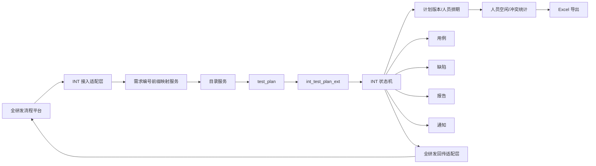
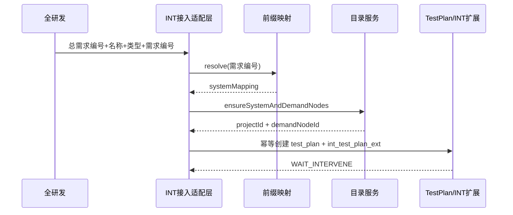

# INT 测试平台技术设计

> 本设计以同目录 `requirements.md` 为唯一业务需求基线。
> 若历史 `.kiro/specs/platform-transformation`、旧需求文档或现有代码与最新需求冲突，以 `requirements.md` 为准；历史文件和现有代码只用于字段命名、已有能力复用和兼容性判断。
> 本设计只固化当前已经能够确定的技术方案；需求中仍标记为待确认/待技术评估的内容，不在这里强行变成已确定需求。

---

## 1. 设计结论

本次不再建设一套独立的 `test_workflow`/“需求测试流程”主数据，而是直接以 MeterSphere 现有 `test_plan` 为核心业务对象，在其上增加 INT 扩展数据、状态机、排期版本、人员统计和全研发同步能力。

核心原则：

1. `test_plan` 继续承担测试计划主记录、项目归属、目录归属、已有用例/报告/权限等能力。
2. 新增一张 INT 计划扩展表，保存总需求编号、INT 状态、开发时间、实际准备时间等 MeterSphere 原计划模型没有的字段。
3. 新增计划版本和人员排期表，解决准备/执行分开排期、多人排期、调整计划历史、人员空闲统计。
4. 缺陷继续复用现有 `issues`，不新建独立缺陷表。
5. 报告继续复用现有 `test_plan_report` 和 `TestPlanReportService`。
6. 用例继续围绕现有测试计划关联用例能力扩展；评审后/最终用例双快照和稳定 ID 方案仍保留技术评估分支。
7. “所属系统”是业务目录层级，不等同于 MeterSphere `project`；技术上通过需求编号前缀映射到目标项目、系统目录和测试组。
8. 全研发不传所属系统，测试平台只根据需求编号前缀解析所属系统。
9. INT 状态机独立于 MeterSphere 原 `TestPlanStatus`，但会把少量关键状态镜像回原状态以兼容现有执行、报告和列表逻辑。
10. 所有 INT 状态流转必须走统一后端状态服务，不能继续通过原 `/test/plan/edit/status/{id}` 自由推进。

---

## 2. 与当前代码的关系

当前代码已经有大量可以直接复用的基础能力：

| 现有能力 | 当前代码依据 | 本次用途 |
|---|---|---|
| 测试计划主表/增删改查 | `TestPlanController`、`TestPlanService` | 继续作为 INT 测试计划主记录 |
| 计划目录 | `TestPlan` 已有 `nodeId`，`TestPlanService` 按 `nodeId` 查询重名计划 | 承载“所属系统 > 总需求编号-需求名称”目录 |
| 需求编号字段 | `AddTestPlanRequest#setRequirementNumber` | 继续承载“需求编号”，不用于总需求编号 |
| 计划关联缺陷查询 | `GET /issues/plan/get/{planId}` | 直接实现计划级关联缺陷列表 |
| 用例级缺陷关联 | `CaseIssueRelate.vue`、`CaseIssueEditDetail.vue` | 保留“计划 + 具体用例”关联 |
| 测试报告 | `TestPlanReportService`、`saveTestPlanReport` | 办结时生成/保存报告 |
| 通知基础能力 | `@SendNotice` | 复用站内通知能力 |
| Kafka 基础能力 | `TestPlanService` 已使用 `KafkaTemplate` | 仅作为现有基础设施参考，不直接把业务设计绑定到 Kafka |
| 全研发回传基础能力 | `RequirementCallbackMessageSender`、`RequirementCallbackMessage` | 扩展为 INT 多节点回传适配器 |

需要特别注意当前 `TestPlanService` 已经在核心计划状态变为 `Completed` 时自动回传需求完成状态，因此 INT 办结不能再无条件走这条旧回调，否则会与新 INT 出站同步重复发送。

---

## 3. 总体架构



### 3.1 后端包建议

```text
test-track/backend/src/main/java/io/metersphere/inttest/
  controller/
    IntSystemMappingController.java
    IntTestPlanController.java
    IntPlanScheduleController.java
    IntPlanResourceController.java
    IntIntegrationController.java        # 仅当外部采用 HTTP 接入时需要
  service/
    IntSystemMappingService.java
    IntPlanDirectoryService.java
    IntRequirementSyncService.java
    IntTestPlanService.java
    IntPlanFlowService.java
    IntPlanVersionService.java
    IntPlanResourceService.java
    IntPlanCaseService.java
    IntPlanIssueService.java
    IntPlanCompletionService.java
    IntPlanNoticeService.java
    IntRequirementCallbackService.java
    IntIntegrationLogService.java
  dto/
  request/
  constant/
  job/
    IntPlanReminderJob.java
  integration/
    IntRequirementInboundGateway.java
    IntRequirementOutboundGateway.java
```

外部到底是 MQ 还是 HTTP，只放在 `integration` 适配层实现，核心业务服务不直接依赖具体 Topic、messageType 或中间件。

### 3.2 前端目录建议

```text
test-track/frontend/src/business/plan/int/
  components/
    IntPlanStatusTag.vue
    IntPlanScheduleEditor.vue
    IntPlanApprovalPanel.vue
    IntPlanFlowActions.vue
    IntPlanIssueList.vue
    IntPlanCaseUpload.vue
  resource/
    IntPersonnelSchedule.vue
    IntPersonnelScheduleDetail.vue
  settings/
    IntSystemMapping.vue

test-track/frontend/src/api/int-test-plan.js
```

INT 计划仍进入现有测试计划页面，不再单独建设旧 spec 中的“需求测试流程”主页面。

---

## 4. 关键字段语义与兼容映射

### 4.1 总需求编号和需求编号

必须严格区分：

| 业务字段 | 含义 | 技术落点 |
|---|---|---|
| 总需求编号 | 原始需求的上层编号，可跨多个系统 | `int_test_plan_ext.total_demand_number` |
| 需求编号 | 具体系统需求编号，前缀可识别所属系统 | 优先复用 `test_plan.requirement_number` |
| 需求名称 | 原始需求名称 | `int_test_plan_ext.demand_name` |
| 所属系统 | 由需求编号前缀解析得到 | `int_system_mapping`，并在扩展表保存 mapping ID |

现有 `RequirementCallbackMessage.dmpNum` 与 `TestPlan.requirementNumber` 已形成单编号回传关系。新设计中继续把该单编号解释为“需求编号”，不得把“总需求编号”塞进 `requirementNumber/dmpNum` 里。

如果后续全研发回传契约要求同时返回总需求编号，再给新 DTO 单独增加 `totalDemandNumber`，不复用 `dmpNum`。

### 4.2 MeterSphere 原字段兼容

| MeterSphere 字段 | INT 使用方式 |
|---|---|
| `test_plan.id` | INT 测试计划唯一 ID |
| `project_id` | 技术承载项目，由前缀映射配置决定；不是“所属系统”本身 |
| `node_id` | 指向“总需求编号-需求名称”二级目录 |
| `name` | 自动创建后只读；具体生成规则参考相关字段文件统一实现 |
| `requirement_number` | 需求编号 |
| `stage` | INT 页面隐藏，不作为 INT 状态 |
| `status` | 只作为原 MeterSphere 粗粒度兼容状态 |
| `planned_start_time` | 镜像当前有效计划的最早测试准备开始时间 |
| `planned_end_time` | 镜像当前有效计划的最晚测试执行结束时间 |
| `actual_start_time` | 镜像实际测试执行开始时间 |
| `actual_end_time` | 镜像实际测试执行结束时间 |

详细排期、准备实际时间、INT 状态均以新增 INT 表为准，不能再把这些字段全部塞回 `test_plan`。

---

## 5. 系统映射与目录设计

### 5.1 映射模型

新增 `int_system_mapping`：

| 字段 | 说明 |
|---|---|
| `id` | 主键 |
| `workspace_id` | 工作空间 |
| `project_id` | INT 计划实际落地的 MeterSphere 项目 |
| `demand_prefix` | 需求编号固定前缀 |
| `system_code` | 可选，系统内部编码 |
| `system_name` | 所属系统展示名称 |
| `test_group_id` | 对应测试用户组 |
| `system_node_id` | 已创建的一级“所属系统”目录 ID |
| `enabled` | 是否启用 |
| `create_time/update_time` | 审计字段 |

唯一约束建议：

```text
(workspace_id, demand_prefix) UNIQUE
```

同一工作空间内不得配置两个会造成歧义的启用前缀。

前缀解析采用“明确配置 + 最长前缀匹配”，并在保存配置时校验歧义。例如已经配置 `CMS-` 时，不允许再配置一个会导致同一需求编号同时匹配的前缀，除非能由更长前缀稳定区分。

### 5.2 所属系统与 Project 的关系

“所属系统”保持业务概念，`project_id` 只是技术容器：

```text
需求编号
  ↓ 前缀映射
int_system_mapping
  ├─ system_name      = 所属系统
  ├─ project_id       = MeterSphere 技术承载项目
  ├─ system_node_id   = 一级目录
  └─ test_group_id    = 测试组
```

因此不再讨论“所属系统是不是 Project”。两者不是同一语义。

### 5.3 总需求目录绑定

新增 `int_demand_directory`，避免通过目录名称反查：

| 字段 | 说明 |
|---|---|
| `id` | 主键 |
| `system_mapping_id` | 所属系统映射 |
| `total_demand_number` | 总需求编号 |
| `demand_name` | 创建时需求名称快照 |
| `node_id` | “总需求编号-需求名称”二级目录 ID |
| `create_time/update_time` | 审计字段 |

唯一约束：

```text
(system_mapping_id, total_demand_number) UNIQUE
```

目录创建逻辑：

1. 根据需求编号前缀获取 `int_system_mapping`。
2. 如果 `system_node_id` 为空或原节点已删除，则创建一级“所属系统”目录并回写 ID。
3. 根据 `(system_mapping_id, total_demand_number)` 查找二级目录绑定。
4. 不存在则创建 `总需求编号-需求名称` 目录并保存 `node_id`。
5. 创建测试计划时直接使用二级目录 `node_id`。

因为业务允许人工修改目录名称、移动目录，所以后续定位必须以 `node_id`/绑定关系为准，不能重新根据目录名匹配。

人工改名/移动不改变业务上的“所属系统”判断，统计和同步仍以 `int_system_mapping` 为准。

---

## 6. INT 测试计划扩展模型

新增 `int_test_plan_ext`，与 `test_plan` 一对一：

| 字段 | 说明 |
|---|---|
| `plan_id` | PK，关联 `test_plan.id` |
| `total_demand_number` | 总需求编号 |
| `demand_name` | 需求名称 |
| `demand_type` | 原始业务需求/系统优化等 |
| `system_mapping_id` | 前缀映射结果 |
| `business_zip_url` | 业务需求 ZIP 链接 |
| `spec_url` | 需求规格说明书链接 |
| `planned_dev_complete_time` | 开发计划预期完成时间 |
| `actual_dev_complete_time` | 开发实际完成时间 |
| `int_status` | INT 状态 |
| `smoke_required` | 是否需要冒烟 |
| `current_plan_version_id` | 当前有效计划版本 |
| `actual_prep_start_time` | 实际测试准备开始时间 |
| `actual_prep_end_time` | 实际测试准备结束时间 |
| `actual_exec_start_time` | 实际测试执行开始时间 |
| `actual_exec_end_time` | 实际测试执行结束时间 |
| `revision` | 乐观锁版本号 |
| `create_time/update_time` | 审计字段 |

需求编号继续保存在 `test_plan.requirement_number`，避免一份数据维护两套主值。

建议建立需求编号唯一索引。如果后续确认需求编号并非全局唯一，则调整为 `(total_demand_number, requirement_number)` 组合唯一；业务服务不要依赖数据库主键以外的物理实现细节。

---

## 7. INT 状态机设计

### 7.1 INT 状态枚举

```text
WAIT_INTERVENE          待介入
PLANNING                测试计划
PENDING_APPROVAL        待审批
PENDING_PREPARATION     待测试准备
PREPARATION             测试准备
PENDING_EXECUTION       待测试执行
EXECUTION               测试执行
COMPLETED               办结
```

### 7.2 状态流转表

| 当前状态 | 动作/条件 | 下一状态 | 后端前置校验 | 副作用 |
|---|---|---|---|---|
| 待介入 | 规格说明书 + 开发计划预期完成时间均存在 | 测试计划 | 两字段均非空 | 通知对应测试组 |
| 测试计划 | 提交测试计划 | 待审批 | 必填项完整、存在准备/执行排期 | 记录提交操作 |
| 待审批 | 审批通过 | 待测试准备 | 当前版本合法 | 初始版本生效、同步全研发 |
| 待审批 | 审批驳回 | 测试计划 | 无 | 记录审批意见 |
| 待测试准备 | 开始测试准备 | 测试准备 | 状态合法 | 写实际准备开始时间、同步全研发 |
| 测试准备 | 完成测试准备 | 待测试执行 | 评审结果、评审人员、评审后用例文件齐全 | 写实际准备结束时间、同步全研发 |
| 待测试执行 | 开始测试执行 | 测试执行 | 开发实际完成时间存在 | 写实际执行开始时间、原计划状态镜像为 Underway、同步全研发 |
| 测试执行 | 办结 | 办结 | 最终用例合法、缺陷全关闭、报告生成成功 | 写实际执行结束、原计划 Completed、同步全研发 |

状态机使用代码显式表驱动，不引入 BPM/工作流引擎。

### 7.3 与 MeterSphere 原状态的映射

INT 状态是业务真值，原 `test_plan.status` 仅做兼容：

```text
WAIT_INTERVENE
PLANNING
PENDING_APPROVAL
PENDING_PREPARATION
PREPARATION
PENDING_EXECUTION
    → TestPlanStatus.Prepare

EXECUTION
    → TestPlanStatus.Underway

COMPLETED
    → TestPlanStatus.Completed
```

这样可以让现有执行、报告和列表逻辑继续工作，同时避免 MeterSphere 原三四个状态承担完整 INT 状态机。

### 7.4 禁止绕过状态机

对于存在 `int_test_plan_ext` 的计划：

1. 原 `/test/plan/edit/status/{id}` 不允许改变 INT 计划业务状态。
2. 原通用编辑接口不得修改 INT 保护字段：`status`、`stage`、`requirementNumber`、INT 派生时间等。
3. 前端 INT 计划只展示 INT 合法操作按钮。
4. 状态校验必须在后端执行，不能只靠按钮隐藏。

---

## 8. 计划版本和人员排期

### 8.1 版本表

新增 `int_plan_version`：

| 字段 | 说明 |
|---|---|
| `id` | 主键 |
| `plan_id` | 测试计划 |
| `version_no` | 1、2、3... |
| `version_type` | INITIAL / ADJUSTMENT |
| `version_status` | DRAFT / EFFECTIVE / SUPERSEDED |
| `adjustment_reason` | 调整原因，初始版本为空 |
| `overall_start_date` | 最早准备开始日期 |
| `overall_end_date` | 最晚执行结束日期 |
| `creator` | 创建人 |
| `effective_time` | 生效时间 |
| `create_time/update_time` | 审计字段 |

唯一约束：

```text
(plan_id, version_no) UNIQUE
```

同一个计划最多只有一个 `EFFECTIVE` 版本。

### 8.2 人员排期表

新增 `int_plan_assignment`：

| 字段 | 说明 |
|---|---|
| `id` | 主键 |
| `plan_version_id` | 计划版本 |
| `phase` | PREPARATION / EXECUTION |
| `user_id` | 执行人 |
| `start_date` | 自然日期开始 |
| `end_date` | 自然日期结束 |
| `sort` | 页面行顺序 |

排期使用“日期”语义，不使用小时级时间。物理字段类型优先用数据库 `DATE`；若项目数据库规范统一要求 BIGINT，则服务层必须统一归一化到自然日，避免时区导致天数偏差。

建议索引：

```text
(plan_version_id, phase)
(user_id, start_date, end_date)
```

### 8.3 初始计划版本

1. 第一次进入“测试计划”后创建 `version_no=1, type=INITIAL, status=DRAFT`。
2. 用户保存计划只修改该 DRAFT。
3. 提交进入待审批时仍保持 DRAFT。
4. 审批通过后 V1 变为 EFFECTIVE，并写入 `current_plan_version_id`。
5. 审批驳回不创建新版本，继续编辑 V1 草稿。

### 8.4 调整计划

审批通过后发生计划调整：

1. 复制当前 EFFECTIVE 版本形成 `N+1` DRAFT。
2. 修改人员、日期并填写调整原因。
3. 用户确认调整后，旧版本变为 SUPERSEDED，新版本变为 EFFECTIVE。
4. 更新 `current_plan_version_id`。
5. 重新计算整体开始/结束时间，并镜像到 `test_plan.planned_start_time/planned_end_time`。
6. 向全研发同步最新计划、人员、调整原因。
7. 不立即发送测试人员通知。
8. 后续 09:00 提醒、冲突统计全部读取最新 EFFECTIVE 版本。

当前需求没有要求“调整计划重新审批”，因此设计中不增加第二次审批流程；如果后续业务补充该要求，只需要在版本生效点前增加审批状态，不需要推翻版本模型。

---

## 9. 人员空闲、占用和冲突统计

### 9.1 数据范围

统计源只读取：

```text
INT 未办结计划
+
当前 EFFECTIVE 计划版本
+
PREPARATION/EXECUTION 全部 assignment
```

当前正在编辑的计划在冲突校验时从查询结果中排除自身旧版本。

### 9.2 区间算法

对于某个人员，在查询范围 `[QStart, QEnd]` 内：

1. 查询所有与范围相交的 assignment：
   `start_date <= QEnd AND end_date >= QStart`。
2. 将日期裁剪到查询范围。
3. 按开始日期排序并合并重叠/连续区间，得到“已占用区间”。
4. 查询范围减去已占用区间，得到“空闲区间”。
5. 使用日期边界扫描统计同一天的并发 assignment 数，`>=2` 的日期计入冲突日期。

不能通过“每条计划天数相加”得到占用天数。

### 9.3 冲突保存规则

保存/提交计划前后端均可调用同一个冲突查询服务。

返回：

```json
{
  "hasConflict": true,
  "conflicts": [
    {
      "userId": "...",
      "planId": "...",
      "phase": "EXECUTION",
      "overlapStart": "2026-09-10",
      "overlapEnd": "2026-09-12"
    }
  ]
}
```

存在冲突只返回警告，不阻塞保存。

### 9.4 Excel 导出

后端使用项目已有 EasyExcel 能力生成两个 Sheet：

```text
Sheet1：人员汇总
Sheet2：排期明细
```

汇总 Sheet：人员、统计起止日期、占用天数、空闲天数、冲突天数、已排计划数。

明细 Sheet：人员、所属系统、总需求编号、需求编号、测试计划、阶段、计划开始日期、计划结束日期、是否冲突、冲突区间。

---

## 10. 审批记录

新增 `int_plan_approval_record`：

| 字段 | 说明 |
|---|---|
| `id` | 主键 |
| `plan_id` | 测试计划 |
| `plan_version_id` | 被审批的初始计划版本 |
| `decision` | APPROVED / REJECTED |
| `comment` | 审批意见，可空 |
| `approver_id` | 审批人 |
| `create_time` | 审批时间 |

审批是测试平台行为，不同步全研发内部审核信息。

权限上继续复用 MeterSphere 项目权限体系；审批动作需要一个可以和普通计划编辑区分的权限/角色约束。若现有项目角色能够满足，则不额外造角色；若无法区分测试团队负责人和测试总负责人，再新增独立 INT 审批权限点。

---

## 11. 实际时间设计

时间来源必须区分计划日期和真实操作时间：

| 字段 | 写入时机 |
|---|---|
| `actual_prep_start_time` | 点击“开始测试准备” |
| `actual_prep_end_time` | 点击“完成测试准备”且数据校验通过 |
| `actual_exec_start_time` | 点击“开始测试执行”且开发实际完成时间存在 |
| `actual_exec_end_time` | 办结校验、报告生成均成功后 |

上述实际时间写入 `int_test_plan_ext`。

为了兼容原 MeterSphere：

- 开始测试执行时同步 `test_plan.actual_start_time`。
- 办结时同步 `test_plan.actual_end_time`。
- 准备阶段时间不写入原 `actual_start_time/actual_end_time`。

---

## 12. 用例文件与计划用例

### 12.1 文件记录

新增 `int_plan_case_file`：

| 字段 | 说明 |
|---|---|
| `id` | 主键 |
| `plan_id` | 测试计划 |
| `file_type` | REVIEWED / FINAL |
| `file_meta_id` | 复用现有附件/文件元数据 ID |
| `upload_user` | 上传人 |
| `upload_time` | 上传时间 |
| `import_status` | PENDING / SUCCESS / FAILED |
| `import_message` | 导入结果说明 |

不另存文件二进制，继续复用 AttachmentService/文件元数据能力。

### 12.2 完成测试准备

“完成测试准备”事务至少处理：

1. 校验评审结果。
2. 校验评审人员。
3. 上传并保存 REVIEWED 文件。
4. 调用 `IntPlanCaseService` 将文件导入/关联到计划用例上下文。
5. 导入成功后记录实际准备结束时间。
6. 状态进入待测试执行。

评审人员可先按 JSON/关联表方式保存，具体展示字段参考相关字段文件；不硬编码人员姓名。

### 12.3 最终用例

办结前 FINAL 文件必须导入成功，并把最终执行状态落到平台可查询的数据中，办结校验不能只相信 Excel 文本。

办结最终从计划用例数据查询是否仍存在：

```text
未执行
不通过
阻塞
```

### 12.4 稳定 ID/双快照技术分支

该部分仍是 requirements 中明确的待技术评估，不在本设计强行落地。

推荐优先评估现有计划关联用例内部 ID：当前计划用例页面已经存在 `planCaseId`/关系记录 ID，并且用例级缺陷也是通过该 ID 关联；如果它在导出、导入和最终文件生命周期中能够稳定保留，可作为最小改造基础。

候选方案顺序：

1. 复用现有计划用例关系 ID，并在 Excel 中暴露稳定“计划用例 ID”。
2. 若内部 ID 不适合作为业务导入键，则增加独立 `plan_case_no`。
3. 不使用 Excel 行号、页面序号和可变化排序作为身份。

只有稳定标识方案确认后，才设计 REVIEWED/FINAL 自动差异比对。

---

## 13. 计划级缺陷设计

### 13.1 不新建缺陷表

继续使用现有 `issues` 数据。

当前已经存在：

```text
GET /issues/plan/get/{planId}
```

因此测试计划“关联缺陷”页直接按 `planId` 查询全部计划缺陷。

### 13.2 关联规则

```text
缺陷
├─ planId       必须
└─ planCaseId   可选
```

从计划级“关联缺陷”新增：

- `resourceId = planId`
- `planCaseId` 可空
- 不强制生成用例关系

从具体计划用例新增：

- `resourceId = planId`
- `addResourceIds = [planCaseId]`
- 保持现有行为

### 13.3 现有代码改造点

`CaseIssueEditDetail.vue` 当前在计划用例入口会同时写 `resourceId=planId` 和 `addResourceIds=[planCaseId]`，可直接保留。

`IssuesService.addIssues()` 当前在 `isPlanEdit` 时会遍历 `addResourceIds` 更新用例缺陷计数，因此要改为：

```text
planId 必须存在
addResourceIds 允许为空
仅当 addResourceIds 非空时处理用例关联和用例缺陷计数
```

解除具体用例关联时，只删除“缺陷-计划用例”关系，不修改缺陷的计划 `resourceId`。

### 13.4 前端

在 `TestPlanView.vue` 现有：

```text
功能用例 / 接口用例 / UI / 性能 / 报告
```

增加：

```text
关联缺陷
```

新增 `IntPlanIssueList` 复用缺陷列表、缺陷编辑抽屉和现有 `getIssuesByPlanId(planId)`。

---

## 14. 开发实际完成时间与开始执行

全研发同步“开发实际完成时间”时，只更新扩展字段，不自动推进测试状态。

开始测试执行接口：

```text
POST /int/test-plan/{planId}/execution/start
```

后端流程：

1. 锁定 INT 计划扩展记录。
2. 校验当前状态为 `PENDING_EXECUTION`。
3. 校验 `actual_dev_complete_time != null`。
4. 不满足时返回业务错误：`开发实际完成时间未提供，不能流转`。
5. 满足时写 `actual_exec_start_time`。
6. INT 状态改为 `EXECUTION`。
7. 镜像原 `test_plan.status = Underway`、`actual_start_time`。
8. 提交全研发“实际执行开始”出站事件。

---

## 15. 冒烟测试

当前只固化一个字段：

```text
smoke_required: boolean
```

其作用是控制“正式用例执行前需要经过冒烟前置动作”的 UI 和校验入口，但不增加主状态。

因为需求尚未确认冒烟结论、人员、时间、备注、关联缺陷等字段，本设计暂不新增 `int_smoke_record` 表。

后续字段确认后可以在执行阶段增加独立记录表，不影响状态机主链。

---

## 16. 办结设计

办结统一走：

```text
POST /int/test-plan/{planId}/complete
```

### 16.1 后端校验顺序

1. INT 状态必须为 `EXECUTION`。
2. FINAL 用例文件必须上传并成功导入。
3. 查询当前计划全部最终用例，不能存在未执行/不通过/阻塞。
4. 通过 `IssuesService.getIssuesByPlanId(planId)` 查询计划全部缺陷。
5. 所有缺陷 canonical status 必须是 `closed`；只关联计划、没有关联用例的缺陷也必须计入。
6. 生成/保存测试计划报告。
7. 获取可回传的报告链接。
8. 写实际执行结束时间。
9. INT 状态改为 `COMPLETED`。
10. 镜像 `test_plan.status=Completed` 和 `actual_end_time`。
11. 写入全研发办结出站事件。

报告生成失败时不能把状态改为办结。

### 16.2 避免旧回调重复发送

当前 `TestPlanService.editTestPlan()` 在原计划状态切到 `Completed` 时会调用 `sendRequirementCompletedCallback()`。

对 INT 受管计划需要增加保护：

```text
if (isIntManagedPlan(planId)) {
    legacy callback 不发送；
    由 IntRequirementCallbackService 统一发送 INT 办结事件；
}
```

普通 MeterSphere 测试计划保持旧行为不变。

---

## 17. 通知设计

### 17.1 即时通知

`待介入 → 测试计划` 自动流转后：

1. 通过 `system_mapping_id` 获取 `test_group_id`。
2. 获取用户组成员。
3. 调用 `IntPlanNoticeService`。
4. `IntPlanNoticeService` 适配项目现有 `@SendNotice`/站内通知实现。

不在业务服务中直接写 Kafka Topic。

### 17.2 09:00 排期提醒

新增 `IntPlanReminderJob`，每天 09:00 执行。

准备提醒：

```text
INT 状态 = PENDING_PREPARATION
当前有效版本 PREPARATION assignment.start_date = today
```

执行提醒：

```text
INT 状态 = PENDING_EXECUTION
当前有效版本 EXECUTION assignment.start_date = today
```

即使开发实际完成时间尚未提供，也仍按计划执行日期发送执行提醒。

### 17.3 防重复

新增轻量 `int_notice_log`：

```text
(plan_id, plan_version_id, user_id, notice_type, notice_date) UNIQUE
```

多实例或任务重试时依赖唯一约束防止重复提醒。

现有右上角抽屉通知最终对应哪个具体 notice 实现仍需代码确认，但不会影响状态/排期设计。

---

## 18. 全研发接入与回传

### 18.1 入站统一命令

无论外部实际使用 MQ 还是 HTTP，先转换为内部命令：

```text
DemandUpsertCommand
  totalDemandNumber
  demandName
  demandType
  demandNumber
  businessZipUrl
  sourceEventId
  sourceTime

SpecSyncCommand
  demandNumber
  specUrl

PlannedDevCompleteCommand
  demandNumber
  plannedDevCompleteTime

ActualDevCompleteCommand
  demandNumber
  actualDevCompleteTime
```

全研发入站 DTO 不包含 `systemName/所属系统`。

### 18.2 需求进入处理顺序



需求创建必须幂等。同一个需求编号重复发送时，不重复创建测试计划，而是更新允许同步的外部字段并记录接入日志。

无法匹配前缀时绝不猜测所属系统，也不自动新建未知系统。最终是“直接拒绝”还是“挂起待处理”仍属业务待确认；技术层至少记录明确失败原因和原始消息，支持后续重放。

### 18.3 出站事件

内部定义统一事件类型：

```text
PLAN_APPROVED
PLAN_ADJUSTED
PREPARATION_STARTED
PREPARATION_COMPLETED
EXECUTION_STARTED
INT_COMPLETED
```

由 `IntRequirementCallbackService` 组装当前计划最新数据，再交给 `IntRequirementOutboundGateway`。

外部 Topic、messageType、字段名继续由 gateway 实现适配，不进入状态服务。

### 18.4 同步日志和重试

新增 `int_integration_log`：

| 字段 | 说明 |
|---|---|
| `id` | 主键 |
| `direction` | IN / OUT |
| `event_type` | 事件类型 |
| `business_key` | 通常为需求编号/planId+事件类型 |
| `source_event_id` | 上游事件 ID，可空 |
| `payload` | 原始/标准化 JSON |
| `status` | SUCCESS / FAILED / PENDING |
| `error_message` | 错误 |
| `retry_count` | 重试次数 |
| `create_time/update_time` | 时间 |

本地状态流转不因出站消息发送瞬时失败而回滚；发送失败写日志并支持重试。报告生成、办结业务校验失败则必须阻止本地办结。

---

## 19. API 设计

### 19.1 INT 计划

| 方法 | 路径 | 说明 |
|---|---|---|
| GET | `/int/test-plan/{planId}` | INT 计划详情 |
| PUT | `/int/test-plan/{planId}/draft` | 保存当前计划草稿 |
| POST | `/int/test-plan/{planId}/submit` | 提交待审批 |
| POST | `/int/test-plan/{planId}/approve` | 审批通过 |
| POST | `/int/test-plan/{planId}/reject` | 审批驳回 |
| POST | `/int/test-plan/{planId}/adjust` | 保存并生效调整版本 |
| POST | `/int/test-plan/{planId}/preparation/start` | 开始测试准备 |
| POST | `/int/test-plan/{planId}/preparation/complete` | 完成测试准备 |
| POST | `/int/test-plan/{planId}/execution/start` | 开始测试执行 |
| POST | `/int/test-plan/{planId}/complete` | 办结 |
| GET | `/int/test-plan/{planId}/history` | 状态/审批/计划版本历史 |

### 19.2 人员排期

| 方法 | 路径 | 说明 |
|---|---|---|
| POST | `/int/resource/schedule/query` | 人员排期汇总 + 明细 |
| POST | `/int/resource/schedule/conflicts` | 保存计划前检查冲突 |
| POST | `/int/resource/schedule/export` | 导出 Excel |

### 19.3 系统映射

| 方法 | 路径 | 说明 |
|---|---|---|
| GET | `/int/system-mapping/list` | 查看映射 |
| POST | `/int/system-mapping/add` | 新增前缀映射 |
| POST | `/int/system-mapping/update` | 修改映射 |
| POST | `/int/system-mapping/enable` | 启停映射 |
| POST | `/int/system-mapping/validate` | 校验前缀是否冲突 |

具体 REST 命名可在实现时按项目现有 Controller 风格微调，核心动作边界不变。

---

## 20. 状态审计与并发控制

新增 `int_plan_status_log`：

| 字段 | 说明 |
|---|---|
| `id` | 主键 |
| `plan_id` | 测试计划 |
| `from_status` | 原状态 |
| `to_status` | 新状态 |
| `action` | 自动条件/提交/审批/开始准备等 |
| `operator_id` | 操作人；自动流转可为空/系统用户 |
| `remark` | 备注 |
| `create_time` | 时间 |

所有状态操作在事务内：

1. 查询 `int_test_plan_ext`。
2. 使用 `revision` 乐观锁或数据库行锁保证并发安全。
3. 校验 `from_status`。
4. 执行业务校验。
5. 更新数据和状态日志。
6. 事务提交后触发通知/出站同步。

同一个计划不能因为双击按钮、MQ 重放或多实例任务被重复推进。

---

## 21. 前端交互设计

### 21.1 测试计划编辑

INT 计划页面继续沿用测试计划外壳，但增加 INT 计划区：

```text
基础信息
  计划名称（只读）
  负责人（只读）
  总需求编号（只读）
  需求编号（只读）
  所属系统（只读，前缀解析）
  需求规格说明书
  开发计划预期完成时间
  开发实际完成时间
  是否需要冒烟

测试准备安排
  人员 | 开始日期 | 结束日期 | +/-

测试执行安排
  人员 | 开始日期 | 结束日期 | +/-
```

隐藏原“测试阶段”下拉框。

提交时若有人员冲突，展示冲突明细弹窗：

```text
存在排期冲突
张三：计划 A，测试执行，9/10-9/12
[返回调整] [仍然提交]
```

### 21.2 状态动作

页面根据后端返回 `availableActions` 决定按钮，不在前端重新推导状态机。

例如：

```json
{
  "status": "PENDING_EXECUTION",
  "availableActions": ["START_EXECUTION", "ADJUST_PLAN"]
}
```

### 21.3 关联缺陷

`TestPlanView.vue` 增加“关联缺陷” Tab，与功能用例、报告并列。

### 21.4 人员排期

在测试计划列表附近增加“人员排期”入口，支持：

- 日期范围
- 人员筛选
- 系统筛选
- 汇总表
- 排期明细
- Excel 导出

人员排期是跨计划视图，不放在某一条测试计划详情内部。

---

## 22. 数据迁移和兼容策略

1. 只有存在 `int_test_plan_ext` 的测试计划才进入新 INT 状态机。
2. 普通 MeterSphere 测试计划完全保持原逻辑。
3. 不自动把历史普通测试计划批量转换成 INT 计划。
4. 上线前先维护完整的“需求编号前缀 ↔ 所属系统 ↔ project ↔ 测试组”映射。
5. 旧 `platform-transformation` spec 中计划新建的 `test_workflow_*` 表不再作为当前实现方案；如果仓库已有相关实验代码，只复用确认仍有价值的字段/适配器，不继续扩张旧模型。
6. 原 `test_plan.requirement_number` 继续保留并明确为“需求编号”。
7. 旧完成回调对 INT 计划增加隔离，避免重复向全研发发送完成事件。

---

## 23. 异常处理

| 场景 | 处理 |
|---|---|
| 需求编号前缀无映射 | 不猜测系统；记录接入失败，待业务确认拒绝/挂起策略 |
| 前缀映射存在歧义 | 配置阶段禁止保存 |
| 自动目录被删除 | 下次接入/修复时重新创建并重绑 nodeId |
| 同一需求重复推送 | 按需求编号幂等更新，不重复建计划 |
| 规格说明书/开发计划时间只到一个 | 保持待介入 |
| 人员排期冲突 | 返回警告，允许保存 |
| 开发实际完成时间缺失 | 禁止开始测试执行 |
| 用例文件导入失败 | 禁止完成准备/办结对应动作 |
| 存在非通过/跳过最终用例 | 禁止办结 |
| 存在未关闭计划缺陷 | 禁止办结 |
| 报告生成失败 | 禁止办结 |
| 全研发回传失败 | 本地动作保留，记录失败并重试 |
| 重复状态请求 | 后端状态校验后返回已处理/非法状态，不重复写实际时间 |

---

## 24. 测试设计

### 24.1 单元测试

重点覆盖：

1. 总需求编号/需求编号字段映射。
2. 需求编号前缀最长匹配和歧义校验。
3. 目录幂等创建。
4. INT 状态机合法/非法流转。
5. 待介入双条件自动流转。
6. 计划版本生效/替换。
7. 日期区间合并、空闲区间、冲突天数。
8. 开始执行的开发实际完成时间校验。
9. 办结用例校验。
10. 计划级缺陷全部关闭校验。
11. 计划级缺陷无 planCaseId 创建。
12. 出站同步幂等/失败重试。

### 24.2 集成测试

至少覆盖完整主链：

```text
接收需求
→ 自动目录
→ 待介入
→ 补规格说明书/开发计划时间
→ 测试计划
→ 编制计划
→ 审批
→ 开始/完成准备
→ 开始执行
→ 最终用例
→ 缺陷关闭
→ 报告
→ 办结
→ 回传
```

还要单独验证：

- 同一总需求多个不同需求编号分批进入。
- 不同需求编号前缀进入不同所属系统目录。
- 调整计划后统计/提醒只读取最新有效版本。
- 人工修改目录名称后，新数据仍能通过 nodeId 正确归属。
- 普通非 INT 测试计划不受新逻辑影响。

### 24.3 前端 E2E

覆盖：

- 合法状态按钮显示。
- 审批通过/驳回。
- 冲突提示但可以继续保存。
- 完成准备弹窗必填校验和文件上传。
- 开始执行缺开发时间时弹窗提示。
- 计划级缺陷新增时用例可空。
- 办结失败原因展示。
- 人员排期查询与导出。

---

## 25. 当前仍不在本设计中定死的内容

以下内容继续按 `requirements.md` 保持待确认/待技术评估：

1. 未匹配需求编号前缀时，最终业务动作是拒绝还是挂起。
2. 测试组多人后如何确定测试团队负责人以及多人通知规则。
3. 冒烟测试具体需要记录的结论、人员、时间、备注和缺陷字段。
4. REVIEWED/FINAL 是否形成双快照。
5. 是否实现 V1/V2 自动差异比对。
6. 最终稳定用例 ID 是复用 planCaseId、全局用例编号还是新增计划用例编号。
7. 右上角抽屉通知最终复用的具体内部实现链路。
8. 全研发外部通信最终使用的 Topic、messageType、传输协议和字段名称。

这些事项确认后，应优先补充本 `design.md`，再进入对应实现任务。

---

## 26. 推荐实施顺序

```text
1. 数据表 + INT 扩展模型
2. 系统前缀映射 + 自动目录
3. 全研发需求接入 + 待介入自动流转
4. INT 状态机保护
5. 计划编制 + 计划版本 + 审批
6. 人员空闲/冲突统计 + Excel
7. 准备开始/完成 + 用例文件
8. 执行开始 + 开发实际完成时间校验
9. 计划级关联缺陷
10. 办结校验 + 报告
11. 通知 + 09:00 提醒
12. 全研发多节点回传 + 重试
13. 用例双版本/差异比对（仅在技术方案确认后实施）
```

这个顺序优先保证核心数据模型和状态机稳定，再逐步接入外围能力，避免一开始同时改动计划、用例、缺陷、通知和对接接口导致联调不可控。
