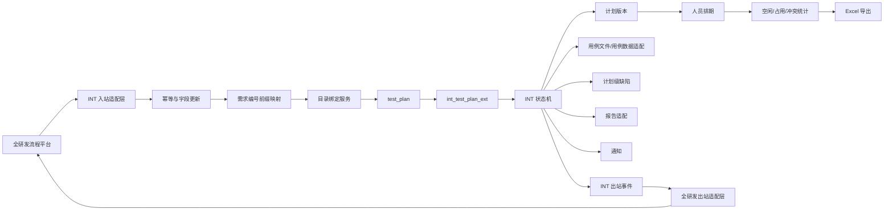

# INT 测试平台技术设计

> 本设计以同目录 `requirements.md` 为唯一业务需求基线。
> 历史 `.kiro/specs`、旧需求文档及现有代码只用于字段、兼容性和技术实现参考；与 `requirements.md` 冲突时，以 `requirements.md` 为准。
> 对 `requirements.md` 中仍标记为【待确认】或【待技术评估】的事项，本设计只预留边界，不自行补全业务规则。

---

## 1. 设计目标与总体结论

本次改造继续以 MeterSphere 现有 `test_plan` 为测试计划主对象，在其上增加 INT 扩展数据、独立状态机、计划版本、人员排期、外部同步、计划级缺陷和办结校验能力。

不再沿用历史 `platform-transformation` 中“重新建设独立 `test_workflow` 主流程”的方案。

核心结论：

1. `test_plan` 继续承担测试计划主记录、项目归属、目录归属以及现有用例/缺陷/报告入口。
2. 新增 INT 扩展表保存总需求编号、需求编号、需求名称、INT 状态、开发时间和实际测试时间等业务真值。
3. “所属系统”不是全研发入站字段，由测试平台通过“需求编号前缀 → 所属系统”固定映射得到。
4. 测试平台业务目录为：`所属系统 > 总需求编号-需求名称 > 测试计划数据`。
5. 新增计划版本和人员排期模型，准备和执行分别排期，历史版本保留，统计只读取最新有效版本。
6. 缺陷继续复用现有 `issues`，测试计划是主关联对象，计划用例是可选关联对象。
7. INT 状态机是业务真值；MeterSphere 原 `TestPlanStatus` 只承担兼容镜像。
8. 全研发入站必须幂等；同一需求编号重复消息不能重复创建测试计划。
9. 全研发出站统一通过适配层发送，业务服务不直接绑定 Topic、messageType 或具体中间件。
10. 用例稳定 ID、评审后/最终双版本、最终 Excel 合并策略仍属于设计闸门，未确认前不得自行实现内容级合并算法。

---

## 2. 当前代码可复用能力

| 现有能力 | 当前实现 | 本次设计 |
|---|---|---|
| 测试计划主对象 | `TestPlanController`、`TestPlanService` | 继续复用 `test_plan` |
| 计划目录 | `TestPlan.nodeId` | 用于绑定“总需求编号-需求名称”二级目录 |
| 计划编辑/查询 | `/test/plan/*` | 普通计划继续使用；INT 关键动作走新增 INT API |
| 计划关联缺陷 | `GET /issues/plan/get/{planId}` | 作为计划级缺陷列表基础 |
| 用例级缺陷 | 现有计划用例缺陷关联 | 保留计划 + 用例双关联 |
| 报告 | `TestPlanReportService` | 优先复用；最终数据源取决于用例导入方案 |
| 通知 | `@SendNotice` 等现有能力 | 通过通知适配服务复用 |
| Kafka | `TestPlanService` 已使用 | 作为现有基础设施，不写死为 INT 通知方案 |
| 需求回传 | `RequirementCallbackMessageSender` | 作为现有回传模式参考，新增 INT 出站适配层 |

当前 `TestPlanService` 在原计划进入 `Completed` 时已有需求完成回调。INT 办结后如果仍镜像 `test_plan.status=Completed`，必须对 INT 计划隔离旧回调，避免新旧两套回传同时发送。

---

## 3. 总体架构



### 3.1 后端模块建议

```text
test-track/backend/src/main/java/io/metersphere/inttest/
  controller/
    IntSystemMappingController.java
    IntTestPlanController.java
    IntPlanScheduleController.java
    IntPlanResourceController.java
  service/
    IntSystemMappingService.java
    IntPlanDirectoryService.java
    IntRequirementSyncService.java
    IntTestPlanService.java
    IntPlanFlowService.java
    IntPlanVersionService.java
    IntPlanResourceService.java
    IntPlanCaseService.java
    IntPlanIssueService.java
    IntPlanCompletionService.java
    IntPlanNoticeService.java
    IntRequirementCallbackService.java
    IntIntegrationLogService.java
  integration/
    IntRequirementInboundGateway.java
    IntRequirementOutboundGateway.java
  job/
    IntPlanReminderJob.java
    IntIntegrationRetryJob.java
  dto/
  request/
  constant/
```

外部通信协议只存在于 `integration` 层；核心状态机只处理标准化内部命令。

### 3.2 前端模块建议

```text
test-track/frontend/src/business/plan/int/
  components/
    IntPlanStatusTag.vue
    IntPlanScheduleEditor.vue
    IntPlanApprovalPanel.vue
    IntPlanFlowActions.vue
    IntPlanIssueList.vue
    IntPlanCaseUpload.vue
  resource/
    IntPersonnelSchedule.vue
    IntPersonnelScheduleDetail.vue
  settings/
    IntSystemMapping.vue

test-track/frontend/src/api/int-test-plan.js
```

INT 计划继续进入现有测试计划体系，不单独恢复历史 spec 的“需求测试流程”主页面。

---

## 4. 业务主键与字段语义

### 4.1 总需求编号、需求编号、所属系统

| 业务字段 | 含义 | 技术真值 |
|---|---|---|
| 总需求编号 | 一条原始需求的上层编号，可跨多个系统 | `int_test_plan_ext.total_demand_number` |
| 需求编号 | 具体系统需求编号；前缀决定所属系统 | `int_test_plan_ext.demand_number` |
| 需求名称 | 原始需求名称 | `int_test_plan_ext.demand_name` |
| 所属系统 | 测试平台前缀映射结果 | `int_system_mapping` + `system_mapping_id` |

为避免现有字段语义不清，本设计不再把 `test_plan.requirement_number` 作为新 INT 业务数据的唯一真值。

建议：

- `int_test_plan_ext.demand_number` 为 INT 需求编号权威值；
- 如确认现有 `test_plan.requirement_number` 的业务含义与“需求编号”一致，则同步镜像，供现有列表/搜索/回调兼容；
- `RequirementCallbackMessage.dmpNum` 现有语义需要结合全研发实际字段契约确认，只能映射“需求编号”或作为旧兼容字段，绝不能承载总需求编号；
- 总需求编号始终单独存储、单独出站。

### 4.2 幂等业务键

requirements 已明确“同一需求编号重复同步不得重复创建测试计划”。技术上建议使用：

```text
(workspace_id, demand_number) UNIQUE
```

作为 INT 入站业务幂等键。

如果部署模型能保证一个全研发租户只落入单一 workspace，也仍保留 workspace 维度，避免不同工作空间之间互相污染。

### 4.3 `test_plan` 兼容字段

| MeterSphere 字段 | INT 使用方式 |
|---|---|
| `id` | INT 测试计划 ID |
| `project_id` | 技术承载项目，由系统映射决定 |
| `node_id` | 指向“总需求编号-需求名称”二级目录 |
| `name` | 页面只读；生成来源仍为【待确认】，不得由设计自行固定 |
| `requirement_number` | 可作为需求编号兼容镜像，不作为唯一真值 |
| `stage` | INT 页面隐藏 |
| `status` | 原 MeterSphere 粗粒度兼容状态 |
| `planned_start_time` | 最新有效计划最早准备开始日期的镜像 |
| `planned_end_time` | 最新有效计划最晚执行结束日期的镜像 |
| `actual_start_time` | 实际测试执行开始时间镜像 |
| `actual_end_time` | 实际测试执行结束时间镜像 |

---

## 5. 仍需先确认的两个计划创建字段

requirements 已明确：计划名称、负责人在计划编制页面置灰，但它们的自动来源尚未确认。

因此设计不采用“默认取需求名称”“默认取测试组第一个人”等隐式规则。

### 5.1 计划名称

当前只确定：

- 自动创建测试计划时必须能得到一个合法的 `test_plan.name`；
- 页面不允许在当前计划编制动作中修改；
- 具体来源/拼接规则仍为【待确认】。

在该规则确认前，`IntRequirementSyncService` 只预留 `IntPlanMetadataResolver.resolvePlanName(...)` 扩展点，不固化算法。

### 5.2 负责人

当前只确定：

- 页面展示负责人并置灰；
- 所属系统可关联测试组/用户组；
- “测试组未来多人后如何确定负责人”仍为【待确认】。

因此不允许简单用“用户组第一个成员”作为负责人。

预留 `IntPlanMetadataResolver.resolvePrincipal(...)`，最终规则确认后再落地。

### 5.3 实施闸门

自动创建 `test_plan` 的开发任务在进入正式实现前，必须先把“计划名称生成规则”和“负责人赋值来源”两个待确认项关闭；否则只能完成入站解析、映射和目录准备，不能宣称计划自动创建功能验收完成。

---

## 6. 系统映射设计

新增 `int_system_mapping`：

| 字段 | 说明 |
|---|---|
| `id` | 主键 |
| `workspace_id` | 工作空间 |
| `project_id` | INT 计划实际落地项目 |
| `demand_prefix` | 固定需求编号前缀 |
| `system_code` | 可选系统内部编码 |
| `system_name` | 所属系统名称 |
| `test_group_id` | 测试用户组 |
| `system_node_id` | 一级“所属系统”目录节点 ID |
| `enabled` | 是否启用 |
| `create_time/update_time` | 审计字段 |

唯一约束：

```text
(workspace_id, demand_prefix) UNIQUE
```

要求：

1. 一个可用前缀只能唯一对应一个所属系统。
2. 配置保存时校验前缀冲突。
3. 解析可采用“规范化前缀 + 最长匹配”方式，保证类似 `CMS-`、`CMS2.0-` 能稳定区分。
4. 解析失败时不猜测所属系统，不自动创建未知系统。
5. `test_group_id` 用于通知和后续人员范围匹配，不等价于“负责人”。

---

## 7. 目录绑定设计

新增 `int_demand_directory`：

| 字段 | 说明 |
|---|---|
| `id` | 主键 |
| `system_mapping_id` | 所属系统映射 |
| `total_demand_number` | 总需求编号 |
| `demand_name_snapshot` | 建目录时名称快照 |
| `node_id` | 二级目录节点 ID |
| `create_time/update_time` | 审计字段 |

唯一约束：

```text
(system_mapping_id, total_demand_number) UNIQUE
```

目录创建流程：

1. 通过需求编号前缀确定 `int_system_mapping`。
2. 定位/创建一级“所属系统”目录。
3. 按 `(system_mapping_id, total_demand_number)` 定位二级目录绑定。
4. 不存在时创建 `总需求编号-需求名称` 二级目录。
5. 创建测试计划时使用绑定的 `node_id`。

因为 requirements 允许人工修改目录，后续定位不能依赖目录名称，必须依赖绑定 ID。

### 7.1 需求名称后续变化

全研发后续更新需求名称时：

- `int_test_plan_ext.demand_name` 更新为最新值；
- `int_demand_directory` 可记录最新名称与创建时快照；
- 是否自动重命名已经存在的“总需求编号-需求名称”目录仍为【待确认】；
- 在业务确认前，目录服务不得把“自动重命名”写成固定行为。

---

## 8. INT 计划扩展表

新增 `int_test_plan_ext`，与 `test_plan` 一对一：

| 字段 | 说明 |
|---|---|
| `plan_id` | PK，关联 `test_plan.id` |
| `workspace_id` | 用于业务幂等隔离 |
| `total_demand_number` | 总需求编号 |
| `demand_number` | 需求编号 |
| `demand_name` | 最新需求名称 |
| `demand_type` | 原始业务需求/系统优化等 |
| `system_mapping_id` | 所属系统映射结果 |
| `business_zip_url` | 业务需求 ZIP 链接 |
| `spec_url` | 需求规格说明书链接 |
| `planned_dev_complete_time` | 开发计划预期完成时间 |
| `actual_dev_complete_time` | 开发实际完成时间 |
| `int_status` | INT 状态 |
| `smoke_required` | 是否需要冒烟 |
| `current_plan_version_id` | 当前有效计划版本 |
| `actual_prep_start_time` | 实际准备开始时间 |
| `actual_prep_end_time` | 实际准备结束时间 |
| `actual_exec_start_time` | 实际执行开始时间 |
| `actual_exec_end_time` | 实际执行结束时间 |
| `revision` | 乐观锁版本号 |
| `create_time/update_time` | 审计字段 |

索引：

```text
UNIQUE(workspace_id, demand_number)
INDEX(total_demand_number)
INDEX(system_mapping_id, int_status)
```

---

## 9. 入站幂等与字段更新

### 9.1 标准内部命令

```text
DemandUpsertCommand
  totalDemandNumber
  demandName
  demandType
  demandNumber
  businessZipUrl
  sourceEventId
  sourceTime

SpecSyncCommand
  demandNumber
  specUrl

PlannedDevCompleteCommand
  demandNumber
  plannedDevCompleteTime

ActualDevCompleteCommand
  demandNumber
  actualDevCompleteTime
```

入站 DTO 不包含所属系统。

### 9.2 `DemandUpsertCommand` 处理

按 `(workspace_id, demandNumber)` 查询：

- 不存在：解析系统 → 创建/定位目录 → 创建 INT 计划；
- 已存在：更新允许由全研发维护的字段，不创建第二条计划。

重复消息、MQ 重投、HTTP 重试都必须得到相同业务结果。

### 9.3 后续字段补充

`SpecSyncCommand`、`PlannedDevCompleteCommand`、`ActualDevCompleteCommand` 都只更新同一需求编号对应的 INT 计划。

其中：

```text
spec_url != null
AND planned_dev_complete_time != null
AND int_status == WAIT_INTERVENE
```

时自动触发：

```text
WAIT_INTERVENE → PLANNING
```

`actual_dev_complete_time` 到达只更新字段，不自动进入测试执行。

### 9.4 字段更新归属

为避免旧消息覆盖新值，建议入站记录 `source_time`/`source_event_id`，字段更新适配器按外部事件时间或版本号判断新旧；若外部无法提供可靠顺序信息，则至少保留完整同步日志并使用“最后成功消息”策略。

---

## 10. INT 状态机

### 10.1 状态枚举

```text
WAIT_INTERVENE          待介入
PLANNING                测试计划
PENDING_APPROVAL        待审批
PENDING_PREPARATION     待测试准备
PREPARATION             测试准备
PENDING_EXECUTION       待测试执行
EXECUTION               测试执行
COMPLETED               办结
```

### 10.2 流转表

| 当前状态 | 动作/条件 | 下一状态 | 关键校验 | 主要副作用 |
|---|---|---|---|---|
| 待介入 | 规格说明书 + 开发计划预期完成时间齐全 | 测试计划 | 两字段非空 | 通知测试组 |
| 测试计划 | 提交计划 | 待审批 | 所有可填写项完整、准备/执行排期完整 | 写状态日志 |
| 待审批 | 审批通过 | 待测试准备 | 当前初始版本合法 | 初始版本生效、同步全研发 |
| 待审批 | 审批驳回 | 测试计划 | 当前状态合法 | 记录审批意见 |
| 待测试准备 | 开始测试准备 | 测试准备 | 当前状态合法 | 写实际准备开始时间、同步全研发 |
| 测试准备 | 完成测试准备 | 待测试执行 | 评审结果、评审人员、评审后文件齐全 | 写实际准备结束时间、同步全研发 |
| 待测试执行 | 开始测试执行 | 测试执行 | 开发实际完成时间存在 | 写实际执行开始、镜像 Underway、同步全研发 |
| 测试执行 | 办结 | 办结 | 最终用例合法、计划缺陷全关闭、报告成功 | 写实际执行结束、镜像 Completed、同步全研发 |

### 10.3 与 MeterSphere 原状态兼容

```text
WAIT_INTERVENE
PLANNING
PENDING_APPROVAL
PENDING_PREPARATION
PREPARATION
PENDING_EXECUTION
    → TestPlanStatus.Prepare

EXECUTION
    → TestPlanStatus.Underway

COMPLETED
    → TestPlanStatus.Completed
```

INT 状态为业务真值。

### 10.4 禁止绕过

对于存在 `int_test_plan_ext` 的计划：

1. 原 `/test/plan/edit/status/{id}` 不得推进 INT 状态。
2. 原通用编辑接口不得修改 INT 保护字段。
3. 前端按钮只根据后端返回的 `availableActions` 展示。
4. 所有状态校验必须在后端执行。

---

## 11. 角色与权限设计

按 requirements 的业务角色控制：

| 动作 | 业务角色 | 技术权限建议 |
|---|---|---|
| 查看 INT 计划 | 测试相关人员 | 复用计划 READ |
| 编制/保存计划 | 测试团队负责人 | `INT_PLAN_EDIT` |
| 提交待审批 | 测试团队负责人 | `INT_PLAN_SUBMIT` |
| 审批通过/驳回 | 测试总负责人 | `INT_PLAN_APPROVE` |
| 开始/完成测试准备 | 测试人员 | `INT_PREPARATION_OPERATE` |
| 开始测试执行 | 测试人员 | `INT_EXECUTION_START` |
| 缺陷操作 | 具备缺陷权限的测试人员 | 复用现有缺陷权限 |
| 办结 | 具备办结权限的测试人员 | `INT_PLAN_COMPLETE` |
| 维护系统映射 | 管理人员 | `INT_SYSTEM_MAPPING_MANAGE` |
| 查看人员排期 | 测试负责人/授权人员 | `INT_RESOURCE_READ` |
| 导出人员排期 | 测试负责人/授权人员 | `INT_RESOURCE_EXPORT` |

是否新建独立权限点，优先根据现有 MeterSphere 权限粒度评估；如果现有权限无法区分“计划提交”和“测试总负责人审批”，则必须增加 INT 专用权限。

用户组用于确定通知/候选人员范围，不直接替代权限体系。

---

## 12. 计划版本

### 12.1 `int_plan_version`

| 字段 | 说明 |
|---|---|
| `id` | 主键 |
| `plan_id` | 测试计划 |
| `version_no` | 1、2、3... |
| `version_type` | INITIAL / ADJUSTMENT |
| `version_status` | DRAFT / EFFECTIVE / SUPERSEDED |
| `adjustment_reason` | 调整原因 |
| `overall_start_date` | 最早准备开始日期 |
| `overall_end_date` | 最晚执行结束日期 |
| `creator` | 创建人 |
| `effective_time` | 生效时间 |
| `create_time/update_time` | 审计字段 |

```text
UNIQUE(plan_id, version_no)
```

一个计划最多存在一个 `EFFECTIVE` 版本。

### 12.2 初始版本

1. 第一次进入“测试计划”创建 V1 DRAFT。
2. 保存只修改当前 DRAFT。
3. 提交待审批时仍为 DRAFT。
4. 审批通过后 V1 → EFFECTIVE。
5. 审批驳回继续编辑同一个 V1，不新增版本。

### 12.3 调整版本

1. 复制当前 EFFECTIVE 为 N+1 DRAFT。
2. 修改人员/日期并填写调整原因。
3. 保存并确认调整后旧版本 → SUPERSEDED，新版本 → EFFECTIVE。
4. 更新 `current_plan_version_id`。
5. 重新镜像整体计划周期。
6. 同步最新计划和调整原因给全研发。
7. 不因调整动作立即发送人员通知。
8. 后续提醒、冲突、空闲统计只使用最新 EFFECTIVE。

requirements 未要求调整计划重新审批，本设计不额外增加审批流程。

---

## 13. 人员排期模型

### 13.1 `int_plan_assignment`

| 字段 | 说明 |
|---|---|
| `id` | 主键 |
| `plan_version_id` | 计划版本 |
| `phase` | PREPARATION / EXECUTION |
| `user_id` | 人员 |
| `start_date` | 自然日开始 |
| `end_date` | 自然日结束 |
| `sort` | 页面行顺序 |

优先使用数据库 `DATE` 类型。

日期区间采用**首尾日期都计入**的闭区间语义：

```text
占用天数 = end_date - start_date + 1
```

### 13.2 整体计划周期

```text
overall_start_date = 所有 PREPARATION 中最早 start_date
overall_end_date   = 所有 EXECUTION 中最晚 end_date
```

同步镜像：

```text
test_plan.planned_start_time ← overall_start_date
test_plan.planned_end_time   ← overall_end_date
```

---

## 14. 人员空闲、占用和冲突统计

### 14.1 统计源

```text
INT 未办结计划
+
每个计划最新 EFFECTIVE 版本
+
PREPARATION / EXECUTION 全部 assignment
```

### 14.2 保存当前草稿时的冲突源

保存/提交一个 DRAFT 时，要同时检查：

1. 当前草稿内部不同 assignment 之间的重叠；
2. 当前草稿与其他未办结计划最新 EFFECTIVE assignment 的重叠。

不能因为排除了“当前计划旧版本”，就漏掉当前草稿中准备阶段和执行阶段互相撞期的问题。

### 14.3 区间算法

对于查询范围 `[QStart, QEnd]`：

1. 查询 `start_date <= QEnd AND end_date >= QStart`。
2. 裁剪到查询范围。
3. 按开始日期排序。
4. 合并重叠或连续区间，得到占用区间。
5. 查询范围减去占用区间得到空闲区间。
6. 对原始 assignment 做边界扫描，同一自然日并发数 `>=2` 记为冲突日。

准备和执行统一参与人员资源占用判断。

### 14.4 保存规则

冲突结果只警告，不阻塞保存和提交。

返回至少包含：人员、相关计划、阶段、冲突起止日期。

### 14.5 Excel 导出

使用项目 EasyExcel 能力，建议两个 Sheet：

```text
Sheet1：人员汇总
Sheet2：排期明细
```

字段覆盖 requirements 要求，并可额外带总需求编号和冲突区间。

---

## 15. 审批记录

新增 `int_plan_approval_record`：

| 字段 | 说明 |
|---|---|
| `id` | 主键 |
| `plan_id` | 测试计划 |
| `plan_version_id` | 被审批版本 |
| `decision` | APPROVED / REJECTED |
| `comment` | 可空 |
| `approver_id` | 审批人 |
| `create_time` | 审批时间 |

审批意见通过/驳回均可填写，均不强制必填。

---

## 16. 实际时间

| INT 字段 | 写入时机 |
|---|---|
| `actual_prep_start_time` | 点击“开始测试准备” |
| `actual_prep_end_time` | “完成测试准备”校验成功 |
| `actual_exec_start_time` | “开始测试执行”且开发实际完成时间存在 |
| `actual_exec_end_time` | 办结全部校验和报告成功 |

为了兼容 MeterSphere：

- 只在开始测试执行时镜像 `test_plan.actual_start_time`；
- 只在办结时镜像 `test_plan.actual_end_time`；
- 准备阶段实际时间不写入原 `actual_start_time/actual_end_time`。

---

## 17. 用例文件与导入边界

### 17.1 文件记录

新增 `int_plan_case_file`：

| 字段 | 说明 |
|---|---|
| `id` | 主键 |
| `plan_id` | 测试计划 |
| `file_type` | REVIEWED / FINAL |
| `file_meta_id` | 附件/文件元数据 ID |
| `upload_user` | 上传人 |
| `upload_time` | 上传时间 |
| `parse_status` | PENDING / SUCCESS / FAILED |
| `parse_message` | 解析结果 |

文件本体继续复用现有附件能力。

### 17.2 解析批次建议

为了不在稳定 ID 方案确认前错误覆盖现有计划用例，建议将每次 Excel 上传先解析为独立批次：

`int_plan_case_import_batch`

| 字段 | 说明 |
|---|---|
| `id` | 批次 ID |
| `plan_id` | 测试计划 |
| `case_file_id` | 文件记录 |
| `version_type` | REVIEWED / FINAL |
| `row_count` | 行数 |
| `status` | PARSED / FAILED / APPLIED |
| `create_time` | 时间 |

`int_plan_case_import_row`

| 字段 | 说明 |
|---|---|
| `id` | 主键 |
| `batch_id` | 上传批次 |
| `source_row_no` | Excel 原行号，仅用于定位错误，不作为用例 ID |
| `stable_case_id` | 可空，等待稳定 ID 方案确认 |
| `case_status` | 最终状态等标准化字段 |
| `raw_data` | 标准化后的行 JSON |
| `parse_error` | 行级错误 |

### 17.3 当前可以确定的行为

“完成测试准备”可以确定：

1. 校验评审结果、评审人员。
2. 保存 REVIEWED 文件。
3. 完成文件结构解析和基础字段校验。
4. 解析成功后记录实际准备结束时间并进入待测试执行。

最终文件可以确定：

1. 保存 FINAL 文件。
2. 解析最终执行状态。
3. 校验状态集合是否包含未执行/不通过/阻塞。

### 17.4 当前不能自行确定的行为

在稳定 ID 和导入策略确认前，不设计以下自动动作：

- 按 Excel 行号覆盖已有用例；
- 按文本相似度猜测“修改”；
- 自动把缺少稳定 ID 的行与旧用例合并；
- 自动判断一行是“删除后重建”还是“修改”；
- 强制把 REVIEWED/FINAL 两批数据合并为一套现有计划用例记录。

因此 `IntPlanCaseService` 分为：

```text
parse()      文件解析与验证，当前可实现
apply()      映射/覆盖/新增/删除，待技术评估确认后实现
compare()    两版本差异，待稳定 ID 后实现
```

### 17.5 报告数据源设计闸门

如果最终选择把 FINAL 数据稳定映射回现有计划用例，可继续直接复用现有 `test_plan_report` 统计。

如果最终选择保留独立用例快照，则报告层需要通过 `IntPlanReportDataProvider` 从最终批次提供统计数据，再决定复用现有报告模板还是增加 INT 报告适配。

在该技术结论确认前，不把“现有 test_plan_report 一定能够直接满足最终报告”写死。

---

## 18. 计划级缺陷

### 18.1 数据原则

继续使用现有 `issues`：

```text
缺陷
├─ planId       必须
└─ planCaseId   可选
```

测试计划“关联缺陷”页按 `planId` 查询全部缺陷。

### 18.2 从计划新增

计划级新增时：

- 当前 `planId` 必须写入；
- `planCaseId/addResourceIds` 允许为空；
- 无明确用例归属的环境、部署、数据、冒烟类问题仍属于测试计划。

### 18.3 从用例新增

继续保留现有：

```text
planId + planCaseId
```

### 18.4 后端改造

当前缺陷新增服务存在按 `addResourceIds` 处理用例缺陷计数的逻辑，改造时必须允许集合为空：

```text
if addResourceIds 非空:
    创建/更新具体用例关系及计数
else:
    只保留计划级关系
```

解除用例关联时只删除用例关系，不能删除缺陷的计划归属。

---

## 19. 开始测试执行

接口：

```text
POST /int/test-plan/{planId}/execution/start
```

事务：

1. 校验 INT 状态为 `PENDING_EXECUTION`。
2. 校验 `actual_dev_complete_time != null`。
3. 缺失时返回：`开发实际完成时间未提供，不能流转`。
4. 写 `actual_exec_start_time`。
5. INT 状态 → `EXECUTION`。
6. 镜像 `test_plan.status=Underway` 和 `actual_start_time`。
7. 记录状态日志。
8. 事务提交后生成“实际执行开始”出站事件。

开发实际完成时间消息本身不触发状态流转。

---

## 20. 冒烟测试

当前仅固化：

```text
smoke_required: boolean
```

冒烟是测试执行阶段前置过程，不新增主状态。

结论、人员、时间、备注、关联缺陷等仍为【待确认】，因此当前不建立固定 `int_smoke_record` 结构；待业务字段确认后再扩展。

---

## 21. 办结

接口：

```text
POST /int/test-plan/{planId}/complete
```

### 21.1 校验顺序

1. INT 状态必须为 `EXECUTION`。
2. FINAL 文件必须上传并解析成功。
3. 从最终可验证数据源确认不存在未执行/不通过/阻塞状态。
4. 按 `planId` 查询计划全部缺陷。
5. 所有计划缺陷必须为“已关闭”。
6. 生成/保存/分享报告成功。
7. 写实际执行结束时间。
8. INT 状态 → `COMPLETED`。
9. 镜像 `test_plan.status=Completed`、`actual_end_time`。
10. 生成 INT 办结出站事件。

“最终可验证数据源”由第 17 节用例导入技术结论决定，不允许用 Excel 行号临时拼出身份关系。

### 21.2 报告失败

报告生成失败时，不得写办结状态和实际执行结束时间。

### 21.3 旧回调隔离

对 INT 计划：

```text
legacy requirement completed callback = 禁用
INT_COMPLETED → IntRequirementCallbackService
```

普通 MeterSphere 测试计划保持原行为。

---

## 22. 通知与 09:00 提醒

### 22.1 待介入 → 测试计划

自动流转完成后：

1. 通过 `system_mapping_id` 找到测试用户组。
2. 获取用户组成员。
3. 通过 `IntPlanNoticeService` 发送站内通知。

不在业务服务中直接操作 Kafka Topic。

### 22.2 排期提醒

`IntPlanReminderJob` 每天 09:00 执行。

准备提醒条件：

```text
int_status = PENDING_PREPARATION
最新 EFFECTIVE PREPARATION assignment.start_date = today
```

执行提醒条件：

```text
int_status = PENDING_EXECUTION
最新 EFFECTIVE EXECUTION assignment.start_date = today
```

开发实际完成时间尚未提供，也不改变计划执行日期提醒。

### 22.3 防重复

新增 `int_notice_log`：

```text
UNIQUE(plan_id, plan_version_id, user_id, notice_type, notice_date)
```

用于任务重跑和多实例防重。

具体右上角抽屉通知调用链继续保持【待技术确认】。

---

## 23. 全研发出站

内部事件：

```text
PLAN_APPROVED
PLAN_ADJUSTED
PREPARATION_STARTED
PREPARATION_COMPLETED
EXECUTION_STARTED
INT_COMPLETED
```

每个事件统一携带：

- `planId`
- `totalDemandNumber`
- `demandNumber`
- 当前最新计划版本数据（适用时）
- 对应实际时间（适用时）
- 报告链接（办结时）

外部 DTO、Topic、messageType 由 `IntRequirementOutboundGateway` 适配。

---

## 24. 同步日志、Outbox 与重试

新增 `int_integration_log`：

| 字段 | 说明 |
|---|---|
| `id` | 主键 |
| `direction` | IN / OUT |
| `event_type` | 事件类型 |
| `business_key` | 业务键 |
| `source_event_id` | 上游事件 ID，可空 |
| `payload` | 原始/标准化 JSON |
| `status` | PENDING / SUCCESS / FAILED |
| `error_message` | 错误 |
| `retry_count` | 重试次数 |
| `create_time/update_time` | 时间 |

出站建议采用“业务事务 + 本地 Outbox 记录”，事务提交后异步发送：

```text
业务事务成功
→ 写 OUT PENDING
→ 异步发送
→ SUCCESS / FAILED
→ FAILED 定时重试
```

这样全研发瞬时不可用不会回滚本地已经完成的“开始准备/开始执行”等真实业务动作。

办结本身的用例、缺陷和报告校验失败仍必须回滚/阻止本地办结。

---

## 25. 状态审计与并发控制

新增 `int_plan_status_log`：

| 字段 | 说明 |
|---|---|
| `id` | 主键 |
| `plan_id` | 测试计划 |
| `from_status` | 原状态 |
| `to_status` | 新状态 |
| `action` | 动作 |
| `operator_id` | 操作人；自动流转可为空 |
| `remark` | 备注 |
| `create_time` | 时间 |

所有状态操作：

1. 查询并锁定/校验 `int_test_plan_ext`。
2. 使用 `revision` 乐观锁或行锁。
3. 校验 from 状态。
4. 校验操作者权限。
5. 执行业务前置校验。
6. 更新业务数据和状态。
7. 写状态日志。
8. 写出站 Outbox（需要时）。
9. 提交事务。

双击、MQ 重放、多实例任务不能重复写实际时间或重复推进状态。

---

## 26. API 设计

### 26.1 INT 计划

| 方法 | 路径 | 说明 |
|---|---|---|
| GET | `/int/test-plan/{planId}` | INT 计划详情 + availableActions |
| PUT | `/int/test-plan/{planId}/draft` | 保存当前计划草稿 |
| POST | `/int/test-plan/{planId}/submit` | 提交待审批 |
| POST | `/int/test-plan/{planId}/approve` | 审批通过 |
| POST | `/int/test-plan/{planId}/reject` | 审批驳回 |
| POST | `/int/test-plan/{planId}/adjust` | 保存并生效调整版本 |
| POST | `/int/test-plan/{planId}/preparation/start` | 开始测试准备 |
| POST | `/int/test-plan/{planId}/preparation/complete` | 完成测试准备 |
| POST | `/int/test-plan/{planId}/execution/start` | 开始测试执行 |
| POST | `/int/test-plan/{planId}/complete` | 办结 |
| GET | `/int/test-plan/{planId}/history` | 状态/审批/版本历史 |

### 26.2 人员排期

| 方法 | 路径 | 说明 |
|---|---|---|
| POST | `/int/resource/schedule/query` | 汇总 + 明细 |
| POST | `/int/resource/schedule/conflicts` | 冲突校验 |
| POST | `/int/resource/schedule/export` | Excel 导出 |

### 26.3 系统映射

| 方法 | 路径 | 说明 |
|---|---|---|
| GET | `/int/system-mapping/list` | 查看映射 |
| POST | `/int/system-mapping/add` | 新增 |
| POST | `/int/system-mapping/update` | 修改 |
| POST | `/int/system-mapping/enable` | 启停 |
| POST | `/int/system-mapping/validate` | 前缀冲突校验 |

### 26.4 用例文件

| 方法 | 路径 | 说明 |
|---|---|---|
| POST | `/int/test-plan/{planId}/case-file/reviewed` | 上传/解析评审后用例 |
| POST | `/int/test-plan/{planId}/case-file/final` | 上传/解析最终用例 |
| GET | `/int/test-plan/{planId}/case-file/history` | 上传批次历史 |

`apply/compare` 接口待稳定 ID 和最终 Excel 策略确认后再增加。

---

## 27. 前端交互

### 27.1 INT 基础信息区

```text
计划名称（只读，来源待确认）
负责人（只读，来源待确认）
总需求编号（只读）
需求编号（只读）
所属系统（只读，前缀映射）
需求规格说明书
开发计划预期完成时间
开发实际完成时间
是否需要冒烟
```

计划编制时隐藏原“测试阶段”。

### 27.2 排期编辑

```text
测试准备安排
  人员 | 开始日期 | 结束日期 | +/-

测试执行安排
  人员 | 开始日期 | 结束日期 | +/-
```

所有当前可填写项按 requirements 做必填校验。

### 27.3 冲突提示

```text
存在排期冲突
张三：计划 A，测试执行，9/10-9/12
[返回调整] [仍然保存/提交]
```

冲突不阻断保存。

### 27.4 状态动作

前端只使用后端 `availableActions`：

```json
{
  "status": "PENDING_EXECUTION",
  "availableActions": ["START_EXECUTION"]
}
```

`availableActions` 同时受状态和当前用户权限控制。

### 27.5 关联缺陷

在 `TestPlanView.vue` 增加“关联缺陷”Tab，复用现有缺陷列表和编辑能力。

### 27.6 人员排期

测试计划列表附近增加“人员排期”入口：日期范围、人员筛选、系统筛选、汇总、明细、Excel 导出。

---

## 28. 数据迁移与兼容

1. 只有存在 `int_test_plan_ext` 的计划才受 INT 状态机管理。
2. 普通 MeterSphere 测试计划保持原逻辑。
3. 不批量把历史普通测试计划转换成 INT 计划。
4. 上线前必须先维护“需求编号前缀 → 所属系统 → project → 测试组”映射。
5. 历史 `test_workflow_*` 方案不再继续扩展。
6. 现有 `test_plan.requirement_number` 如确认语义一致，可作为需求编号兼容镜像；不承载总需求编号。
7. 旧需求完成回调对 INT 计划隔离。
8. 新增 INT 表必须使用独立迁移脚本，不改写已上线 migration。

---

## 29. 异常处理

| 场景 | 处理 |
|---|---|
| 需求编号前缀无映射 | 不猜测；记录失败；最终拒绝/挂起待业务确认 |
| 前缀配置歧义 | 配置阶段禁止保存 |
| 系统/需求目录被人工改名 | 通过绑定 ID 定位，不依赖名称 |
| 目录被删除 | 记录绑定失效；按修复策略重新建绑 |
| 同一需求重复推送 | 幂等更新，不重复建计划 |
| 旧消息晚到 | 结合 sourceTime/version 防止覆盖新数据 |
| 规格说明书/计划预期时间只到一项 | 保持待介入 |
| 人员排期冲突 | 提示，允许保存 |
| 开发实际完成时间缺失 | 禁止开始测试执行 |
| 用例文件解析失败 | 禁止完成对应阶段动作 |
| 最终用例存在非法状态 | 禁止办结 |
| 存在未关闭计划缺陷 | 禁止办结 |
| 报告失败 | 禁止办结 |
| 全研发出站失败 | 本地动作保留，Outbox 重试 |
| 重复状态请求 | 状态/乐观锁拦截，不重复写时间 |

---

## 30. 测试设计

### 30.1 单元测试

重点覆盖：

1. 总需求编号与需求编号严格分离。
2. `(workspace, demandNumber)` 幂等。
3. 需求编号前缀解析和歧义校验。
4. 目录绑定幂等，不按名称反查。
5. 入站后续字段更新不重复建计划。
6. 待介入双条件自动流转。
7. INT 状态机合法/非法流转。
8. 状态动作角色权限。
9. 计划版本生效/替换。
10. 自然日期闭区间天数计算。
11. 草稿内部准备/执行冲突。
12. 草稿与其他计划冲突。
13. 区间合并、空闲和冲突天数。
14. 开始执行开发实际完成时间校验。
15. 计划级缺陷无用例创建。
16. 解除用例关联保留计划关联。
17. FINAL 文件状态解析。
18. 办结最终状态校验。
19. 办结缺陷全关闭校验。
20. Outbox 失败重试和事件幂等。

### 30.2 集成测试

```text
接收需求
→ 前缀映射
→ 自动目录
→ 幂等创建计划
→ 待介入
→ 规格说明书 + 开发计划预期完成时间
→ 测试计划
→ 编制计划
→ 待审批
→ 审批
→ 开始/完成准备
→ 待执行
→ 开发实际完成时间校验
→ 执行
→ 最终用例
→ 缺陷关闭
→ 报告
→ 办结
→ 全研发回传
```

另测：

- 同一总需求多个需求编号分批进入；
- 同一需求编号重复消息；
- 不同前缀落不同所属系统；
- 需求名称更新但目录重命名规则未启用时不误建新目录；
- 计划调整后统计/提醒只使用最新版本；
- 人工改目录名称后仍正确绑定；
- 普通非 INT 计划不受影响。

### 30.3 前端 E2E

覆盖：

- 合法状态与角色按钮；
- 审批通过/驳回；
- 冲突提示但允许保存；
- 完成准备必填和文件上传；
- 开始执行缺开发实际时间提示；
- 计划级新增缺陷时用例可空；
- 办结失败原因展示；
- 人员排期查询与导出。

---

## 31. 当前设计闸门/未定事项

以下内容不得由实现人员自行猜测：

1. 无法匹配需求编号前缀时最终是拒绝还是挂起。
2. 测试组多人后测试团队负责人确定规则及多人通知规则。
3. 测试计划名称自动生成来源/命名规则。
4. 测试计划负责人自动赋值来源。
5. 需求名称变化后目录是否自动重命名。
6. 冒烟测试需要记录的详细字段。
7. REVIEWED/FINAL 是否作为正式双快照长期保存。
8. 稳定用例 ID 最终来源。
9. FINAL Excel 对已有用例采用覆盖、合并、新增、删除的具体识别策略。
10. 是否实现评审后/最终版本自动差异比对。
11. 最终报告数据源是现有计划用例还是独立 FINAL 快照。
12. 右上角抽屉通知具体内部调用链。
13. 全研发最终传输协议、Topic、messageType 和外部字段名称。

其中第 3、4 项会阻塞“全自动创建 test_plan”的完整验收；第 8、9、11 项会阻塞“最终用例落库 + 报告数据源”的最终实现。

---

## 32. 推荐实施顺序

```text
1. INT 扩展表 + 系统映射 + 目录绑定
2. 入站标准命令 + 幂等/更新日志
3. 确认计划名称和负责人规则
4. 自动创建 test_plan + 待介入状态
5. 待介入双条件自动流转
6. INT 状态机 + 角色权限
7. 计划版本 + 准备/执行排期 + 审批
8. 人员空闲/占用/冲突统计 + Excel
9. 开始/完成测试准备 + REVIEWED 文件解析
10. 开始测试执行 + 开发实际完成时间校验
11. 计划级关联缺陷
12. 确认稳定用例 ID、FINAL 导入和报告数据源方案
13. FINAL 文件落地 + 办结校验 + 报告
14. 站内通知 + 09:00 提醒
15. 全研发多节点出站 + Outbox 重试
16. 用例双版本差异比对（仅确认后实施）
```

这个顺序把仍未确认的业务/技术事项作为明确闸门，避免开发过程中用代码结构或个人猜测替代 requirements。