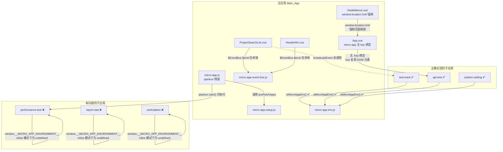
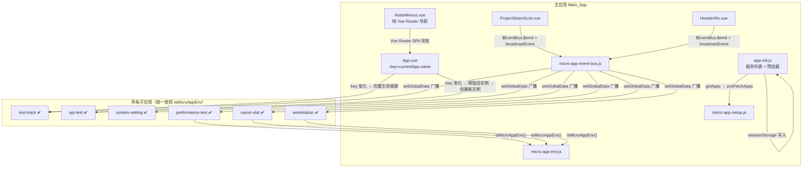

# 设计文档

## 概述

本设计文档描述了 MeterSphere 从 qiankun 迁移到 micro-app 后发现的 6 个 Bug 的修复方案。修复工作集中在前端 JavaScript/Vue 文件，涉及跨应用事件广播、inline 模式环境检测、EventBus 适配器兼容性、qiankun 残留代码清理、预加载调用链修复、以及侧边栏菜单点击无法触发子应用生命周期切换。

所有修复遵循"改动面小、边界清晰、可回滚"的二次开发原则，优先复用已有的工具函数（`isMicroAppEnv()`、`getMicroAppPublicPath()`、`broadcastEvent()`），以正确实现的模块（test-track、api-test、system-setting）为参考模板。

## 架构

### 当前架构（存在问题）



### 修复后架构



## 组件与接口

### 修改的组件

| 组件 | 文件路径 | 修改内容 |
|------|----------|----------|
| App.vue | `framework/sdk-parent/frontend/src/App.vue` | `<micro-app>` 标签添加 `:key="currentApp.name"` 绑定 |
| AsideMenus | `framework/sdk-parent/frontend/src/components/layout/AsideMenus.vue` | 移除 `active()` 和 `activeAnalyticsStat()` 中的 `window.location.href` 强制刷新 |
| ProjectSearchList | `framework/sdk-parent/frontend/src/components/head/ProjectSearchList.vue` | change() 方法中添加 broadcastEvent 调用 |
| HeaderWs | `framework/sdk-parent/frontend/src/components/head/HeaderWs.vue` | _changeWs() 方法中添加 broadcastEvent 调用 |
| micro-app-event-bus | `framework/sdk-parent/frontend/src/utils/micro-app-event-bus.js` | createEventBusAdapter() 内部使用 isMicroAppEnv() |
| performance-test main | `performance-test/frontend/src/main.js` | 替换所有 window.__MICRO_APP_ENVIRONMENT__ |
| performance-test public-path | `performance-test/frontend/src/public-path.js` | 使用 isMicroAppEnv() 和 getMicroAppPublicPath() |
| report-stat main | `report-stat/frontend/src/main.js` | 替换所有 window.__MICRO_APP_ENVIRONMENT__ |
| report-stat public-path | `report-stat/frontend/src/public-path.js` | 使用 isMicroAppEnv() 和 getMicroAppPublicPath() |
| workstation main | `workstation/frontend/src/main.js` | 替换所有 window.__MICRO_APP_ENVIRONMENT__ |
| workstation public-path | `workstation/frontend/src/public-path.js` | 使用 isMicroAppEnv() 和 getMicroAppPublicPath() |
| Main_App main | `framework/sdk-parent/frontend/src/main.js` | 移除 `import './micro-app'` |

### 新增的组件

| 组件 | 文件路径 | 用途 |
|------|----------|------|
| app-init | `framework/sdk-parent/frontend/src/app-init.js` | 从 micro-app.js 迁移服务列表获取和预加载逻辑 |

### 删除的组件

| 组件 | 文件路径 | 原因 |
|------|----------|------|
| micro-app.js | `framework/sdk-parent/frontend/src/micro-app.js` | qiankun 残留代码，registerMicroApps/start 不再需要 |

### 接口定义

#### broadcastEvent（已存在，需被调用）

```javascript
/**
 * 全局广播事件到所有子应用
 * @param {Object} eventData - 事件数据
 * @param {string} eventData.type - 事件类型，如 'projectChange'、'changeWs'
 */
broadcastEvent({ type: 'projectChange' })
broadcastEvent({ type: 'changeWs' })
```

#### isMicroAppEnv（已存在，需在更多位置使用）

```javascript
/**
 * 判断当前是否运行在 micro-app 子应用环境中
 * 兼容 inline 模式和非 inline 模式
 * @returns {boolean}
 */
isMicroAppEnv()
```

#### getMicroAppPublicPath（已存在，需在更多位置使用）

```javascript
/**
 * 获取 micro-app 注入的公共路径
 * inline 模式下从 __MICRO_APP_PROXY_WINDOW__ 中获取
 * @returns {string|undefined}
 */
getMicroAppPublicPath()
```

### Bug 6 修复方案详细设计

#### 问题根因分析

当用户点击侧边栏菜单从一个模块切换到另一个模块时（如 `/track` → `/api`），问题链如下：

1. Vue Router 导航触发 `$route` 变化
2. `App.vue` 中 `currentModuleName` 计算属性更新（如 `track` → `api`）
3. `currentApp` 计算属性返回新的配置对象（不同的 `name` 和 `entry`）
4. 但 `<micro-app>` 标签没有 `:key` 绑定，Vue 复用同一个 DOM 元素
5. micro-app 框架检测到 `name` 属性变化，但 `:destroy="false"` 阻止了旧实例的完整销毁
6. 新子应用的生命周期（created → beforemount → mounted）不会被触发

同时，`AsideMenus.vue` 中部分菜单项使用 `window.location.href` 进行导航：
- `active()` 方法：当已在 `/api` 路由时，执行 `window.location.href = "/#/api/home"` 强制刷新
- `activeAnalyticsStat()` 方法：执行 `window.location.href = "/#/analytics"` 强制刷新

这些 `window.location.href` 赋值会导致浏览器完整刷新页面，绕过了 Vue Router 的 SPA 导航机制。

#### 修复方案

**修复点 1：App.vue 添加 `:key` 绑定**

```vue
<!-- 修复前 -->
<micro-app
  v-if="currentApp"
  :name="currentApp.name"
  :url="currentApp.entry"
  ...
/>

<!-- 修复后 -->
<micro-app
  v-if="currentApp"
  :key="currentApp.name"
  :name="currentApp.name"
  :url="currentApp.entry"
  ...
/>
```

添加 `:key="currentApp.name"` 后，当模块名变化时：
- Vue 识别到 key 不同，销毁旧的 `<micro-app>` DOM 元素
- micro-app 框架触发旧子应用的 unmount 生命周期
- Vue 创建新的 `<micro-app>` DOM 元素
- micro-app 框架触发新子应用的完整生命周期（created → beforemount → mounted）

**修复点 2：AsideMenus.vue 移除 `window.location.href` 强制刷新**

```javascript
// 修复前
active() {
  if (this.activeIndex === '/api') {
    window.location.href = "/#/api/home";
  }
},
activeAnalyticsStat() {
  window.location.href = "/#/analytics";
},

// 修复后：移除 active() 和 activeAnalyticsStat() 方法
// el-menu 已配置 router 属性，Vue Router 会自动处理导航
// 同时移除模板中 @click="active()" 和 @click="activeAnalyticsStat()" 绑定
```

`el-menu` 组件已设置 `router` 属性，当用户点击菜单项时，Element UI 会自动调用 `$router.push(index)` 进行 SPA 导航。移除 `window.location.href` 后，所有菜单导航统一走 Vue Router，配合 App.vue 的 `:key` 绑定，即可正确触发子应用生命周期。

#### 设计决策

| 决策 | 选择 | 理由 |
|------|------|------|
| 使用 `:key` 而非 `:destroy="true"` | `:key="currentApp.name"` | `:key` 是 Vue 标准机制，语义清晰；`:destroy="true"` 会影响所有场景（包括同模块内路由变化），粒度过粗 |
| 保留 `:destroy="false"` | 不修改 | `:destroy="false"` 配合 `:key` 使用时，只在模块切换时触发销毁重建，同模块内路由变化不会触发，性能更优 |
| 完全移除 `active()` 方法 | 移除方法和 @click 绑定 | `active()` 的原始意图是在已处于 /api 时刷新到 /api/home，但这在微前端架构下应由子应用内部路由处理，而非主应用强制刷新 |
| 完全移除 `activeAnalyticsStat()` 方法 | 移除方法和 @click 绑定 | el-menu 的 router 属性已能处理 /analytics 导航，无需额外的 window.location.href |

## 数据模型

本次修复不涉及数据模型变更。所有修改均为前端 JavaScript 逻辑层面的修复。

### 事件数据格式（EventBusData）

broadcastEvent 和 createEventBusAdapter 之间通过以下数据格式通信：

```javascript
// broadcastEvent 发送的数据格式
{
  eventType: 'EventBus',        // 固定标识
  eventName: 'projectChange',   // 事件名称
  payload: { type: 'projectChange', ...extraData }  // 完整事件数据
}
```

### sessionStorage 数据

从 micro-app.js 迁移到 app-init.js 的数据写入：

```javascript
sessionStorage.setItem('micro_apps', JSON.stringify(modules));    // { "api-test": true, ... }
sessionStorage.setItem('micro_ports', JSON.stringify(microPorts)); // { "api-test": 8004, ... }
```


## 正确性属性

*正确性属性是一种在系统所有有效执行中都应成立的特征或行为——本质上是关于系统应该做什么的形式化陈述。属性是人类可读规范与机器可验证正确性保证之间的桥梁。*

### Property 1: EventBus 事件转发一致性

*For any* 事件名称和任意 payload 数据，当通过 micro-app 的 globalDataListener 接收到符合 EventBusData 格式的数据时，createEventBusAdapter() 创建的本地 EventBus 应触发与 eventName 字段完全一致的事件，且 payload 数据完整传递。

**Validates: Requirements 1.4, 3.2**

### Property 2: 服务列表 sessionStorage 写入正确性

*For any* 从 getApps() 返回的服务列表，app-init.js 写入 sessionStorage 的 `micro_apps` 应包含除 gateway 外的所有服务（值为 true），`micro_ports` 应包含对应的端口映射，且与原始数据一致。

**Validates: Requirements 4.3, 5.3**

### Property 3: preFetchApps 网关过滤

*For any* 服务列表（包含或不包含 gateway 服务），preFetchApps() 生成的预加载应用列表应排除 serviceId 为 'gateway' 的条目，且包含所有其他服务。

**Validates: Requirements 5.2**

### Property 4: 路由路径到模块名的映射一致性

*For any* 有效的模块路由路径（如 `/track/...`、`/api/...`、`/performance/...`），`currentModuleName` 计算属性应返回路径第一段作为模块名，且该模块名与 `MIGRATED_MODULES` 配置表中的 key 一致，使 `currentApp.name` 能正确作为 `<micro-app>` 的 `:key` 值驱动实例切换。

**Validates: Requirements 6.1**

## 错误处理

### Bug 1 修复的错误处理

- broadcastEvent 内部调用 microApp.setGlobalData()，如果 microApp 未初始化，不应阻塞主应用的正常流程
- broadcastEvent 调用应放在 `$EventBus.$emit` 之后，确保本地事件不受影响

### Bug 2 修复的错误处理

- isMicroAppEnv() 已内置容错逻辑，检查 `window.__MICRO_APP_PROXY_WINDOW__` 前先判断其是否存在
- getMicroAppPublicPath() 返回 undefined 时，webpack 会使用默认的 publicPath

### Bug 3 修复的错误处理

- createEventBusAdapter() 中 `window.microApp?.addDataListener` 使用可选链操作符，microApp 对象不存在时不会报错

### Bug 4 修复的错误处理

- 删除 micro-app.js 前需确认服务列表获取逻辑已迁移到 app-init.js
- app-init.js 中 getApps() 调用应包含 .catch() 错误处理，与原 micro-app.js 保持一致

### Bug 5 修复的错误处理

- preFetchApps() 调用失败不应影响主应用启动，应在 catch 中记录错误日志

### Bug 6 修复的错误处理

- 当 `currentApp` 为 null 时（路由不对应任何子应用），`v-if="currentApp"` 确保 `<micro-app>` 标签不渲染，`:key` 绑定不会产生副作用
- 移除 `active()` 和 `activeAnalyticsStat()` 后，el-menu 的 `router` 属性确保所有导航通过 Vue Router 处理，如果路由不存在会被 `{path: "*", redirect: "/"}` 兜底

## 测试策略

### 测试框架

- 单元测试：Jest（Vue CLI 默认集成）
- 属性测试：fast-check（JavaScript 属性测试库）
- 组件测试：@vue/test-utils

### 单元测试

针对具体的修复点编写单元测试：

1. **broadcastEvent 调用验证**：mock broadcastEvent，验证 ProjectSearchList.change() 和 HeaderWs._changeWs() 中调用了 broadcastEvent
2. **isMicroAppEnv() inline 模式检测**：模拟 inline 模式环境（设置 `window.__MICRO_APP_PROXY_WINDOW__.__MICRO_APP_ENVIRONMENT__ = true`），验证返回 true
3. **createEventBusAdapter() inline 模式注册**：模拟 inline 模式环境，验证 addDataListener 和 addGlobalDataListener 被调用
4. **app-init.js 服务列表处理**：mock getApps()，验证 sessionStorage 写入和 preFetchApps 调用
5. **App.vue currentApp 计算属性**：验证不同路由路径返回正确的模块名，确保 `:key` 绑定值正确
6. **AsideMenus 无 window.location.href**：验证 active() 和 activeAnalyticsStat() 方法已移除

### 属性测试

使用 fast-check 库，每个属性测试运行至少 100 次迭代：

- **Property 1**：生成随机事件名和 payload，验证 EventBus 转发一致性
  - Tag: **Feature: micro-app-bugfix, Property 1: EventBus 事件转发一致性**
- **Property 2**：生成随机服务列表，验证 sessionStorage 写入正确性
  - Tag: **Feature: micro-app-bugfix, Property 2: 服务列表 sessionStorage 写入正确性**
- **Property 3**：生成随机服务列表（含/不含 gateway），验证过滤逻辑
  - Tag: **Feature: micro-app-bugfix, Property 3: preFetchApps 网关过滤**
- **Property 4**：生成随机模块名和路由路径，验证 currentModuleName 映射正确性
  - Tag: **Feature: micro-app-bugfix, Property 4: 路由路径到模块名的映射一致性**

### 手动验证

由于涉及微前端运行时行为，以下场景需要手动验证：

1. 在浏览器中点击侧边栏菜单切换模块，观察子应用是否正确触发生命周期
2. 在浏览器中切换项目，观察子应用是否刷新数据
3. 在浏览器中切换工作空间，观察子应用是否刷新数据
4. 验证 performance-test、report-stat、workstation 在 inline 模式下不会双重挂载
5. 验证 qiankun 的路由劫持不再生效
6. 验证从 /api 点击接口测试菜单不会触发页面刷新
7. 验证点击统计分析菜单不会触发页面刷新
