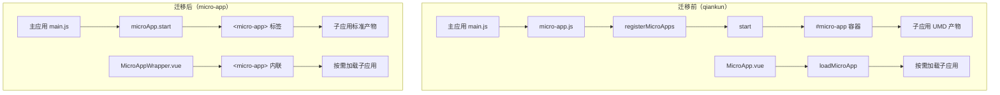
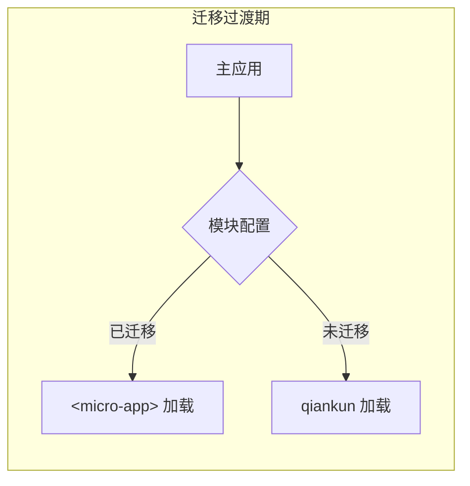
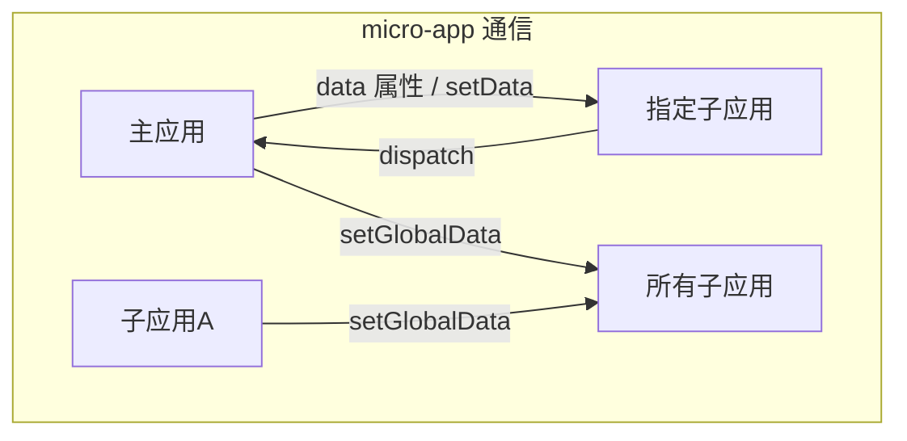

# 设计文档：微前端框架迁移（qiankun → micro-app）

## 概述

本设计将 MeterSphere 的微前端框架从 qiankun 2.9.3 迁移到京东 micro-app。迁移采用渐进式策略，支持 qiankun 和 micro-app 双模式并行，逐模块切换，最终完全移除 qiankun。

核心设计决策：
1. 使用 micro-app 的 WebComponent 标签模式（`<micro-app>`）替代 qiankun 的 `registerMicroApps` + `start`
2. 子应用采用 micro-app 的 **UMD 生命周期模式**（`window.mount` / `window.unmount`），适合 MeterSphere 频繁切换模块的场景，避免每次加载重复执行初始化代码
3. **明确区分「UMD 模式」与「UMD 打包格式」**：
   - **UMD 模式**（micro-app 概念）：指子应用将渲染/卸载逻辑放入 `window.mount` / `window.unmount` 函数，micro-app 在子应用渲染/卸载时调用这些函数，避免重复执行初始化代码
   - **UMD 打包格式**（webpack 概念）：指 webpack 的 `libraryTarget: 'umd'` 配置，将代码打包为 UMD 模块格式。**micro-app 不需要此配置**，必须移除
   - qiankun 同时要求两者（UMD 打包 + 生命周期导出），micro-app 只需要 UMD 生命周期模式，不需要 UMD 打包
4. 使用 micro-app 的 `data` 属性 + `dispatch` + `setGlobalData` 替代 qiankun 的 EventBus props 传递和 globalState
5. 保留子应用独立运行能力，通过环境检测（`window.__MICRO_APP_ENVIRONMENT__`）替代 `window.__POWERED_BY_QIANKUN__`
6. 渐进式迁移期间，主应用通过配置标记区分已迁移/未迁移模块
7. 主应用必须配置 `Vue.config.ignoredElements = ['micro-app']`，否则 Vue 2 会对未识别的自定义元素发出警告
8. **Vue 3 + Vite 子应用必须使用 `iframe` 沙箱**（`<micro-app iframe>`），因为 Vite 输出的 `<script type="module">` 无法被 with 沙箱拦截；Vue 2 + Webpack 子应用使用默认的 with 沙箱即可
9. 两种技术栈（Vue 2 + Webpack / Vue 3 + Vite）统一使用 `window.mount` / `window.unmount` 生命周期管理，差异仅在沙箱模式

## 架构

### 整体架构变更



### 渐进式迁移架构



迁移过渡期，主应用维护一个模块配置表：

```javascript
// micro-app-config.js
const MIGRATED_MODULES = {
  'analytics-stat':       { migrated: true, isViteApp: false },  // 第一个迁移的模块
  'workstation':          { migrated: false, isViteApp: false },
  'report-stat':          { migrated: false, isViteApp: false },
  'project-management':   { migrated: false, isViteApp: false },
  'system-setting':       { migrated: false, isViteApp: false },
  'test-track':           { migrated: false, isViteApp: false },
  'api-test':             { migrated: false, isViteApp: false },
  'performance-test':     { migrated: false, isViteApp: false },
  // 未来 Vue 3 + Vite 模块：isViteApp 设为 true，自动开启 iframe 沙箱
};
```

## 组件与接口

### 1. 主应用改造

#### 1.1 micro-app 初始化（替代 micro-app.js）

```javascript
// framework/sdk-parent/frontend/src/micro-app-setup.js
import microApp from '@micro-zoe/micro-app';
import Vue from 'vue';

// 【关键】Vue 2 必须忽略 micro-app 自定义元素，否则会报 Unknown custom element 警告
Vue.config.ignoredElements = ['micro-app'];

microApp.start({
  // 沙箱默认开启，无需显式配置 disable-sandbox: false
  // 【注意】不在全局设置 iframe: true，因为只有 Vite 子应用需要 iframe 沙箱
  // Vue 2 + Webpack 子应用使用默认的 with 沙箱即可
  // Vite 子应用通过 <micro-app iframe> 标签属性单独开启
  // 开启 fiber 模式：异步执行子应用 JS，减少主线程阻塞
  // MeterSphere 有 8 个子应用，fiber 模式可改善首屏性能
  fiber: true,
  // 全局生命周期
  lifeCycles: {
    created(e) {
      console.log('[micro-app] 子应用容器已创建', e.detail.name);
    },
    beforemount(e) {
      console.log('[micro-app] 子应用即将挂载', e.detail.name);
    },
    mounted(e) {
      console.log('[micro-app] 子应用已挂载', e.detail.name);
    },
    unmount(e) {
      console.log('[micro-app] 子应用已卸载', e.detail.name);
    },
    error(e) {
      console.error('[micro-app] 子应用加载出错', e.detail.name, e.detail.error);
    },
  },
});
```

#### 1.2 预加载策略

MeterSphere 用户频繁在模块间切换，利用 micro-app 的 `preFetch` API 在浏览器空闲时预加载子应用资源，提升切换体验：

```javascript
// framework/sdk-parent/frontend/src/micro-app-setup.js（续）
// 在获取服务列表后调用预加载
export function preFetchApps(services) {
  const apps = services
    .filter(svc => svc.serviceId !== 'gateway')
    .map(svc => ({
      name: svc.serviceId,
      url: getEntryUrl(svc),
    }));
  // 延迟 3 秒执行预加载，避免影响首屏渲染
  microApp.preFetch(apps, 3000);
}
```

#### 1.3 App.vue 子应用容器改造

将 `<div id="micro-app">` 替换为动态 `<micro-app>` 标签：

```vue
<template>
  <div id="app">
    <router-view/>
    <!-- micro-app 子应用容器（已迁移模块） -->
    <micro-app
      v-if="currentApp && currentApp.migrated"
      :name="currentApp.name"
      :url="currentApp.entry"
      :data="appData"
      :destroy="false"
      :fiber="true"
      :iframe="currentApp.isViteApp || false"
      @datachange="handleDataChange"
      @error="handleError"
    />
    <!-- qiankun 容器（未迁移模块，过渡期保留） -->
    <div v-if="currentApp && !currentApp.migrated" id="micro-app"></div>
  </div>
</template>
```

> 注意：
> - 全局路由激活的子应用不设置 `destroy`，利用 micro-app 的缓存机制加速重复加载。按需加载场景（MicroAppWrapper）才设置 `destroy=true`。
> - `iframe` 属性仅对 Vue 3 + Vite 子应用设置为 `true`，Vue 2 + Webpack 子应用使用默认的 with 沙箱（`iframe=false`）。
> - 模块配置表中通过 `isViteApp` 字段标识子应用的技术栈类型。

#### 1.4 MicroAppWrapper.vue（替代 MicroApp.vue）

按需加载组件，用于跨模块嵌入场景（如 test-track 中嵌入 API 报告）：

```vue
<template>
  <div class="micro-app-wrapper">
    <micro-app
      :name="appName"
      :url="appUrl"
      :data="appData"
      :iframe="isViteApp"
      destroy
      clear-data
      :fiber="true"
      @datachange="handleDataChange"
      @mounted="onMounted"
      @unmount="onUnmount"
      @error="onError"
    />
  </div>
</template>

<script>
import { MIGRATED_MODULES } from '@/micro-app-config';

export default {
  name: 'MicroAppWrapper',
  props: {
    to: String,        // 目标路由路径
    service: String,   // 服务名称
    routeParams: null, // 路由参数
    routeName: null,   // 路由名称
  },
  computed: {
    appName() {
      // micro-app 要求 name 全局唯一，以字母开头，仅允许字母、数字、中划线、下划线
      // 使用 service + Vue 实例 uid 确保多个 MicroAppWrapper 加载同一 service 时不冲突
      return `embed-${this.service}-${this._uid}`;
    },
    appUrl() {
      const microPorts = JSON.parse(sessionStorage.getItem('micro_ports'));
      if (process.env.NODE_ENV === 'development') {
        return `//127.0.0.1:${microPorts[this.service] - 4000}`;
      }
      return `${window.location.origin}/${this.service}`;
    },
    appData() {
      return {
        defaultPath: this.to,
        routeParams: this.routeParams,
        routeName: this.routeName,
      };
    },
    isViteApp() {
      // 根据模块配置表判断是否为 Vite 子应用，Vite 子应用必须开启 iframe 沙箱
      const config = MIGRATED_MODULES[this.service];
      return config && config.isViteApp || false;
    },
  },
  watch: {
    // 当路由参数变化时，通过 microApp.setData 更新子应用数据
    routeParams: {
      handler() { this.updateChildData(); },
      deep: true,
    },
    to() { this.updateChildData(); },
  },
  methods: {
    updateChildData() {
      // micro-app 的 data 属性是响应式的，Vue 的 computed 会自动触发更新
      // 但如果需要强制更新（数据值未变但需要重新触发），可使用 forceSetData
      // 这里依赖 Vue 的响应式即可
    },
    handleDataChange(e) {
      // e.detail.data 包含子应用通过 dispatch 发送的数据
      const data = e.detail.data;
      this.$emit('datachange', data);
    },
    onMounted() {
      this.$emit('mounted');
    },
    onUnmount() {
      this.$emit('unmount');
    },
    onError(e) {
      console.error('[MicroAppWrapper] 子应用加载失败:', this.service, e.detail.error);
      this.$emit('error', e.detail.error);
    },
  },
};
</script>
```

> 关键设计决策：
> - `destroy` 属性设为 true：按需加载场景下，组件销毁时强制清除缓存资源，避免内存泄漏
> - `clear-data` 属性：卸载时清空通讯缓存，防止下次加载时收到上一次的残留数据
> - `appName` 使用 `embed-` 前缀：与全局路由激活的子应用名称区分，避免 name 冲突（全局用 serviceId 如 `api-test`，嵌入用 `embed-api-test-42`）

### 2. 子应用改造

#### 2.1 main.js 改造模板（UMD 生命周期模式）

micro-app 推荐在频繁渲染/卸载场景下使用 UMD 生命周期模式。MeterSphere 的模块切换属于此场景，因此所有子应用统一采用 UMD 生命周期模式。

> **重要概念澄清**：这里的「UMD 模式」是 micro-app 的术语，指将渲染/卸载逻辑放入 `window.mount` / `window.unmount` 函数。这与 webpack 的 `libraryTarget: 'umd'`（UMD 打包格式）完全无关。micro-app 不需要 UMD 打包格式，必须移除 webpack 的 `libraryTarget: 'umd'` 配置。

UMD 生命周期模式的核心：将渲染逻辑放入 `window.mount`，卸载逻辑放入 `window.unmount`。非微前端环境直接调用 `window.mount()`。

**UMD 模式下的数据流**：
- **初始数据**：`window.mount(data)` 的 `data` 参数来自 `<micro-app>` 标签的 `data` 属性，micro-app 在调用 `window.mount` 时自动传入
- **后续数据更新**：通过 `window.microApp.addDataListener()` 监听主应用通过 `setData` 发送的数据变化
- 两种机制互补：mount 负责初始化数据，addDataListener 负责运行时动态更新

以 workstation 为例，展示改造后的 main.js：

```javascript
// workstation/frontend/src/main.js
import './public-path';  // 必须在最顶部引入
import Vue from 'vue';
import ElementUI from 'element-ui';
import App from './App.vue';
import i18n from './i18n';
import router from './router';
import { createPinia, PiniaVuePlugin } from 'pinia';
import PersistedState from 'pinia-plugin-persistedstate';
// ... 其他 import 保持不变 ...

Vue.config.productionTip = false;

// 【关键】Vue 插件注册放在 mount 外部，只执行一次
// 这是 UMD 生命周期模式的优势：避免重复注册插件
const pinia = createPinia();
pinia.use(PersistedState);

Vue.use(ElementUI, { i18n: (key, value) => i18n.t(key, value) });
Vue.use(PiniaVuePlugin);
// ... 其他 Vue.use 保持不变 ...

let instance = null;

// UMD 生命周期模式：渲染函数
// data 参数由 micro-app 自动传入，来源于 <micro-app :data="appData"> 的 data 属性
window.mount = (data) => {
  // 创建 EventBus（micro-app 环境下不再从 props 接收，自行创建）
  Vue.prototype.$EventBus = new Vue();

  instance = new Vue({
    i18n,
    router,
    pinia,
    render: (h) => h(App),
  }).$mount('#app');
};

// UMD 生命周期模式：卸载函数
window.unmount = () => {
  if (instance) {
    instance.$destroy();
    instance.$el.innerHTML = '';
    instance = null;
  }
};

// 非微前端环境直接渲染
if (!window.__MICRO_APP_ENVIRONMENT__) {
  window.mount();
}
```

对于含按需加载场景的子应用（如 api-test），mount 中需处理路由参数：

```javascript
// api-test/frontend/src/main.js（关键差异部分）
let instance = null;

// UMD 生命周期模式：渲染函数
// data 参数由 micro-app 自动传入，包含 defaultPath、routeParams、routeName 等
window.mount = (data) => {
  Vue.prototype.$EventBus = new Vue();

  // 根据是否有 defaultPath 决定使用哪个 router
  const useRouter = (data && (data.defaultPath || data.routeName)) ? microRouter : router;

  instance = new Vue({
    i18n,
    router: useRouter,
    pinia,
    render: (h) => h(App),
  }).$mount('#app');

  // 如果有目标路由，跳转到指定页面
  if (data && (data.defaultPath || data.routeName)) {
    microRouter.push({
      path: data.defaultPath,
      params: data.routeParams,
      name: data.routeName,
    });
  }
};

window.unmount = () => {
  if (instance) {
    instance.$destroy();
    instance.$el.innerHTML = '';
    instance = null;
  }
};

if (!window.__MICRO_APP_ENVIRONMENT__) {
  window.mount();
}

// 监听主应用数据变化（路由更新等）
// 用于按需加载场景下，主应用通过 setData 更新子应用路由
// 注意：这是对 window.mount(data) 初始数据的补充，处理运行时的动态数据更新
if (window.__MICRO_APP_ENVIRONMENT__) {
  window.microApp?.addDataListener((data) => {
    if (data && (data.defaultPath || data.routeName)) {
      const targetRouter = instance?.$router || microRouter;
      targetRouter.push({
        path: data.defaultPath,
        params: data.routeParams,
        name: data.routeName,
      });
    }
  });
}
```

> 注意：api-test 有多个 pages 入口（shareApiReport、shareDocument、apiDocument），这些入口不在微前端环境下运行，不受此改造影响。

#### 2.2 public-path.js 改造

```javascript
// 改造前（qiankun）
import { getApps } from 'metersphere-frontend/src/api/apps';

if (window.__POWERED_BY_QIANKUN__) {
  __webpack_public_path__ = window.__INJECTED_PUBLIC_PATH_BY_QIANKUN__;
}

if (!window.__POWERED_BY_QIANKUN__) {
  getApps().then(res => { /* ... */ });
}

// 改造后（micro-app）
import { getApps } from 'metersphere-frontend/src/api/apps';

if (window.__MICRO_APP_ENVIRONMENT__) {
  // micro-app 自动注入 __MICRO_APP_PUBLIC_PATH__
  __webpack_public_path__ = window.__MICRO_APP_PUBLIC_PATH__;
}

if (!window.__MICRO_APP_ENVIRONMENT__) {
  // 独立运行时，从网关获取服务列表（与原逻辑一致）
  getApps().then(res => {
    let modules = {}, microPorts = {};
    res.data.forEach(svc => {
      let name = svc.serviceId;
      modules[name] = true;
      microPorts[name] = svc.port;
    });
    sessionStorage.setItem('micro_apps', JSON.stringify(modules));
    sessionStorage.setItem('micro_ports', JSON.stringify(microPorts));
  });
}
```

#### 2.3 vue.config.js 改造

```javascript
// 改造前（qiankun 要求 UMD 打包格式）
configureWebpack: {
  output: {
    library: `${name}-[name]`,
    libraryTarget: 'umd',           // ← qiankun 要求的 UMD 打包格式
    chunkLoadingGlobal: `webpackJsonp_${name}`,
    filename: `js/${name}-[name].[contenthash:8].js`,
    chunkFilename: `js/${name}-[name].[contenthash:8].js`,
  }
}

// 改造后（micro-app 不需要 UMD 打包格式）
// 注意：移除的是 webpack 的 UMD 打包配置（library + libraryTarget）
// 保留的是 micro-app 的 UMD 生命周期模式（window.mount / window.unmount，在 main.js 中实现）
// 两者是完全不同的概念
configureWebpack: {
  output: {
    // 移除 library 和 libraryTarget（micro-app 不需要 UMD 打包格式）
    chunkLoadingGlobal: `webpackJsonp_${name}`,  // 保留，避免多应用 chunk 冲突
    globalObject: 'window',  // 【新增】确保全局对象指向 window，micro-app 指南推荐
    filename: `js/${name}-[name].[contenthash:8].js`,
    chunkFilename: `js/${name}-[name].[contenthash:8].js`,
  }
}
```

CORS 头配置保持不变（开发环境仍需跨域）：
```javascript
devServer: {
  headers: {
    'Access-Control-Allow-Origin': '*',
  }
}
```

### 3. 跨应用通信改造

#### 3.1 通信架构



micro-app 提供两种通信机制：
1. **绑定式通信**：主应用 ↔ 指定子应用（`data` 属性 / `setData` / `dispatch`）
2. **全局通信**：广播到所有应用（`setGlobalData` / `addGlobalDataListener`）

#### 3.2 主应用 → 指定子应用

```javascript
// 方式1：通过 data 属性（Vue 响应式，推荐用于初始数据和路由参数）
// 在 UMD 生命周期模式下，data 属性的值会作为 window.mount(data) 的参数传入
// 后续 data 属性变化时，会触发子应用的 addDataListener 回调
<micro-app
  :name="appName"
  :url="appUrl"
  :data="{ defaultPath: '/some-page', routeParams: { id: 123 } }"
/>

// 方式2：通过 setData（命令式，推荐用于运行时动态更新）
// 子应用通过 addDataListener 接收，不会重新触发 window.mount
import microApp from '@micro-zoe/micro-app';
microApp.setData('api-test', { event: 'routeUpdate', path: '/new-page' });

// 方式3：强制发送（数据值未变但需要重新触发时使用）
microApp.forceSetData('api-test', { event: 'refresh' });
```

#### 3.3 子应用 → 主应用

```javascript
// 子应用通过 dispatch 发送数据到主应用
// 注意：dispatch 只接受对象参数，且是异步执行
if (window.__MICRO_APP_ENVIRONMENT__) {
  window.microApp.dispatch({ type: 'projectChange', payload: { projectId } });
}

// 如果数据未变但需要重新发送，使用 forceDispatch
window.microApp.forceDispatch({ type: 'refresh' });
```

#### 3.4 全局广播（替代遍历 EventBus）

qiankun 时代，项目切换等全局事件需要遍历所有子应用的 EventBus 逐个通知。micro-app 提供 `setGlobalData` 一次性广播到所有应用：

```javascript
// 主应用广播全局事件（如项目切换、工作空间切换）
import microApp from '@micro-zoe/micro-app';

function broadcastEvent(eventData) {
  // setGlobalData 会通知所有已注册 globalDataListener 的子应用
  microApp.setGlobalData(eventData);
}

// 使用示例
broadcastEvent({ type: 'projectChange', projectId: 'xxx' });
broadcastEvent({ type: 'changeWs', workspaceId: 'xxx' });
```

```javascript
// 子应用监听全局数据
if (window.__MICRO_APP_ENVIRONMENT__) {
  window.microApp.addGlobalDataListener((data) => {
    if (data.type === 'projectChange') {
      // 处理项目切换
    }
    if (data.type === 'changeWs') {
      // 处理工作空间切换
    }
  });
}
```

#### 3.5 EventBus 兼容适配器

为减少子应用内部改动，提供一个 EventBus 兼容适配器。子应用内部的 `$EventBus.$emit` / `$on` 继续工作，跨应用事件通过 micro-app 通信桥接：

```javascript
// framework/sdk-parent/frontend/src/utils/micro-app-event-bus.js
import Vue from 'vue';

/**
 * 创建兼容 EventBus 的适配器
 * - 子应用内部的 $EventBus.$emit / $on 继续工作（本地事件）
 * - micro-app 传来的数据转发到本地 EventBus（跨应用 → 本地）
 * - 本地 EventBus 的跨应用事件通过 dispatch 发送到主应用（本地 → 跨应用）
 */
export function createEventBusAdapter() {
  const localBus = new Vue();

  if (window.__MICRO_APP_ENVIRONMENT__) {
    // 监听主应用通过 data 属性 / setData 传来的数据
    window.microApp?.addDataListener((data) => {
      if (data.eventType && data.eventName) {
        localBus.$emit(data.eventName, data.payload);
      }
    });

    // 监听全局广播数据
    window.microApp?.addGlobalDataListener((data) => {
      if (data.eventType && data.eventName) {
        localBus.$emit(data.eventName, data.payload);
      }
    });
  }

  return localBus;
}
```

### 4. 路由机制

#### 4.1 路由模式选择

MeterSphere 使用 hash 路由。micro-app 默认的虚拟路由系统（search 模式）会将子应用路由信息作为 query 参数追加到浏览器地址栏，如 `?micro-app-api-test=%2Fpage1`。

对于 MeterSphere 的场景，建议使用 `native` 模式或保持默认 `search` 模式：
- `search` 模式（默认）：子应用路由与主应用路由完全隔离，互不干扰，最安全
- `native` 模式：子应用直接操作浏览器路由，地址更简洁，但需要确保主子应用路由不冲突

考虑到 MeterSphere 当前 qiankun 方案下子应用已经直接操作 hash 路由，为减少迁移风险，建议先使用默认 `search` 模式，后续根据需要再切换。

#### 4.2 当前 qiankun 路由激活 → micro-app 路由控制

qiankun 使用 `activeRule` 基于 hash 前缀匹配：
```javascript
activeRule: (location) => location.hash.startsWith('#/' + name)
```

micro-app 不需要 activeRule，通过主应用的 Vue Router 控制 `<micro-app>` 标签的显示/隐藏：

```javascript
// 主应用路由配置
{
  path: '/:module(.*)',
  component: MicroAppContainer,
  // MicroAppContainer 根据 $route.params.module 决定加载哪个子应用
}
```

```vue
<!-- MicroAppContainer.vue -->
<template>
  <micro-app
    v-if="moduleName"
    :name="moduleName"
    :url="moduleUrl"
    :data="moduleData"
    @datachange="handleDataChange"
    @error="handleError"
  />
</template>
```

#### 4.3 主应用控制子应用路由跳转

micro-app 提供 `microApp.router.push` API，可从主应用控制子应用的路由跳转：

```javascript
import microApp from '@micro-zoe/micro-app';

// 控制子应用跳转到指定页面
microApp.router.push({ name: 'api-test', path: '/api/definition' });
```

## 数据模型

### Vue 3 + Vite 子应用接入方案（需求 8）

为支持未来 Vue 3 + Vite 子应用的渐进式接入，设计如下方案：

#### 沙箱模式选择

| 子应用技术栈 | 沙箱模式 | 原因 |
|-------------|---------|------|
| Vue 2 + Webpack（现有 8 个模块） | with 沙箱（默认） | Webpack 输出标准 JS，with 沙箱可正常拦截 |
| Vue 3 + Vite（未来新模块） | iframe 沙箱（`<micro-app iframe>`） | Vite 输出 `<script type="module">`，with 沙箱无法拦截 module 类型脚本 |

#### Vite 子应用特殊处理

1. **必须开启 iframe 沙箱**：在 `<micro-app>` 标签上设置 `iframe` 属性
2. **location 替换**：Vite 子应用中涉及路由的 `location` 操作需替换为 `window.microApp.location`，因为 iframe 沙箱中 `location` 指向 iframe 的地址而非浏览器地址
3. **生命周期一致**：Vite 子应用同样使用 `window.mount` / `window.unmount` 生命周期模式（这只是全局变量赋值，与打包格式无关，ES Module 输出完全兼容）
4. **预加载配置**：Vite 子应用预加载时也需设置 `iframe: true`

```javascript
// Vite 子应用的 main.js 示例（Vue 3 + Vite）
import { createApp } from 'vue';
import App from './App.vue';
import router from './router';

let app = null;

// 同样使用 window.mount / window.unmount，与 Vue 2 子应用一致
window.mount = (data) => {
  app = createApp(App);
  app.use(router);
  app.mount('#app');

  if (data && data.defaultPath) {
    router.push(data.defaultPath);
  }
};

window.unmount = () => {
  if (app) {
    app.unmount();
    app = null;
  }
};

if (!window.__MICRO_APP_ENVIRONMENT__) {
  window.mount();
}

// 路由相关操作使用 microApp.location 替代原生 location
if (window.__MICRO_APP_ENVIRONMENT__) {
  // window.microApp.location.pathname 替代 window.location.pathname
  // window.microApp.location.href 替代 window.location.href
  window.microApp?.addDataListener((data) => {
    if (data && data.defaultPath) {
      router.push(data.defaultPath);
    }
  });
}
```

#### 预加载配置更新

```javascript
// micro-app-setup.js 中的预加载需区分 Vite 子应用
export function preFetchApps(services) {
  const apps = services
    .filter(svc => svc.serviceId !== 'gateway')
    .map(svc => ({
      name: svc.serviceId,
      url: getEntryUrl(svc),
      // Vite 子应用预加载时也需设置 iframe
      ...(MIGRATED_MODULES[svc.serviceId]?.isViteApp ? { iframe: true } : {}),
    }));
  microApp.preFetch(apps, 3000);
}
```

### 模块配置数据结构

```typescript
interface MicroAppModuleConfig {
  name: string;           // 模块名称（serviceId）
  entry: string;          // 入口 URL
  migrated: boolean;      // 是否已迁移到 micro-app
  isViteApp: boolean;     // 是否为 Vue 3 + Vite 子应用（决定是否使用 iframe 沙箱）
  activeRule: string;     // hash 路由前缀（qiankun 过渡期使用）
}
```

模块配置表示例：
```javascript
// micro-app-config.js
const MIGRATED_MODULES = {
  'analytics-stat': { migrated: true, isViteApp: false },   // Vue 2 + Webpack，with 沙箱
  'workstation':    { migrated: false, isViteApp: false },
  'report-stat':    { migrated: false, isViteApp: false },
  // ... 其他模块
  // 未来 Vue 3 + Vite 模块示例：
  // 'new-module':  { migrated: true, isViteApp: true },    // Vue 3 + Vite，iframe 沙箱
};
```

interface MicroAppData {
  defaultPath?: string;   // 目标路由路径
  routeParams?: object;   // 路由参数
  routeName?: string;     // 路由名称
}

// 全局广播数据格式
interface GlobalEventData {
  type: string;           // 事件类型：'projectChange' | 'changeWs' | ...
  [key: string]: any;     // 事件数据
}

// EventBus 兼容层数据格式（通过 setData 传递）
interface EventBusData {
  eventType: string;      // 固定标识，表示这是一个 EventBus 事件
  eventName: string;      // 事件名称
  payload?: any;          // 事件数据
}
```

### 服务列表数据（来自 GET /services）

```typescript
interface ServiceInfo {
  serviceId: string;  // 如 'api-test', 'test-track'
  port: number;       // 后端端口，如 8004
}
// 前端端口约定：port - 4000
```


## 正确性属性

*正确性属性是一种在系统所有有效执行中都应成立的特征或行为——本质上是关于系统应该做什么的形式化陈述。属性作为人类可读规范和机器可验证正确性保证之间的桥梁。*

### Property 1: 服务列表到 micro-app 标签映射

*For any* 从网关返回的服务列表（包含任意数量的 ServiceInfo 对象），主应用为每个非 gateway 服务创建的 `<micro-app>` 配置数量应等于服务列表中非 gateway 条目数，且每个配置的 `name` 应等于 serviceId，`url` 应根据环境正确计算（开发环境：`//127.0.0.1:{port-4000}`，生产环境：`{origin}/{serviceId}`）。

**Validates: Requirements 1.2**

### Property 2: 主应用到子应用数据传递完整性

*For any* 数据对象（包含 defaultPath、routeParams、routeName 等字段），通过 micro-app 的 `data` 属性或 `setData` 传递给子应用后，子应用通过 `window.microApp.getData()` 获取的数据应与传入数据等价。

**Validates: Requirements 3.3, 4.1**

### Property 3: 子应用到主应用数据传递完整性

*For any* 子应用通过 `window.microApp.dispatch()` 发送的数据对象，主应用通过 `@datachange` 事件（`e.detail.data`）接收到的数据应与发送数据等价。

**Validates: Requirements 4.2**

### Property 4: 全局广播覆盖率

*For any* 已加载的子应用集合（数量 ≥ 1），当主应用通过 `microApp.setGlobalData()` 广播事件时，每个子应用注册的 `addGlobalDataListener` 回调都应收到该事件数据。

**Validates: Requirements 4.3**

### Property 5: publicPath 资源路径正确性

*For any* 子应用在 micro-app 环境下运行时（`window.__MICRO_APP_ENVIRONMENT__` 为 true），`__webpack_public_path__` 的值应等于 `window.__MICRO_APP_PUBLIC_PATH__`，确保所有静态资源请求使用正确的基础路径。

**Validates: Requirements 5.4**

### Property 6: 双模式并行加载与回退

*For any* 模块配置表（每个模块标记为 migrated 或未 migrated），主应用对标记为 migrated 的模块应使用 micro-app 加载，对标记为未 migrated 的模块应使用 qiankun 加载。将任意已迁移模块的标记改回未迁移后，该模块应能通过 qiankun 正常加载。

**Validates: Requirements 6.1, 6.4**

### Property 7: 模块切换正确性与资源释放

*For any* 模块切换序列（长度 ≥ 2），每次切换后当前活跃的子应用应仅为最后切换到的模块，之前的模块实例应已被卸载（unmount 事件已触发）。

**Validates: Requirements 3.2, 7.4**

### Property 8: 页面刷新后状态恢复

*For any* 模块和路由组合（moduleId + routePath），在该状态下刷新页面后，主应用应重新加载相同的模块，且子应用的路由应恢复到刷新前的路径。

**Validates: Requirements 7.5**

### Property 9: iframe 沙箱模式选择正确性

*For any* 模块配置表中标记为 `isViteApp: true` 的模块，主应用生成的 `<micro-app>` 标签应包含 `iframe` 属性；标记为 `isViteApp: false` 的模块，`<micro-app>` 标签不应包含 `iframe` 属性（使用默认 with 沙箱）。

**Validates: Requirements 8.1, 8.2**

## 错误处理

### 子应用加载失败

- micro-app 提供 `error` 生命周期回调，当子应用加载失败时触发
- 主应用应在 `<micro-app>` 标签上监听 `@error` 事件
- 加载失败时显示友好的错误提示，并提供重试按钮（可通过 `microApp.reload(name)` 重新加载）
- 记录错误日志到控制台，包含子应用名称和错误详情

### 子应用渲染异常

- 子应用内部错误不应影响主应用和其他子应用（micro-app 沙箱隔离）
- 子应用应使用 Vue 的 `errorHandler` 捕获渲染异常
- 异常信息通过 `dispatch` 上报给主应用

### 沙箱兼容问题

- micro-app 沙箱中顶层变量不会泄漏为全局变量（`var xx` 不等于 `window.xx`）
- 如果子应用出现 `xxx is not defined` 错误，需要将 `var xx =` 改为 `window.xx =`
- 可通过 micro-app 的插件系统批量修改：
  ```javascript
  microApp.start({
    plugins: {
      modules: {
        '应用名称': [{
          loader(code, url) {
            if (url === 'xxx.js') {
              code = code.replace('var xx_dll=', 'window.xx_dll=');
            }
            return code;
          }
        }]
      }
    }
  });
  ```

### 通信数据丢失

- `dispatch` 是异步执行的，多次调用会合并。如果需要确保每次都触发，使用 `forceDispatch`
- 主应用向子应用传递数据时，如果子应用尚未挂载完成，数据会在挂载后自动传递（micro-app 内置机制）
- 子应用 dispatch 到主应用时，如果主应用未监听，数据会被丢弃（需在主应用侧确保监听器已注册）

### 渐进式迁移期间的兼容错误

- 如果模块配置表中标记错误（已迁移模块标记为未迁移或反之），可能导致加载失败
- 主应用应在加载失败时自动尝试另一种加载方式作为降级策略

### 资源路径错误

- 如果 `__MICRO_APP_PUBLIC_PATH__` 未正确注入，子应用的静态资源会 404
- public-path.js 应包含降级逻辑：如果 micro-app 环境变量不存在，使用默认的 `/` 路径

## 测试策略

### 测试框架选择

- 单元测试：Jest（与现有项目一致）
- 属性测试：fast-check（JavaScript 生态最成熟的属性测试库）
- 集成测试：手动测试（跨模块加载场景）

### 单元测试

1. 模块配置解析：验证服务列表到 micro-app 配置的转换逻辑
2. EventBus 适配器：验证事件转发和监听的正确性
3. 路由激活逻辑：验证 hash 路由到模块名的映射
4. public-path 设置：验证不同环境下的 publicPath 计算
5. 全局广播函数：验证 broadcastEvent 调用 setGlobalData 的正确性

### 属性测试

使用 fast-check 库，每个属性测试运行至少 100 次迭代。

每个属性测试必须用注释标注对应的设计文档属性：
- 格式：`// Feature: micro-frontend-migration, Property N: {property_text}`

属性测试覆盖：
- Property 1: 服务列表映射（生成随机服务列表，验证配置生成）
- Property 2: 数据传递完整性（生成随机数据对象，验证传递后等价）
- Property 3: dispatch 数据完整性（生成随机数据对象，验证接收后等价）
- Property 4: 广播覆盖率（生成随机子应用集合，验证全部收到）
- Property 5: publicPath 正确性（生成随机路径，验证设置正确）
- Property 6: 双模式加载选择（生成随机配置表，验证加载方式正确）
- Property 7: 切换序列正确性（生成随机切换序列，验证资源释放）
- Property 8: 刷新恢复（生成随机模块+路由，验证恢复正确）
- Property 9: iframe 沙箱选择（生成随机配置表含 isViteApp 标记，验证 iframe 属性设置正确）

### 集成测试（手动）

1. 逐模块验证：每个子应用迁移后，手动验证核心功能
2. 跨模块嵌入：验证 test-track 中嵌入 API 报告等场景
3. 快速切换：在模块间快速切换，观察是否有白屏或内存泄漏
4. 刷新恢复：在各模块的不同页面刷新，验证状态恢复
5. Vue 2 + Vue 3 混合：验证未来 Vue 3 模块的共存能力

### 迁移验证清单

每个子应用迁移后需通过以下检查：
- [ ] 子应用在 micro-app 环境下正常加载
- [ ] 子应用独立运行模式正常
- [ ] 跨模块嵌入场景正常（如适用）
- [ ] EventBus 事件传递正常
- [ ] 路由导航和参数传递正常
- [ ] 静态资源加载正常（无 404）
- [ ] 构建产物大小无异常增长
