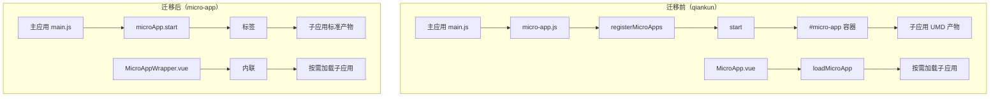
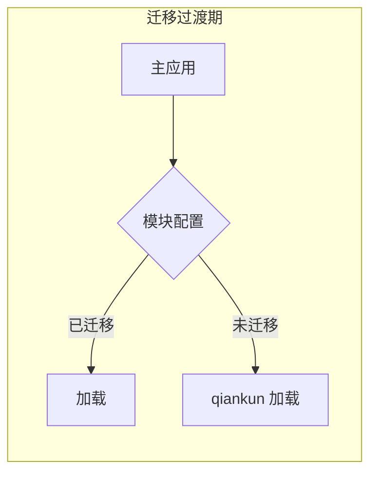
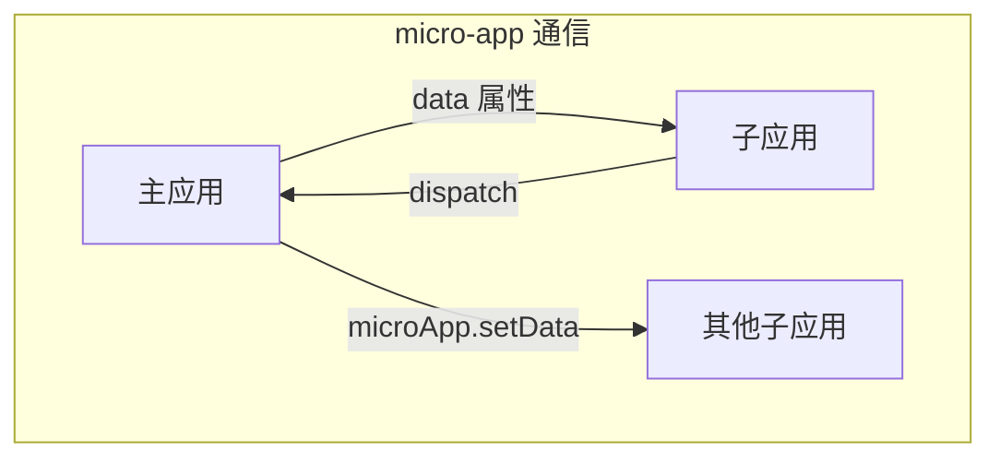

# 设计文档：微前端框架迁移（qiankun → micro-app）

## 概述

本设计将 MeterSphere 的微前端框架从 qiankun 2.9.3 迁移到京东 micro-app。迁移采用渐进式策略，支持 qiankun 和 micro-app 双模式并行，逐模块切换，最终完全移除 qiankun。

核心设计决策：
1. 使用 micro-app 的 WebComponent 标签模式（`<micro-app>`）替代 qiankun 的 `registerMicroApps` + `start`
2. 使用 micro-app 的 `data` 属性 + `dispatch` 替代 qiankun 的 EventBus props 传递和 globalState
3. 保留子应用独立运行能力，通过环境检测（`window.__MICRO_APP_ENVIRONMENT__`）替代 `window.__POWERED_BY_QIANKUN__`
4. 渐进式迁移期间，主应用通过配置标记区分已迁移/未迁移模块

## 架构

### 整体架构变更



### 渐进式迁移架构



迁移过渡期，主应用维护一个模块配置表：

```javascript
// micro-app-config.js
const MIGRATED_MODULES = {
  'analytics-stat': true,   // 第一个迁移的模块
  'workstation': false,
  'report-stat': false,
  'project-management': false,
  'system-setting': false,
  'test-track': false,
  'api-test': false,
  'performance-test': false,
};
```

## 组件与接口

### 1. 主应用改造

#### 1.1 micro-app 初始化（替代 micro-app.js）

```javascript
// framework/sdk-parent/frontend/src/micro-app-setup.js
import microApp from '@micro-zoe/micro-app';

microApp.start({
  // 沙箱配置
  'disable-sandbox': false,
  // 全局生命周期
  lifeCycles: {
    created() {
      console.log('[micro-app] 子应用容器已创建');
    },
    beforemount() {
      console.log('[micro-app] 子应用即将挂载');
    },
    mounted() {
      console.log('[micro-app] 子应用已挂载');
    },
    unmount() {
      console.log('[micro-app] 子应用已卸载');
    },
    error() {
      console.log('[micro-app] 子应用加载出错');
    },
  },
});
```

#### 1.2 App.vue 子应用容器改造

将 `<div id="micro-app">` 替换为动态 `<micro-app>` 标签：

```vue
<template>
  <div id="app">
    <router-view/>
    <!-- micro-app 子应用容器 -->
    <micro-app
      v-if="currentApp"
      :name="currentApp.name"
      :url="currentApp.entry"
      :data="appData"
      @datachange="handleDataChange"
    />
  </div>
</template>
```

#### 1.3 MicroAppWrapper.vue（替代 MicroApp.vue）

按需加载组件，用于跨模块嵌入场景：

```vue
<template>
  <div class="micro-app-wrapper">
    <micro-app
      :name="appName"
      :url="appUrl"
      :data="appData"
      @datachange="handleDataChange"
      @mounted="onMounted"
      @unmount="onUnmount"
    />
  </div>
</template>

<script>
export default {
  name: 'MicroAppWrapper',
  props: {
    to: String,        // 目标路由路径
    service: String,   // 服务名称
    routeParams: null, // 路由参数
    routeName: null,   // 路由名称
  },
  computed: {
    appName() {
      // micro-app 要求每个实例 name 唯一
      return `micro-${this.service}-${this._uid}`;
    },
    appUrl() {
      const microPorts = JSON.parse(sessionStorage.getItem('micro_ports'));
      if (process.env.NODE_ENV === 'development') {
        return `//127.0.0.1:${microPorts[this.service] - 4000}`;
      }
      return `${window.location.origin}/${this.service}`;
    },
    appData() {
      return {
        defaultPath: this.to,
        routeParams: this.routeParams,
        routeName: this.routeName,
      };
    },
  },
  methods: {
    handleDataChange(e) {
      // 处理子应用发送的数据
      const data = e.detail.data;
      this.$emit('datachange', data);
    },
    onMounted() {},
    onUnmount() {},
  },
};
</script>
```

### 2. 子应用改造

#### 2.1 main.js 改造模板

以 api-test 为例，展示改造前后对比：

**改造后的 main.js：**

```javascript
import './public-path';  // 保留，但内容改造
import Vue from 'vue';
// ... 其他 import 保持不变 ...

let instance = null;

function render(props = {}) {
  const { container, defaultPath, routeParams, routeName } = props;
  
  // 事件总线：从 micro-app 的 data 中获取，或创建新的
  Vue.prototype.$EventBus = new Vue();
  
  instance = new Vue({
    i18n,
    router: defaultPath || routeName ? microRouter : router,
    pinia,
    render: (h) => h(App),
  }).$mount(container ? container.querySelector('#app') : '#app');

  if (defaultPath || routeName) {
    microRouter.push({ path: defaultPath, params: routeParams, name: routeName });
  }
}

// 独立运行时
if (!window.__MICRO_APP_ENVIRONMENT__) {
  render();
}

// micro-app 生命周期 - 通过 window 监听
// mount: micro-app 会自动执行入口 JS，无需显式 mount
// unmount: 监听卸载事件
window.addEventListener('unmount', () => {
  if (instance) {
    instance.$destroy();
    instance.$el.innerHTML = '';
    instance = null;
  }
});

// 监听主应用数据变化（路由更新等）
window.microApp?.addDataListener((data) => {
  if (data.defaultPath || data.routeName) {
    const targetRouter = instance?.$router || microRouter;
    targetRouter.push({
      path: data.defaultPath,
      params: data.routeParams,
      name: data.routeName,
    });
  }
});
```

#### 2.2 public-path.js 改造

```javascript
// 改造前（qiankun）
if (window.__POWERED_BY_QIANKUN__) {
  __webpack_public_path__ = window.__INJECTED_PUBLIC_PATH_BY_QIANKUN__;
}

// 改造后（micro-app）
if (window.__MICRO_APP_ENVIRONMENT__) {
  __webpack_public_path__ = window.__MICRO_APP_PUBLIC_PATH__;
}
```

#### 2.3 vue.config.js 改造

移除 UMD 相关配置：

```javascript
// 改造前
output: {
  library: `${name}-[name]`,
  libraryTarget: 'umd',
  chunkLoadingGlobal: `webpackJsonp_${name}`,
  filename: `js/${name}-[name].[contenthash:8].js`,
  chunkFilename: `js/${name}-[name].[contenthash:8].js`,
}

// 改造后
output: {
  // 移除 library 和 libraryTarget（micro-app 不需要 UMD）
  chunkLoadingGlobal: `webpackJsonp_${name}`,  // 保留，避免多应用 chunk 冲突
  filename: `js/${name}-[name].[contenthash:8].js`,
  chunkFilename: `js/${name}-[name].[contenthash:8].js`,
}
```

CORS 头配置保持不变（开发环境仍需跨域）。

### 3. 跨应用通信改造

#### 3.1 通信架构



#### 3.2 主应用 → 子应用（data 属性）

```javascript
// 主应用通过 data 属性传递数据
<micro-app
  :name="appName"
  :url="appUrl"
  :data="{ event: 'projectChange', projectId: currentProjectId }"
/>
```

#### 3.3 子应用 → 主应用（dispatch）

```javascript
// 子应用发送数据到主应用
if (window.__MICRO_APP_ENVIRONMENT__) {
  window.microApp.dispatch({ type: 'projectChange', payload: { projectId } });
}
```

#### 3.4 EventBus 兼容层

为减少子应用内部改动，提供一个 EventBus 兼容适配器：

```javascript
// framework/sdk-parent/frontend/src/utils/micro-app-event-bus.js
import Vue from 'vue';

/**
 * 创建兼容 EventBus 的适配器
 * 子应用内部的 $EventBus.$emit / $on 继续工作
 * 跨应用事件通过 micro-app 的 dispatch 桥接
 */
export function createEventBusAdapter() {
  const localBus = new Vue();
  
  // 监听 micro-app 传来的事件，转发到本地 EventBus
  if (window.__MICRO_APP_ENVIRONMENT__) {
    window.microApp?.addDataListener((data) => {
      if (data.eventType && data.eventName) {
        localBus.$emit(data.eventName, data.payload);
      }
    });
  }
  
  return localBus;
}
```

### 4. 路由激活机制

#### 4.1 当前 qiankun 路由激活

qiankun 使用 `activeRule` 基于 hash 前缀匹配：
```javascript
activeRule: (location) => location.hash.startsWith('#/' + name)
```

#### 4.2 micro-app 路由激活

micro-app 不需要 activeRule，通过主应用的 Vue Router 控制 `<micro-app>` 标签的显示/隐藏：

```javascript
// 主应用路由配置
{
  path: '/:module(.*)',
  component: MicroAppContainer,
  // MicroAppContainer 根据 $route.params.module 决定加载哪个子应用
}
```

```vue
<!-- MicroAppContainer.vue -->
<template>
  <micro-app
    v-if="moduleName"
    :name="moduleName"
    :url="moduleUrl"
    :data="moduleData"
  />
</template>
```

## 数据模型

### 模块配置数据结构

```typescript
interface MicroAppModuleConfig {
  name: string;           // 模块名称（serviceId）
  entry: string;          // 入口 URL
  migrated: boolean;      // 是否已迁移到 micro-app
  activeRule: string;     // hash 路由前缀
}

interface MicroAppData {
  defaultPath?: string;   // 目标路由路径
  routeParams?: object;   // 路由参数
  routeName?: string;     // 路由名称
  eventType?: string;     // 事件类型标识
  eventName?: string;     // 事件名称
  payload?: any;          // 事件数据
}
```

### 服务列表数据（来自 GET /services）

```typescript
interface ServiceInfo {
  serviceId: string;  // 如 'api-test', 'test-track'
  port: number;       // 后端端口，如 8004
}
// 前端端口约定：port - 4000
```


## 正确性属性

*正确性属性是一种在系统所有有效执行中都应成立的特征或行为——本质上是关于系统应该做什么的形式化陈述。属性作为人类可读规范和机器可验证正确性保证之间的桥梁。*

### Property 1: 服务列表到 micro-app 标签映射

*For any* 从网关返回的服务列表，主应用为每个非 gateway 服务创建的 `<micro-app>` 标签数量应等于服务列表长度减去 gateway 条目数，且每个标签的 `name` 和 `url` 属性应与对应服务的 serviceId 和端口计算结果一致。

**Validates: Requirements 1.2**

### Property 2: 主应用到子应用数据传递

*For any* 数据对象（包含 defaultPath、routeParams、routeName 等字段），通过 micro-app 的 `data` 属性传递给子应用后，子应用通过 `window.microApp.getData()` 获取的数据应与传入数据等价。

**Validates: Requirements 3.3, 4.1**

### Property 3: 子应用到主应用数据传递

*For any* 子应用通过 `window.microApp.dispatch()` 发送的数据对象，主应用通过 `@datachange` 事件接收到的数据应与发送数据等价。

**Validates: Requirements 4.2**

### Property 4: 事件广播到所有子应用

*For any* 已加载的子应用集合（数量 ≥ 1），当主应用通过 `microApp.setData()` 向每个子应用广播事件时，每个子应用的 dataListener 都应收到该事件数据。

**Validates: Requirements 4.3**

### Property 5: publicPath 资源路径正确性

*For any* 子应用在 micro-app 环境下运行时，`__webpack_public_path__` 的值应等于 `window.__MICRO_APP_PUBLIC_PATH__`，确保所有静态资源请求使用正确的基础路径。

**Validates: Requirements 5.4**

### Property 6: 双模式并行加载与回退

*For any* 模块配置表（每个模块标记为 migrated 或未 migrated），主应用对标记为 migrated 的模块应使用 micro-app 加载，对标记为未 migrated 的模块应使用 qiankun 加载。将任意已迁移模块的标记改回未迁移后，该模块应能通过 qiankun 正常加载。

**Validates: Requirements 6.1, 6.4**

### Property 7: 模块切换正确性与资源释放

*For any* 模块切换序列（长度 ≥ 2），每次切换后当前活跃的子应用应仅为最后切换到的模块，之前的模块实例应已被卸载（unmount 事件已触发）。

**Validates: Requirements 3.2, 7.4**

### Property 8: 页面刷新后状态恢复

*For any* 模块和路由组合（moduleId + routePath），在该状态下刷新页面后，主应用应重新加载相同的模块，且子应用的路由应恢复到刷新前的路径。

**Validates: Requirements 7.5**

## 错误处理

### 子应用加载失败

- micro-app 提供 `error` 生命周期回调，当子应用加载失败时触发
- 主应用应在 `<micro-app>` 标签上监听 `@error` 事件
- 加载失败时显示友好的错误提示，并提供重试按钮
- 记录错误日志到控制台，包含子应用名称和错误详情

### 子应用渲染异常

- 子应用内部错误不应影响主应用和其他子应用（micro-app 沙箱隔离）
- 子应用应使用 Vue 的 `errorHandler` 捕获渲染异常
- 异常信息通过 `dispatch` 上报给主应用

### 通信超时

- 主应用向子应用传递数据时，如果子应用尚未挂载完成，数据会在挂载后自动传递（micro-app 内置机制）
- 子应用 dispatch 到主应用时，如果主应用未监听，数据会被丢弃（需在主应用侧确保监听器已注册）

### 渐进式迁移期间的兼容错误

- 如果模块配置表中标记错误（已迁移模块标记为未迁移或反之），可能导致加载失败
- 主应用应在加载失败时自动尝试另一种加载方式作为降级策略

### 资源路径错误

- 如果 `__MICRO_APP_PUBLIC_PATH__` 未正确注入，子应用的静态资源会 404
- public-path.js 应包含降级逻辑：如果 micro-app 环境变量不存在，使用默认的 `/` 路径

## 测试策略

### 测试框架选择

- 单元测试：Jest（与现有项目一致）
- 属性测试：fast-check（JavaScript 生态最成熟的属性测试库）
- 集成测试：Cypress 或手动测试（跨模块加载场景）

### 单元测试

1. 模块配置解析：验证服务列表到 micro-app 配置的转换逻辑
2. EventBus 适配器：验证事件转发和监听的正确性
3. 路由激活逻辑：验证 hash 路由到模块名的映射
4. public-path 设置：验证不同环境下的 publicPath 计算

### 属性测试

使用 fast-check 库，每个属性测试运行至少 100 次迭代。

每个属性测试必须用注释标注对应的设计文档属性：
- 格式：`// Feature: micro-frontend-migration, Property N: {property_text}`

属性测试覆盖：
- Property 1: 服务列表映射（生成随机服务列表，验证标签生成）
- Property 2: 数据传递完整性（生成随机数据对象，验证传递后等价）
- Property 3: dispatch 数据完整性（生成随机数据对象，验证接收后等价）
- Property 4: 广播覆盖率（生成随机子应用集合，验证全部收到）
- Property 5: publicPath 正确性（生成随机路径，验证设置正确）
- Property 6: 双模式加载选择（生成随机配置表，验证加载方式正确）
- Property 7: 切换序列正确性（生成随机切换序列，验证资源释放）
- Property 8: 刷新恢复（生成随机模块+路由，验证恢复正确）

### 集成测试（手动）

1. 逐模块验证：每个子应用迁移后，手动验证核心功能
2. 跨模块嵌入：验证 test-track 中嵌入 API 报告等场景
3. 快速切换：在模块间快速切换，观察是否有白屏或内存泄漏
4. 刷新恢复：在各模块的不同页面刷新，验证状态恢复
5. Vue 2 + Vue 3 混合：验证 analytics-stat（Vue 2 迁移后）与未来 Vue 3 模块的共存

### 迁移验证清单

每个子应用迁移后需通过以下检查：
- [ ] 子应用在 micro-app 环境下正常加载
- [ ] 子应用独立运行模式正常
- [ ] 跨模块嵌入场景正常（如适用）
- [ ] EventBus 事件传递正常
- [ ] 路由导航和参数传递正常
- [ ] 静态资源加载正常（无 404）
- [ ] 构建产物大小无异常增长
