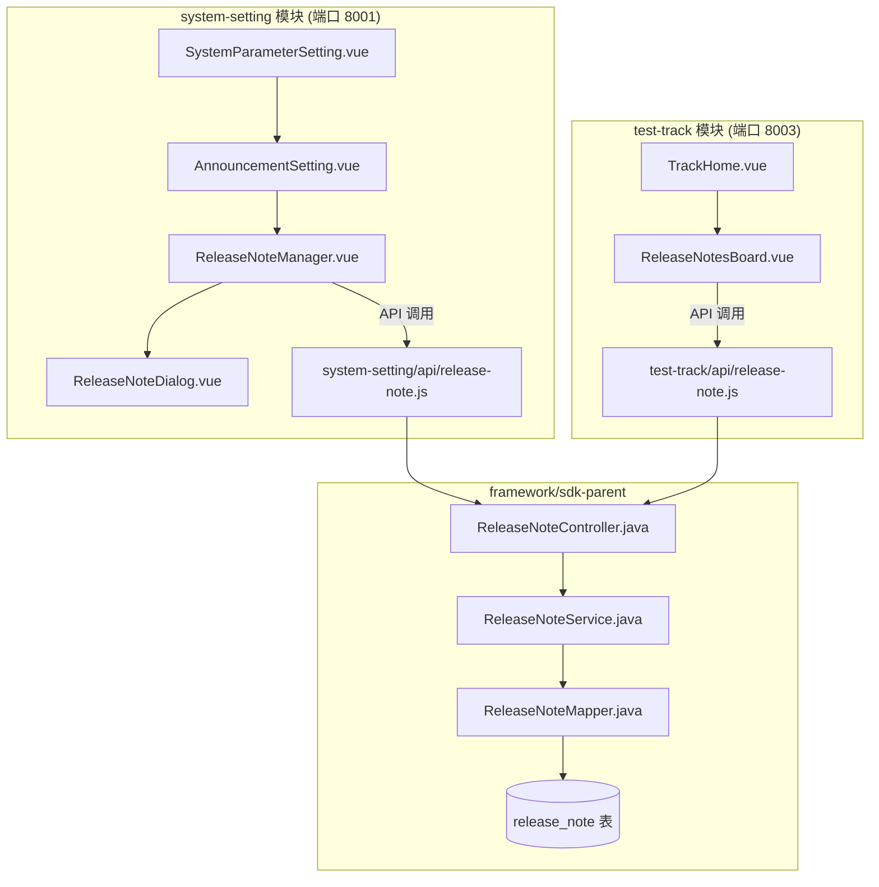

# 设计文档：需求上线内容管理（Release Notes Board）

## 概述

本功能为 MeterSphere 新增一个轻量级的内容发布/展示系统。管理员在系统设置的公告设置 Tab 页中录入需求上线记录，测试团队成员在测试跟踪首页以列表形式查看最近5条记录，点击弹出对话框查看完整内容。

功能涉及两个模块：
- **system-setting**：后端 API（Controller + Service + Mapper）+ 前端管理组件
- **test-track**：前端展示组件

数据存储使用独立的 `release_note` 表，不含 `release_date` 字段，使用 `create_time` 作为排序依据。

## 架构



### 设计决策

1. **Controller 放在 SDK 层**：system-setting 和 test-track 两个模块都需要访问同一套 API，放在 `framework/sdk-parent/sdk` 中可以被所有模块共享，与 `SystemParameterController` 模式一致。
2. **管理组件嵌入公告设置页**：在 `AnnouncementSetting.vue` 下方追加 `ReleaseNoteManager` 区域，用 `<el-divider>` 分隔。
3. **独立数据表**：不复用 `system_parameter` 的 key-value 模式，因为上线记录是结构化的多条数据，需要分页、排序等能力。
4. **无 release_date 字段**：使用 `create_time` 作为排序和展示依据，简化数据模型。
5. **Track 首页不分页**：仅展示最近5条记录，通过 `GET /release-note/recent/5` 接口获取，无需分页组件。
6. **点击弹出对话框**：Track 首页点击记录弹出 `el-dialog` 显示完整内容，而非展开行内。

## 组件与接口

### 后端组件

#### ReleaseNoteController

位置：`framework/sdk-parent/sdk/src/main/java/io/metersphere/controller/ReleaseNoteController.java`

```java
@RestController
@RequestMapping("/release-note")
public class ReleaseNoteController {

    // 新增上线记录（需要 SYSTEM_SETTING:READ+EDIT 权限）
    @PostMapping("/add")
    @RequiresPermissions(PermissionConstants.SYSTEM_SETTING_READ_EDIT)
    ReleaseNote add(@RequestBody ReleaseNote releaseNote);

    // 更新上线记录（需要 SYSTEM_SETTING:READ+EDIT 权限）
    @PostMapping("/update")
    @RequiresPermissions(PermissionConstants.SYSTEM_SETTING_READ_EDIT)
    void update(@RequestBody ReleaseNote releaseNote);

    // 删除上线记录（需要 SYSTEM_SETTING:READ+EDIT 权限）
    @GetMapping("/delete/{id}")
    @RequiresPermissions(PermissionConstants.SYSTEM_SETTING_READ_EDIT)
    void delete(@PathVariable String id);

    // 分页查询上线记录列表（按 create_time 倒序）
    @PostMapping("/list/{goPage}/{pageSize}")
    Pager<List<ReleaseNote>> list(@PathVariable int goPage, @PathVariable int pageSize);

    // 获取最近 N 条记录（供 Track 首页使用，无需管理权限）
    @GetMapping("/recent/{limit}")
    List<ReleaseNote> recent(@PathVariable int limit);

    // 获取单条上线记录详情
    @GetMapping("/get/{id}")
    ReleaseNote get(@PathVariable String id);
}
```

#### ReleaseNoteService

位置：`framework/sdk-parent/sdk/src/main/java/io/metersphere/service/ReleaseNoteService.java`

职责：
- CRUD 业务逻辑
- 自动填充 `id`（UUID）、`creator`（当前登录用户）、`createTime`、`updateTime`
- 分页查询使用 PageHelper，按 `create_time DESC` 排序
- `recent(limit)` 方法：直接 SQL `ORDER BY create_time DESC LIMIT {limit}`
- 删除/更新/查询时校验记录是否存在，不存在抛出 MSException

#### ReleaseNoteMapper

位置：`framework/sdk-parent/sdk/src/main/java/io/metersphere/base/mapper/ReleaseNoteMapper.java`

标准 MyBatis Mapper 接口 + XML，提供：
- `insert(ReleaseNote)`
- `updateByPrimaryKeySelective(ReleaseNote)`
- `deleteByPrimaryKey(String id)`
- `selectByPrimaryKey(String id)`
- `selectByExample(ReleaseNoteExample)`
- `selectRecent(int limit)` — 自定义 SQL 查询最近 N 条

对应 XML：`framework/sdk-parent/sdk/src/main/resources/mapper/ReleaseNoteMapper.xml`

### 前端组件

#### ReleaseNoteManager.vue

位置：`system-setting/frontend/src/business/system/setting/ReleaseNoteManager.vue`

功能：
- 表格展示所有上线记录（列：标题、创建人、创建时间、操作）
- 新增/编辑按钮打开 `ReleaseNoteDialog`
- 删除按钮弹出确认框
- 分页（每页10条），使用 `el-pagination`
- 权限控制：`SYSTEM_SETTING:READ` 可见，`SYSTEM_SETTING:READ+EDIT` 可操作

集成方式：在 `AnnouncementSetting.vue` 底部引入此组件，用 `<el-divider>` 分隔。

#### ReleaseNoteDialog.vue

位置：`system-setting/frontend/src/business/system/setting/ReleaseNoteDialog.vue`

功能：
- `el-dialog` 弹窗，包含表单：标题（el-input, maxlength=100）、内容详情（el-input textarea, maxlength=2000）
- 表单校验：两个字段均为必填
- 新增/编辑复用同一弹窗，编辑时预填充数据

#### ReleaseNotesBoard.vue

位置：`test-track/frontend/src/business/home/components/ReleaseNotesBoard.vue`

功能：
- 调用 `GET /release-note/recent/5` 获取最近5条记录
- 每条记录显示格式：
  - 标题行：`{create_time 格式化为 YYYY年MM月DD日}上线公告`
  - 下方：`创建时间: YYYY-MM-DD` 和 `创建者: {creator_name}`
- 点击记录弹出 `el-dialog` 显示完整 content
- 空状态显示"暂无上线记录"
- 不分页，仅展示最近5条
- 在 `TrackHome.vue` 中作为新的 `el-row` 插入到 `FailureTestCaseList` 下方

### API 层

#### system-setting 前端 API

位置：`system-setting/frontend/src/api/release-note.js`

```javascript
import {post, get} from 'metersphere-frontend/src/plugins/request';

export function addReleaseNote(data) {
  return post('/release-note/add', data);
}
export function updateReleaseNote(data) {
  return post('/release-note/update', data);
}
export function deleteReleaseNote(id) {
  return get('/release-note/delete/' + id);
}
export function listReleaseNotes(goPage, pageSize) {
  return post('/release-note/list/' + goPage + '/' + pageSize, {});
}
```

#### test-track 前端 API

位置：`test-track/frontend/src/api/release-note.js`

```javascript
import {get} from 'metersphere-frontend/src/plugins/request';

export function getRecentReleaseNotes(limit) {
  return get('/release-note/recent/' + limit);
}
export function getReleaseNote(id) {
  return get('/release-note/get/' + id);
}
```

## 数据模型

### release_note 表

| 字段 | 类型 | 约束 | 说明 |
|------|------|------|------|
| id | VARCHAR(50) | PRIMARY KEY | UUID 主键 |
| title | VARCHAR(100) | NOT NULL | 上线标题 |
| content | TEXT | NOT NULL | 内容详情 |
| creator | VARCHAR(50) | NOT NULL | 创建人 ID |
| create_time | BIGINT | NOT NULL | 创建时间戳 |
| update_time | BIGINT | NOT NULL | 更新时间戳 |

索引：`idx_create_time` ON `create_time` DESC

### ReleaseNote 实体类

位置：`framework/sdk-parent/domain/src/main/java/io/metersphere/base/domain/ReleaseNote.java`

```java
@Data
public class ReleaseNote implements Serializable {
    private String id;
    private String title;
    private String content;
    private String creator;
    private Long createTime;
    private Long updateTime;
    private static final long serialVersionUID = 1L;
}
```

### Flyway 迁移脚本

位置：`system-setting/backend/src/main/resources/db/migration/V135__release_note.sql`

```sql
CREATE TABLE IF NOT EXISTS `release_note` (
    `id`           VARCHAR(50)  NOT NULL,
    `title`        VARCHAR(100) NOT NULL COMMENT '上线标题',
    `content`      TEXT         NOT NULL COMMENT '内容详情',
    `creator`      VARCHAR(50)  NOT NULL COMMENT '创建人ID',
    `create_time`  BIGINT       NOT NULL COMMENT '创建时间戳',
    `update_time`  BIGINT       NOT NULL COMMENT '更新时间戳',
    PRIMARY KEY (`id`),
    INDEX `idx_create_time` (`create_time` DESC)
) ENGINE = InnoDB DEFAULT CHARSET = utf8mb4 COLLATE = utf8mb4_general_ci;
```

## 正确性属性

*正确性属性是一种在系统所有有效执行中都应成立的特征或行为——本质上是关于系统应该做什么的形式化陈述。属性是人类可读规范与机器可验证正确性保证之间的桥梁。*

以下属性基于需求文档中的验收标准推导而来，经过去重和合并后保留了具有独立验证价值的属性。

### Property 1: CRUD 往返一致性

*For any* 有效的 ReleaseNote 数据（标题非空且≤100字符、内容非空且≤2000字符），通过 add 接口创建后，再通过 get 接口按 ID 查询，返回的记录应包含相同的 title 和 content，且 creator 应等于创建时的当前用户 ID，createTime 和 updateTime 应为非空正整数。

**Validates: Requirements 2.2, 5.6, 5.7**

### Property 2: 必填字段校验

*For any* ReleaseNote 数据，若 title 或 content 为 null 或空字符串，则 add 接口应拒绝该请求并抛出异常，数据库中不应新增记录。

**Validates: Requirements 2.3**

### Property 3: 列表按创建时间倒序排列

*For any* 包含多条 ReleaseNote 的数据集，通过 list 接口或 recent 接口查询返回的记录列表中，每条记录的 createTime 应大于或等于其后一条记录的 createTime。recent 接口返回的记录数应不超过 limit 参数值。

**Validates: Requirements 3.1, 4.2, 5.4, 5.5**

### Property 4: 分页正确性

*For any* 包含 N 条 ReleaseNote 的数据集，以 pageSize 为页大小查询第 goPage 页时，返回的记录数应等于 `min(pageSize, max(0, N - (goPage-1)*pageSize))`，且 total 应等于 N。

**Validates: Requirements 3.5**

### Property 5: 删除后不可查

*For any* 已存在的 ReleaseNote，通过 delete 接口删除后，再通过 get 接口查询该 ID 应返回 null 或抛出异常，且 list 接口返回的列表中不应包含该记录。对于不存在的 ID，get/delete 接口应抛出异常。

**Validates: Requirements 3.4, 5.3, 5.8**

### Property 6: 更新正确性

*For any* 已存在的 ReleaseNote 和新的有效 title/content 值，通过 update 接口更新后，再通过 get 接口查询应返回更新后的 title 和 content，且 updateTime 应大于或等于更新前的 updateTime。

**Validates: Requirements 5.2**

### Property 7: 日期格式化正确性

*For any* 有效的 BIGINT 时间戳，前端格式化函数应将其转换为 `YYYY年MM月DD日` 格式的字符串，且该字符串应与 `YYYY-MM-DD` 格式的日期对应同一天。

**Validates: Requirements 4.3**

## 错误处理

| 场景 | 处理方式 | 用户反馈 |
|------|---------|---------|
| 必填字段为空提交 | 前端表单校验拦截，后端 Service 层二次校验 | 对应字段显示红色校验错误提示 |
| 保存/更新失败 | 前端 catch 异常 | `$error()` 显示错误提示 |
| 删除不存在的记录 | Service 层校验记录存在性，抛出 MSException | 返回 500 + 错误信息 |
| 查询不存在的记录 | Service 层返回 null，Controller 判断后返回 404 | 前端处理 404 响应 |
| 分页参数非法 | Service 层设置默认值（goPage=1, pageSize=10） | 正常返回第一页数据 |
| 标题超过100字符 | 前端 maxlength 限制 + 后端截断 | 前端输入框限制 |
| 内容超过2000字符 | 前端 maxlength 限制 + 后端截断 | 前端输入框限制 |

## 测试策略

### 测试框架

- **后端单元测试**：JUnit 5 + Mockito（Spring Boot Starter Test）
- **后端属性测试**：jqwik（Java 属性测试库），每个属性测试最少运行 100 次迭代
- **前端测试**：手动验证（项目当前无前端自动化测试框架配置）

### 双重测试方法

- **单元测试**：验证具体示例、边界情况和错误条件
- **属性测试**：验证跨所有输入的通用属性

两者互补，单元测试捕获具体 bug，属性测试验证通用正确性。

### 单元测试覆盖

- ReleaseNoteService.add：正常创建、字段校验失败
- ReleaseNoteService.update：正常更新、记录不存在
- ReleaseNoteService.delete：正常删除、记录不存在
- ReleaseNoteService.list：空数据、单页数据、多页数据
- ReleaseNoteService.recent：空数据、少于 limit 条、多于 limit 条
- ReleaseNoteService.get：正常查询、记录不存在

### 属性测试

每个属性测试对应设计文档中的一个正确性属性，使用 jqwik 库实现：

| 属性 | 测试标签 | 最少迭代 |
|------|---------|---------|
| Property 1 | Feature: release-notes-board, Property 1: CRUD round-trip consistency | 100 |
| Property 2 | Feature: release-notes-board, Property 2: Required field validation | 100 |
| Property 3 | Feature: release-notes-board, Property 3: List ordering by create_time desc | 100 |
| Property 4 | Feature: release-notes-board, Property 4: Pagination correctness | 100 |
| Property 5 | Feature: release-notes-board, Property 5: Delete then not found | 100 |
| Property 6 | Feature: release-notes-board, Property 6: Update correctness | 100 |
| Property 7 | Feature: release-notes-board, Property 7: Date formatting | 100 |

### 测试数据生成策略

属性测试需要生成随机的 ReleaseNote 数据：
- `title`：1-100 个随机中英文字符
- `content`：1-2000 个随机中英文字符（Property 7 需要特别生成超过100字符的内容）
- `creator`：随机 UUID 字符串
- `createTime`：合理范围内的随机时间戳（如近5年内）
