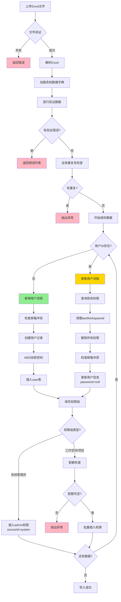

# Excel导入用户功能 - 完整决策树与逻辑分析

---

## 完整决策树

### 一、文件上传阶段

```
开始上传
├─ 文件为空？
│  └─ 是 → 抛出异常："upload_fail"
│
├─ 文件格式检查
│  ├─ .xls ✓
│  ├─ .xlsx ✓
│  └─ 其他 → 前端拦截（后端EasyExcel解析失败）
│
└─ 文件大小检查
   ├─ 超过限制 → 前端拦截（@MsFileLimit注解）
   └─ 通过 → 进入解析阶段
```

### 二、模板解析阶段

```
解析Excel
├─ 根据用户Locale选择模板类
│  ├─ zh_CN → UserExcelDataCn
│  ├─ en_US → UserExcelData
│  └─ zh_TW → UserExcelDataTw
│
├─ 加载系统数据字典
│  ├─ workspaceNameMap（工作空间名称→ID）
│  ├─ projectNameMap（项目名称→ID）
│  └─ savedUserId（已存在的用户ID列表）
│
└─ 逐行解析
   └─ 进入数据验证阶段
```

### 三、数据验证阶段（逐行）

```
验证单行数据
│
├─ 【必填字段检查】（EasyExcel自动）
│  ├─ ID为空 → 错误
│  ├─ 姓名为空 → 错误
│  ├─ 邮箱为空 → 错误
│  ├─ 密码为空 → 错误
│  └─ 权限字段为空 → 错误
│
├─ 【ID格式验证】
│  ├─ 包含中文字符？
│  │  └─ 是 → 错误："user_import_id_not_chinese"
│  ├─ 长度 > 50？
│  │  └─ 是 → 错误："user_import_id_too_long"
│  └─ ID已存在于数据库？
│     └─ 是 → 标记为"更新模式"（不报错）
│
├─ 【姓名验证】
│  └─ 长度 < 2 或 > 50？
│     └─ 是 → 错误："user_import_name_length_limit"
│
├─ 【邮箱验证】
│  └─ 格式不正确？
│     └─ 是 → 错误（EasyExcel注解验证）
│
├─ 【密码验证】
│  ├─ 长度 < 8 或 > 30？
│  │  └─ 是 → 错误
│  └─ 不包含大小写字母和数字？
│     └─ 是 → 错误："password_format_is_incorrect"
│
├─ 【电话验证】（可选）
│  └─ 不为空且格式不正确？
│     └─ 是 → 错误
│
├─ 【系统管理员验证】
│  └─ userIsAdmin = "是/Yes"
│     └─ 无需额外验证（系统级权限）
│
├─ 【工作空间管理员验证】
│  ├─ userIsTestManager = "是/Yes"
│  │  ├─ testManagerWorkspace 为空？
│  │  │  └─ 是 → ⚠️ 通过验证（权限列表为空）
│  │  └─ testManagerWorkspace 不为空
│  │     ├─ 按换行符分割工作空间名称
│  │     └─ 每个工作空间名称
│  │        ├─ 在workspaceNameMap中存在？
│  │        │  └─ 否 → 错误："user_import_workspace_not_fond: {名称}"
│  │        └─ 是 → 通过
│  └─ userIsTestManager = "否/No"
│     └─ 忽略testManagerWorkspace字段
│
├─ 【工作空间成员验证】
│  └─ （同工作空间管理员验证逻辑）
│
├─ 【项目管理员验证】
│  ├─ userIsProjectAdmin = "是/Yes"
│  │  ├─ proAdminProject 为空？
│  │  │  └─ 是 → ⚠️ 通过验证（权限列表为空）
│  │  └─ proAdminProject 不为空
│  │     ├─ 按换行符分割项目名称
│  │     └─ 每个项目名称
│  │        ├─ 在projectNameMap中存在？
│  │        │  └─ 否 → 错误："user_import_organization_not_fond: {名称}"
│  │        └─ 是 → 通过
│  └─ userIsProjectAdmin = "否/No"
│     └─ 忽略proAdminProject字段
│
├─ 【项目成员验证】
│  └─ （同项目管理员验证逻辑）
│
└─ 【只读用户验证】
   └─ （同项目管理员验证逻辑）
```

### 四、全局重复性检查

```
所有行验证完成后
│
├─ 【Excel内ID重复检查】
│  ├─ 统计所有ID出现次数
│  ├─ 找出出现次数 > 1 的ID
│  └─ 有重复？
│     └─ 是 → 抛出异常："user_import_id_is_repeat: {ID列表}"
│
├─ 【Excel内邮箱重复检查】
│  ├─ 统计所有邮箱出现次数
│  ├─ 找出出现次数 > 1 的邮箱
│  └─ 有重复？
│     └─ 是 → 抛出异常："user_import_email_is_repeat: {邮箱列表}"
│
└─ 【有任何行验证错误？】
   ├─ 是 → 返回错误列表（不执行保存）
   └─ 否 → 进入数据保存阶段
```

### 五、数据保存阶段

```
开始保存数据
│
├─ 反转列表顺序（Collections.reverse）
│  └─ 原因：保证Excel中的顺序与导入顺序一致
│
└─ 遍历每条数据
   │
   ├─ 【判断用户是否存在】
   │  ├─ ID在savedUserId中？
   │  │  ├─ 是 → 走【更新流程】
   │  │  └─ 否 → 走【新增流程】
   │
   ├─ ═══════════════════════════════════
   │  【新增流程】saveImportUser()
   │  ═══════════════════════════════════
   │  │
   │  ├─ 再次检查ID是否存在（双重保险）
   │  │  └─ 存在 → 抛出异常："user_id_already_exists"
   │  │
   │  ├─ 创建用户基本信息
   │  │  ├─ 设置createTime = 当前时间
   │  │  ├─ 设置updateTime = 当前时间
   │  │  ├─ 设置status = "1"（启用）
   │  │  ├─ 设置source = "LOCAL"
   │  │  ├─ 密码MD5加密
   │  │  └─ 检查邮箱是否已存在
   │  │     └─ 存在 → 抛出异常："user_email_already_exists"
   │  │
   │  ├─ 插入user表
   │  │
   │  └─ 保存用户权限组
   │     └─ 调用saveImportUserGroup()
   │
   └─ ═══════════════════════════════════
      【更新流程】updateImportUserGroup()
      ═══════════════════════════════════
      │
      ├─ 查询用户当前所有权限组
      │  └─ 获取sourceId列表
      │
      ├─ 检查lastWorkspaceId是否需要清空
      │  ├─ lastWorkspaceId在sourceId列表中？
      │  │  └─ 是 → 设置lastWorkspaceId = ""
      │  └─ 更新user表
      │
      ├─ 删除用户所有现有权限组
      │  └─ DELETE FROM user_group WHERE user_id = ?
      │
      ├─ 保存新的权限组
      │  └─ 调用saveImportUserGroup()
      │
      ├─ 检查邮箱是否与其他用户冲突
      │  └─ 冲突 → 抛出异常："user_email_already_exists"
      │
      └─ 更新用户基本信息
         ├─ 设置updateTime = 当前时间
         ├─ 设置password = null（⚠️ 不更新密码）
         └─ 更新user表（只更新非空字段）
```

### 六、权限组保存详细流程

```
saveImportUserGroup(groups, userId)
│
├─ groups为空？
│  └─ 是 → 直接返回（用户无任何权限）
│
└─ 遍历每个权限组
   │
   ├─ ═══════════════════════════════════
   │  【系统管理员权限】
   │  groupId = "admin"
   │  ═══════════════════════════════════
   │  │
   │  ├─ 创建UserGroup记录
   │  │  ├─ id = UUID
   │  │  ├─ userId = 用户ID
   │  │  ├─ groupId = "admin"
   │  │  ├─ sourceId = "system"（固定值）
   │  │  ├─ createTime = 当前时间
   │  │  └─ updateTime = 当前时间
   │  │
   │  └─ 插入user_group表
   │
   └─ ═══════════════════════════════════
      【工作空间/项目权限】
      groupId = ws_admin/ws_member/project_admin/project_member/read_only
      ═══════════════════════════════════
      │
      ├─ 获取权限对应的sourceId列表（工作空间ID或项目ID）
      │
      ├─ 【配额检查】checkQuota()
      │  ├─ 查询Group表获取type（WORKSPACE/PROJECT）
      │  ├─ 调用baseQuotaService.checkMemberCount()
      │  │  ├─ 检查每个工作空间/项目的成员数量配额
      │  │  └─ 超过配额 → 抛出异常
      │  └─ 通过 → 继续
      │
      ├─ 开启批量插入模式
      │  └─ sqlSessionFactory.openSession(ExecutorType.BATCH)
      │
      ├─ 遍历每个sourceId
      │  ├─ 创建UserGroup记录
      │  │  ├─ id = UUID
      │  │  ├─ userId = 用户ID
      │  │  ├─ groupId = 权限组ID
      │  │  ├─ sourceId = 工作空间ID/项目ID
      │  │  ├─ createTime = 当前时间
      │  │  └─ updateTime = 当前时间
      │  │
      │  └─ mapper.insertSelective(userGroup)
      │
      ├─ 批量提交
      │  └─ sqlSession.flushStatements()
      │
      └─ 关闭SqlSession
```

### 七、关键边界情况处理

#### 7.1 权限为"是"但工作空间/项目为空

```
场景：userIsTestManager = "是"，testManagerWorkspace = ""

处理逻辑：
├─ 验证阶段：通过（checkWorkSpace返回null）
├─ 转换阶段：getIdByExcelInfoAndIdDic返回空列表
└─ 保存阶段：该权限组不会被添加到groups中

结果：用户被标记为"工作空间管理员"，但没有任何工作空间权限
⚠️ 这是一个潜在的逻辑漏洞！
```

#### 7.2 用户ID已存在但邮箱不同

```
场景：
- Excel中 ID=user1, Email=new@example.com
- 数据库中 ID=user1, Email=old@example.com

处理逻辑：
├─ 走更新流程
├─ 检查邮箱冲突（排除自己）
│  └─ new@example.com 被其他用户使用？
│     ├─ 是 → 抛出异常
│     └─ 否 → 更新成功（邮箱被修改）

⚠️ 文档未说明：更新时会修改邮箱！
```

#### 7.3 密码处理差异

```
新增用户：
└─ 密码经过MD5加密后存储

更新用户：
└─ password字段设置为null，不更新密码
   └─ 原因：避免覆盖用户已修改的密码

⚠️ 文档未说明：更新时不会修改密码！
```

#### 7.4 lastWorkspaceId清理逻辑

```
更新用户时：
├─ 查询用户当前所有权限的sourceId
├─ lastWorkspaceId在sourceId列表中？
│  └─ 是 → 清空lastWorkspaceId
│     └─ 原因：该工作空间权限即将被删除
└─ 否 → 保持不变

⚠️ 文档未说明此逻辑！
```

#### 7.5 配额检查机制

```
触发时机：
└─ 为用户分配工作空间/项目权限时

检查逻辑：
├─ 获取权限组类型（WORKSPACE/PROJECT）
├─ 构建Map<sourceId, List<userId>>
├─ 调用baseQuotaService.checkMemberCount()
│  ├─ 查询每个工作空间/项目的配额限制
│  ├─ 查询当前成员数量
│  └─ 当前数量 + 新增数量 > 配额
│     └─ 是 → 抛出异常
└─ 通过 → 继续

⚠️ 文档完全未提及配额检查！
```

#### 7.6 批量插入优化

```
性能优化：
├─ 使用ExecutorType.BATCH模式
├─ 批量插入user_group记录
└─ 统一提交（flushStatements）

优势：
├─ 减少数据库交互次数
├─ 提高大批量导入性能
└─ 减少网络开销

⚠️ 文档未说明性能优化措施！
```

### 八、错误处理与事务

#### 8.1 事务边界

```
事务范围：
├─ UserService类标注@Transactional
├─ 单个用户的保存是一个事务
└─ 任何异常都会回滚当前用户的所有操作

⚠️ 注意：
├─ 不是整个Excel文件一个事务
├─ 前面成功的用户不会回滚
└─ 失败后续用户不会继续处理
```

#### 8.2 错误返回机制

```
验证阶段错误：
├─ 收集所有错误行
├─ 返回ExcelResponse
│  ├─ success = false
│  └─ errList = 错误详情列表
└─ 不执行任何保存操作

保存阶段错误：
├─ 第一个错误立即抛出异常
├─ 后续数据不再处理
└─ 前端显示错误信息

⚠️ 文档未明确说明错误处理策略！
```

### 九、完整流程图（Mermaid）



### 十、原文档遗漏内容总结

#### 10.1 核心逻辑遗漏

| 遗漏内容                      | 严重程度 | 说明                                                                 |
| ----------------------------- | -------- | -------------------------------------------------------------------- |
| **更新时不修改密码**    | 🔴 高    | 文档说"更新用户权限配置（不修改基本信息）"，但实际会修改邮箱、姓名等 |
| **更新时邮箱可变**      | 🔴 高    | 文档未说明更新时会修改邮箱                                           |
| **配额检查机制**        | 🔴 高    | 完全未提及成员数量配额限制                                           |
| **lastWorkspaceId清理** | 🟡 中    | 未说明更新时的工作空间清理逻辑                                       |
| **权限为空的处理**      | 🟡 中    | 权限为"是"但工作空间/项目为空时的行为                                |
| **批量插入优化**        | 🟢 低    | 未说明ExecutorType.BATCH性能优化                                     |
| **事务边界**            | 🟡 中    | 未明确说明事务范围和回滚机制                                         |

#### 10.2 边界情况遗漏

| 场景                     | 文档是否覆盖 | 实际行为                     |
| ------------------------ | ------------ | ---------------------------- |
| ID存在但邮箱不同         | ❌           | 更新邮箱（可能导致邮箱冲突） |
| 权限为"是"但工作空间为空 | ❌           | 验证通过，但不分配权限       |
| Excel内ID重复            | ✅           | 抛出异常，不执行保存         |
| Excel内邮箱重复          | ✅           | 抛出异常，不执行保存         |
| 配额不足                 | ❌           | 抛出异常，回滚当前用户       |
| 工作空间/项目不存在      | ✅           | 验证失败，返回错误           |
| 密码格式错误             | ✅           | 验证失败，返回错误           |

#### 10.3 数据更新对比表

| 字段            | 新增用户         | 更新用户      | 文档说明                  |
| --------------- | ---------------- | ------------- | ------------------------- |
| id              | ✅ 设置          | ❌ 不变       | ✅ 正确                   |
| name            | ✅ 设置          | ✅ 更新       | ❌ 文档说"不修改基本信息" |
| email           | ✅ 设置          | ✅ 更新       | ❌ 文档说"不修改基本信息" |
| phone           | ✅ 设置          | ✅ 更新       | ❌ 文档说"不修改基本信息" |
| password        | ✅ MD5加密       | ❌ 不更新     | ❌ 文档未说明             |
| status          | ✅ 设置为"1"     | ❌ 不变       | ✅ 正确                   |
| source          | ✅ 设置为"LOCAL" | ❌ 不变       | ✅ 正确                   |
| createTime      | ✅ 当前时间      | ❌ 不变       | ✅ 正确                   |
| updateTime      | ✅ 当前时间      | ✅ 当前时间   | ✅ 正确                   |
| lastWorkspaceId | ❌ 不设置        | ⚠️ 条件清空 | ❌ 文档未说明             |
| 权限组          | ✅ 新增          | ✅ 全部替换   | ✅ 正确                   |

### 十一、潜在问题与风险

#### 11.1 逻辑漏洞

```
问题1：权限为"是"但工作空间为空
├─ 现象：验证通过，但用户没有实际权限
├─ 影响：用户困惑，以为有权限但实际无法访问
└─ 建议：验证阶段应强制要求填写工作空间/项目

问题2：更新时修改邮箱
├─ 现象：可能导致邮箱冲突
├─ 影响：如果新邮箱已被其他用户使用，导入失败
└─ 建议：更新时应保持邮箱不变，或单独提供邮箱修改功能

问题3：事务边界不清晰
├─ 现象：部分用户导入成功，部分失败
├─ 影响：数据不一致，需要手动清理
└─ 建议：提供全部成功或全部失败的选项
```

#### 11.2 性能风险

```
大批量导入（1000+用户）：
├─ 配额检查：每个用户都会查询数据库
├─ 权限插入：虽然使用批量模式，但仍有性能瓶颈
└─ 建议：
   ├─ 提供异步导入功能
   ├─ 分批处理（每批100-200条）
   └─ 提供导入进度反馈
```

#### 11.3 用户体验问题

```
问题1：错误信息不够友好
├─ 现象：技术性错误信息（如"user_import_id_is_repeat"）
└─ 建议：提供更友好的中文提示

问题2：无法预览导入结果
├─ 现象：导入前无法确认数据是否正确
└─ 建议：提供导入预览功能

问题3：无法部分导入
├─ 现象：一个错误导致整个文件无法导入
└─ 建议：提供"跳过错误行"选项
```

### 十二、测试用例建议

#### 12.1 正常场景

```
测试用例1：新增单个用户
├─ 输入：完整的用户信息，ID不存在
├─ 期望：用户创建成功，权限分配正确
└─ 验证：user表、user_group表

测试用例2：更新单个用户
├─ 输入：完整的用户信息，ID已存在
├─ 期望：用户信息更新，权限全部替换
└─ 验证：密码未变，权限已替换

测试用例3：批量导入（新增+更新）
├─ 输入：10个用户，5个新增，5个更新
├─ 期望：全部成功
└─ 验证：数据一致性
```

#### 12.2 异常场景

```
测试用例4：ID重复（Excel内）
├─ 输入：2个用户使用相同ID
├─ 期望：抛出异常，不执行保存
└─ 验证：数据库无变化

测试用例5：邮箱重复（Excel内）
├─ 输入：2个用户使用相同邮箱
├─ 期望：抛出异常，不执行保存
└─ 验证：数据库无变化

测试用例6：工作空间不存在
├─ 输入：工作空间名称错误
├─ 期望：验证失败，返回错误列表
└─ 验证：数据库无变化

测试用例7：配额不足
├─ 输入：工作空间成员数量已达上限
├─ 期望：抛出配额异常
└─ 验证：当前用户回滚，前面用户保留

测试用例8：密码格式错误
├─ 输入：密码不符合复杂度要求
├─ 期望：验证失败，返回错误列表
└─ 验证：数据库无变化
```

#### 12.3 边界场景

```
测试用例9：权限为"是"但工作空间为空
├─ 输入：userIsTestManager="是"，testManagerWorkspace=""
├─ 期望：验证通过，但无实际权限
└─ 验证：user_group表无对应记录

测试用例10：更新时修改邮箱
├─ 输入：ID存在，邮箱不同
├─ 期望：邮箱更新成功
└─ 验证：user表邮箱已变

测试用例11：更新时邮箱冲突
├─ 输入：ID存在，新邮箱被其他用户使用
├─ 期望：抛出邮箱冲突异常
└─ 验证：数据库无变化

测试用例12：lastWorkspaceId清理
├─ 输入：更新用户，删除其lastWorkspaceId对应的权限
├─ 期望：lastWorkspaceId被清空
└─ 验证：user表lastWorkspaceId为空
```

#### 12.4 性能测试

```
测试用例13：大批量导入（1000用户）
├─ 输入：1000个新用户
├─ 期望：全部成功，耗时 < 30秒
└─ 验证：数据完整性

测试用例14：大批量更新（1000用户）
├─ 输入：1000个已存在用户
├─ 期望：全部成功，耗时 < 30秒
└─ 验证：权限全部替换

测试用例15：复杂权限组合
├─ 输入：每个用户5种权限，每种权限10个工作空间/项目
├─ 期望：全部成功
└─ 验证：user_group表记录数正确
```

### 十三、改进建议

#### 13.1 短期改进（低成本）

```
1. 完善文档
   ├─ 明确说明更新时的字段变更规则
   ├─ 补充配额检查说明
   └─ 添加边界情况说明

2. 优化错误提示
   ├─ 将技术性错误码转换为友好提示
   ├─ 提供错误行号和具体字段
   └─ 给出修复建议

3. 增强验证
   ├─ 权限为"是"时强制要求填写工作空间/项目
   ├─ 更新时禁止修改邮箱（或单独提示）
   └─ 提供数据格式预检查
```

#### 13.2 中期改进（中等成本）

```
1. 导入预览功能
   ├─ 解析后显示将要执行的操作
   ├─ 区分新增/更新/跳过
   └─ 允许用户确认后再执行

2. 部分导入功能
   ├─ 提供"跳过错误行"选项
   ├─ 记录成功和失败的行
   └─ 生成导入报告

3. 异步导入
   ├─ 大批量数据后台处理
   ├─ 提供进度查询接口
   └─ 完成后邮件通知
```

#### 13.3 长期改进（高成本）

```
1. 智能匹配
   ├─ 工作空间/项目名称模糊匹配
   ├─ 自动纠正常见错误
   └─ 提供候选项供用户选择

2. 模板自定义
   ├─ 允许选择需要的字段
   ├─ 支持自定义字段导入
   └─ 保存常用模板

3. 导入历史
   ├─ 记录每次导入操作
   ├─ 支持回滚
   └─ 提供审计日志
```

### 十四、总结

#### 原文档完整性评分：60/100

**优点：**

- ✅ 基本功能说明清晰
- ✅ 字段格式要求详细
- ✅ 多语言支持说明完整
- ✅ 文件路径清晰

**不足：**

- ❌ 更新逻辑说明不准确（说"不修改基本信息"，实际会修改）
- ❌ 完全未提及配额检查机制
- ❌ 未说明密码处理差异
- ❌ 未说明lastWorkspaceId清理逻辑
- ❌ 未说明事务边界和回滚机制
- ❌ 边界情况覆盖不全

**建议：**

1. 使用本决策树文档补充原文档
2. 重点补充"更新逻辑"章节
3. 添加"配额检查"章节
4. 添加"边界情况处理"章节
5. 提供完整的测试用例

---

*文档版本：v2.0*
*创建时间：2026-02-05*
*基于代码版本：MeterSphere v2.10*
