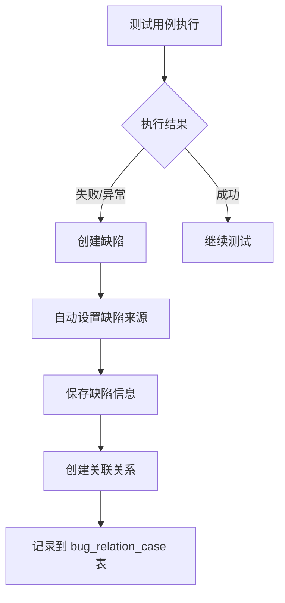

# MeterSphere 缺陷来源字段说明

## 概述

在 MeterSphere 缺陷管理系统中，"缺陷来源"字段用于标识缺陷是从哪种类型的测试用例中发现并关联的。该字段建立了缺陷与测试用例之间的追溯关系，为质量管理和测试分析提供重要数据支撑。

## 缺陷来源类型

### 支持的来源类型

| 来源类型 | 英文标识 | 中文说明 | 对应数据表 | 模块表 |
|---------|---------|---------|-----------|--------|
| **功能用例** | `FUNCTIONAL` | 从功能测试用例执行中发现的缺陷 | `functional_case` | `functional_case_module` |
| **接口用例** | `API` | 从接口测试用例执行中发现的缺陷 | `api_test_case` | `api_definition_module` |
| **场景用例** | `SCENARIO` | 从场景测试用例执行中发现的缺陷 | `api_scenario` | `api_scenario_module` |

### 来源类型详细说明

#### 1. 功能用例 (FUNCTIONAL)
- **定义**：从功能测试用例执行过程中发现的缺陷
- **场景**：测试人员在执行手工功能测试时发现问题
- **特点**：通常涉及业务逻辑、用户界面、用户体验等方面的问题
- **权限要求**：需要 `FUNCTIONAL_CASE_READ` 权限

#### 2. 接口用例 (API)
- **定义**：从接口测试用例执行中发现的缺陷
- **场景**：接口自动化测试失败或接口响应异常时创建的缺陷
- **特点**：主要涉及接口功能、数据格式、性能等技术问题
- **权限要求**：需要 `PROJECT_API_DEFINITION_CASE_READ` 权限

#### 3. 场景用例 (SCENARIO)
- **定义**：从场景测试用例执行中发现的缺陷
- **场景**：复杂业务流程测试或端到端测试中发现的问题
- **特点**：涉及多个接口或服务的集成问题
- **权限要求**：需要 `PROJECT_API_SCENARIO_READ` 权限

## 数据库设计

### 核心表结构

#### 缺陷主表 (bug)
```sql
CREATE TABLE IF NOT EXISTS bug(
    `id` VARCHAR(50) NOT NULL COMMENT 'ID',
    `num` INT NOT NULL COMMENT '业务ID',
    `title` VARCHAR(255) NOT NULL COMMENT '缺陷标题',
    `handle_user` VARCHAR(50) NOT NULL COMMENT '处理人',
    `create_user` VARCHAR(50) NOT NULL COMMENT '创建人',
    `create_time` BIGINT NOT NULL COMMENT '创建时间',
    `update_user` VARCHAR(50) NOT NULL COMMENT '更新人',
    `update_time` BIGINT NOT NULL COMMENT '更新时间',
    `project_id` VARCHAR(50) NOT NULL COMMENT '项目ID',
    `template_id` VARCHAR(50) NOT NULL COMMENT '模板ID',
    `platform` VARCHAR(50) NOT NULL COMMENT '缺陷平台',
    `status` VARCHAR(50) NOT NULL DEFAULT '' COMMENT '状态',
    `tags` VARCHAR(1000) COMMENT '标签',
    `platform_bug_id` VARCHAR(50) COMMENT '第三方平台缺陷ID',
    `deleted` BIT(1) NOT NULL COMMENT '删除状态',
    `pos` BIGINT NOT NULL COMMENT '自定义排序，间隔5000',
    PRIMARY KEY (id)
) COMMENT = '缺陷' DEFAULT CHARSET=utf8mb4 COLLATE=utf8mb4_general_ci;
```

#### 缺陷关联用例表 (bug_relation_case)
```sql
CREATE TABLE IF NOT EXISTS bug_relation_case(
    `id` VARCHAR(50) NOT NULL COMMENT 'ID',
    `case_id` VARCHAR(50) COMMENT '关联功能用例ID',
    `bug_id` VARCHAR(50) NOT NULL COMMENT '缺陷ID',
    `case_type` VARCHAR(64) NOT NULL COMMENT '用例类型;FUNCTIONAL/API/SCENARIO',
    `test_plan_id` VARCHAR(50) COMMENT '测试计划ID',
    `test_plan_case_id` VARCHAR(50) COMMENT '测试计划用例关联ID',
    `create_user` VARCHAR(50) NOT NULL COMMENT '创建人',
    `create_time` BIGINT NOT NULL COMMENT '创建时间',
    `update_time` BIGINT NOT NULL COMMENT '更新时间',
    PRIMARY KEY (id)
) COMMENT = '缺陷关联用例' DEFAULT CHARSET=utf8mb4 COLLATE=utf8mb4_general_ci;
```

### 关键字段说明

- **case_type**：存储缺陷来源类型，取值为 `FUNCTIONAL`、`API`、`SCENARIO`
- **case_id**：关联的具体用例ID
- **bug_id**：关联的缺陷ID
- **test_plan_id**：如果是从测试计划执行中发现的缺陷，记录测试计划ID
- **test_plan_case_id**：测试计划中的用例关联ID

## 代码实现

### 枚举定义

```java
@Getter
public enum CaseType {
    /**
     * 功能用例
     */
    FUNCTIONAL_CASE("FUNCTIONAL", "test_case", 
        PermissionConstants.FUNCTIONAL_CASE_READ, 
        "functional_case", "functional_case_module", 
        "functional_case.module.default.name", 
        "test_plan_default_functional_collection_name"),
    
    /**
     * 接口用例
     */
    API_CASE("API", "api_case", 
        PermissionConstants.PROJECT_API_DEFINITION_CASE_READ, 
        "api_test_case", "api_definition_module", 
        "api_unplanned_request", 
        "test_plan_default_api_collection_name"),
    
    /**
     * 场景用例
     */
    SCENARIO_CASE("SCENARIO", "scenario_case", 
        PermissionConstants.PROJECT_API_SCENARIO_READ, 
        "api_scenario", "api_scenario_module", 
        "api_unplanned_scenario", 
        "test_plan_default_scenario_collection_name");

    private final String key;           // 类型标识
    private final String type;          // 类型名称
    private final String usePermission; // 所需权限
    private final String caseTable;     // 用例表名
    private final String moduleTable;   // 模块表名
    private final String unPlanName;    // 未规划名称
    private final String planDefaultCollection; // 默认测试集名称
}
```

### 服务层实现

```java
@Service
public class BugRelateCaseCommonService {
    
    /**
     * 校验用例类型参数合法性
     */
    private void checkCaseTypeParamIllegal(String sourceType) {
        CaseType caseType = CaseType.getType(sourceType);
        if (caseType == null) {
            throw new MSException("不支持的用例类型: " + sourceType);
        }
    }
    
    /**
     * 关联缺陷和用例
     */
    public void relateBugAndCase(AssociateOtherCaseRequest request, String currentUser) {
        // 验证用例类型
        checkCaseTypeParamIllegal(request.getSourceType());
        
        // 创建关联关系
        BugRelationCase record = new BugRelationCase();
        record.setId(IDGenerator.nextStr());
        record.setCaseId(request.getCaseId());
        record.setBugId(request.getSourceId());
        record.setCaseType(request.getSourceType()); // 设置缺陷来源
        record.setCreateUser(currentUser);
        record.setCreateTime(System.currentTimeMillis());
        record.setUpdateTime(System.currentTimeMillis());
        
        bugRelationCaseMapper.insert(record);
    }
}
```

## 业务流程

### 缺陷创建流程



### 来源类型自动识别

1. **功能用例执行**
   - 用户在功能用例执行页面标记用例失败
   - 点击"创建缺陷"按钮
   - 系统自动设置 `case_type = "FUNCTIONAL"`

2. **接口用例执行**
   - 接口自动化测试执行失败
   - 从测试报告创建缺陷
   - 系统自动设置 `case_type = "API"`

3. **场景用例执行**
   - 场景测试执行异常
   - 从场景报告创建缺陷
   - 系统自动设置 `case_type = "SCENARIO"`

## 应用场景

### 1. 质量追溯

**场景描述**：开发人员修复缺陷后，需要快速找到相关测试用例进行回归验证。

**实现方式**：
```sql
-- 查询缺陷关联的所有测试用例
SELECT 
    brc.case_type AS 来源类型,
    brc.case_id AS 用例ID,
    CASE 
        WHEN brc.case_type = 'FUNCTIONAL' THEN fc.name
        WHEN brc.case_type = 'API' THEN atc.name  
        WHEN brc.case_type = 'SCENARIO' THEN as.name
    END AS 用例名称
FROM bug_relation_case brc
LEFT JOIN functional_case fc ON brc.case_id = fc.id AND brc.case_type = 'FUNCTIONAL'
LEFT JOIN api_test_case atc ON brc.case_id = atc.id AND brc.case_type = 'API'
LEFT JOIN api_scenario as ON brc.case_id = as.id AND brc.case_type = 'SCENARIO'
WHERE brc.bug_id = '缺陷ID';
```

### 2. 测试效果分析

**场景描述**：分析不同类型测试用例的缺陷发现效率。

**统计维度**：
- 按来源类型统计缺陷数量
- 分析各类型用例的缺陷发现率
- 评估测试策略的有效性

```sql
-- 按来源类型统计缺陷数量
SELECT 
    brc.case_type AS 来源类型,
    COUNT(DISTINCT brc.bug_id) AS 缺陷数量,
    COUNT(DISTINCT brc.case_id) AS 关联用例数
FROM bug_relation_case brc
INNER JOIN bug b ON brc.bug_id = b.id AND b.deleted = 0
WHERE b.project_id = '项目ID'
GROUP BY brc.case_type
ORDER BY 缺陷数量 DESC;
```

### 3. 测试计划执行

**场景描述**：在测试计划执行过程中，从不同类型的用例创建缺陷。

**关联信息**：
- 记录测试计划ID (`test_plan_id`)
- 记录测试计划用例关联ID (`test_plan_case_id`)
- 便于后续的测试计划报告统计

## 最佳实践

### 1. 缺陷创建规范

- **及时关联**：发现缺陷时应立即与相关测试用例建立关联
- **准确分类**：确保缺陷来源类型准确反映实际发现渠道
- **完整信息**：记录完整的测试计划和用例关联信息

### 2. 数据维护

- **定期清理**：清理已删除用例的关联关系
- **数据一致性**：确保缺陷和用例的关联关系准确
- **权限控制**：严格控制缺陷关联操作的权限

### 3. 分析应用

- **趋势分析**：定期分析不同来源类型的缺陷趋势
- **效率评估**：评估各类型测试用例的缺陷发现效率
- **策略优化**：基于数据分析结果优化测试策略

## 注意事项

### 1. 数据完整性

- 缺陷来源字段为必填项，不能为空
- 必须是预定义的枚举值之一
- 关联的用例必须真实存在且未被删除

### 2. 权限控制

- 不同来源类型需要对应的查看权限
- 创建关联关系需要相应的操作权限
- 删除关联关系需要管理员权限

### 3. 性能考虑

- 大量数据查询时注意添加适当的索引
- 复杂关联查询考虑使用缓存优化
- 定期归档历史数据以提升查询性能

## 总结

缺陷来源字段是 MeterSphere 缺陷管理系统的重要组成部分，它：

1. **建立追溯关系**：连接缺陷与测试用例，形成完整的质量追溯链
2. **支持数据分析**：为测试效果分析和策略优化提供数据基础
3. **提升工作效率**：帮助团队快速定位相关测试用例，提高缺陷处理效率
4. **规范管理流程**：标准化缺陷发现和处理流程，提升团队协作效率

通过合理使用缺陷来源字段，团队可以更好地管理测试过程中发现的问题，建立完善的质量管理体系。