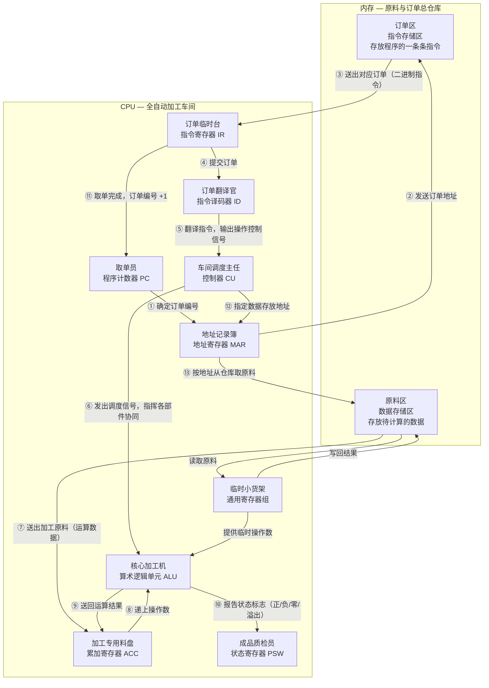

```mermaid
flowchart TB
    %% 定义核心区块
    subgraph Memory[内存 — 原料与订单总仓库]
        direction LR
        A1[订单区<br/>指令存储区<br/>存放程序的一条条指令]
        A2[原料区<br/>数据存储区<br/>存放待计算的数据]
    end
subgraph CPU[CPU — 全自动加工车间]
    direction TB
    B1[取单员<br/>程序计数器 PC]
    B8[地址记录簿<br/>地址寄存器 MAR]
    B2[订单临时台<br/>指令寄存器 IR]
    B9[订单翻译官<br/>指令译码器 ID]
    B7[车间调度主任<br/>控制器 CU]
    B3[核心加工机<br/>算术逻辑单元 ALU]
    B4[加工专用料盘<br/>累加寄存器 ACC]
    B5[成品质检员<br/>状态寄存器 PSW]
    B6[临时小货架<br/>通用寄存器组]
end

%% 取指令 Fetch
B1 -- "① 确定订单编号" --> B8
B8 -- "② 发送订单地址" --> A1
A1 -- "③ 送出对应订单（二进制指令）" --> B2

%% 译码 Decode
B2 -- "④ 提交订单" --> B9
B9 -- "⑤ 翻译指令，输出操作控制信号" --> B7
B7 -- "⑥ 发出调度信号，指挥各部件协同" --> B3

%% 执行 Execute
A2 -- "⑦ 送出加工原料（运算数据）" --> B4
B4 -- "⑧ 递上操作数" --> B3
B3 -- "⑨ 送回运算结果" --> B4
B3 -- "⑩ 报告状态标志（正/负/零/溢出）" --> B5

%% PC 自增
B2 -- "⑪ 取单完成，订单编号 +1" --> B1

%% 地址寄存器也用于数据寻址
B7 -- "⑫ 指定数据存放地址" --> B8
B8 -- "⑬ 按地址从仓库取原料" --> A2

%% 通用寄存器的辅助作用
A2 -- "读取原料" --> B6
B6 -- "写回结果" --> A2
B6 -- "提供临时操作数" --> B3
```


```mermaid

```


