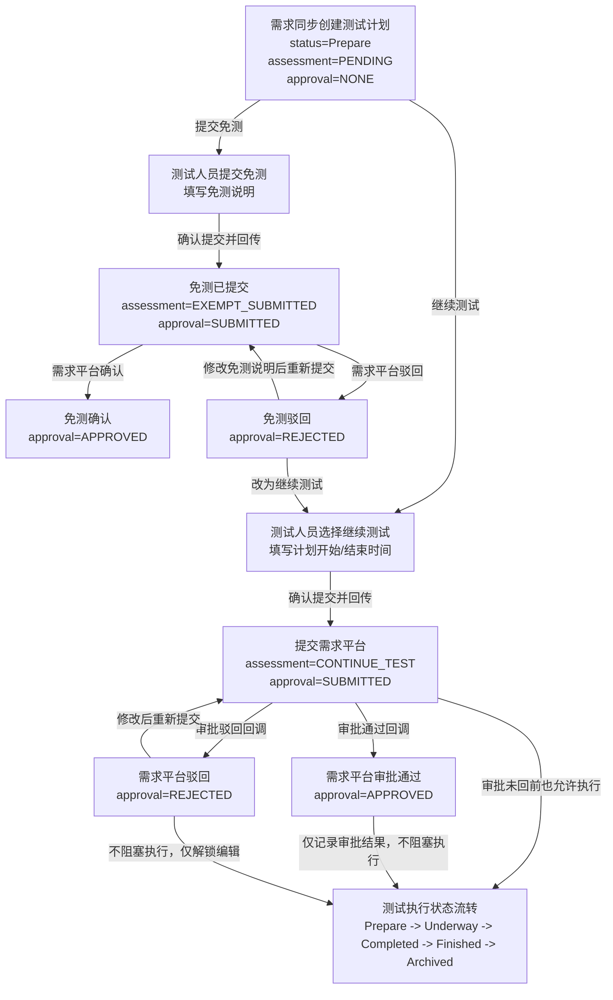

# 测试计划需求同步状态工作流设计

## 1. 背景

需求平台的需求同步到 MeterSphere 后，不再进入“需求池”作为中转页面，而是直接生成或更新测试计划。测试人员需要先判断该需求是否需要测试，并将判断结果同步给需求平台。需求平台收到结果后进入后续阶段，并可能对测试平台提交的信息进行审批通过或驳回。

本设计只作用于“需求平台同步来的测试计划”，普通手工创建的测试计划继续沿用 MeterSphere 原有测试计划生命周期。

## 2. 设计结论

采用“底层分层、前台合并展示”的状态模型：

| 状态层 | 字段 | 职责 |
|---|---|---|
| 测试执行状态 | `status` | 保留 MeterSphere 原有测试计划执行生命周期 |
| 需求评估状态 | `requirement_assessment_status` | 表示测试人员对需求的判断：待评估、继续测试、提交免测 |
| 需求审批状态 | `requirement_approval_status` | 表示需求平台对测试判断的确认结果：已提交、审批通过、已驳回 |

页面上不直接暴露三个字段，而是保留原有“测试计划状态”列，并新增一个合成展示字段“需求处理状态”。

## 3. 设计原则

1. `status` 只表达测试执行状态，不混入需求审批语义。
2. 需求平台审批不阻塞测试执行。
3. 免测是一条独立结束线，不进入 `Finished` 表示测试完成。
4. 驳回不暂停测试执行，只解锁计划或免测信息编辑，并允许重新提交。
5. 普通测试计划不受新工作流影响。
6. 页面展示要简单，系统内部状态要清晰可追踪。

## 4. 状态字段定义

### 4.1 测试执行状态

继续使用 MeterSphere 原字段 `test_plan.status`。

| 状态值 | 中文含义 | 说明 |
|---|---|---|
| `Prepare` | 未开始 | 测试计划创建后的默认执行状态 |
| `Underway` | 进行中 | 已开始执行测试 |
| `Completed` | 已完成 | 测试用例执行完成 |
| `Finished` | 已结束 | 到达计划结束时间或手工结束 |
| `Archived` | 已归档 | 历史归档，不再参与日常执行 |
| `Cancelled` | 已取消 | 取消测试计划 |

### 4.2 需求评估状态

新增字段 `requirement_assessment_status`。

| 状态值 | 中文含义 | 适用场景 |
|---|---|---|
| `NONE` | 无需求评估 | 普通手工创建测试计划 |
| `PENDING` | 待评估 | 需求平台同步创建测试计划后的默认状态 |
| `CONTINUE_TEST` | 继续测试 | 测试人员判断该需求需要测试 |
| `EXEMPT_SUBMITTED` | 免测已提交 | 测试人员判断该需求免测并已提交免测说明 |

### 4.3 需求审批状态

新增字段 `requirement_approval_status`。

| 状态值 | 中文含义 | 适用场景 |
|---|---|---|
| `NONE` | 未提交 | 尚未向需求平台提交测试判断 |
| `SUBMITTED` | 已提交 | 已将继续测试或免测结果回传需求平台 |
| `APPROVED` | 审批通过 | 需求平台已确认测试判断 |
| `REJECTED` | 已驳回 | 需求平台驳回测试判断，测试人员需要修改后重新提交 |

## 5. 初始化规则

| 测试计划来源 | `status` | `requirement_assessment_status` | `requirement_approval_status` |
|---|---|---|---|
| 普通手工创建 | `Prepare` | `NONE` | `NONE` |
| 需求平台同步创建 | `Prepare` | `PENDING` | `NONE` |

需求平台同步来的测试计划需要同时保存需求编号、所属系统、需求文档链接、需求简述等扩展信息。是否同步更新已有测试计划，由需求同步设计另行约束。

## 6. 页面展示规则

页面保留原有“测试计划状态”列，用于展示 `status`。

新增“需求处理状态”列，由 `requirement_assessment_status` 和 `requirement_approval_status` 合成展示。

| `requirement_assessment_status` | `requirement_approval_status` | 页面显示 |
|---|---|---|
| `NONE` | `NONE` | `--` |
| `PENDING` | `NONE` | 待评估 |
| `CONTINUE_TEST` | `SUBMITTED` | 继续测试-已提交 |
| `CONTINUE_TEST` | `APPROVED` | 继续测试-审批通过 |
| `CONTINUE_TEST` | `REJECTED` | 继续测试-已驳回 |
| `EXEMPT_SUBMITTED` | `SUBMITTED` | 免测已提交 |
| `EXEMPT_SUBMITTED` | `APPROVED` | 免测已确认 |
| `EXEMPT_SUBMITTED` | `REJECTED` | 免测已驳回 |

## 7. 工作流



## 8. 操作规则

| 页面状态 | 可操作项 | 说明 |
|---|---|---|
| 待评估 | 继续测试、提交免测 | 需求同步后的初始处理状态 |
| 继续测试-已提交 | 正常执行测试计划 | 不等待需求平台审批 |
| 继续测试-审批通过 | 正常执行测试计划 | 需求平台已确认 |
| 继续测试-已驳回 | 编辑计划信息、重新提交 | 不阻塞执行 |
| 免测已提交 | 查看免测信息 | 不进入测试执行 |
| 免测已确认 | 查看免测信息 | 免测线结束 |
| 免测已驳回 | 修改免测信息、重新提交，或改为继续测试 | 允许重新处理 |

## 9. 编辑权限规则

| 场景 | 编辑规则 |
|---|---|
| 普通测试计划 | 沿用 MeterSphere 原权限控制 |
| 待评估 | 允许执行评估动作，测试执行相关入口默认不突出展示 |
| 继续测试-已提交 | 建议锁定关键计划字段，允许执行测试 |
| 继续测试-审批通过 | 按原测试计划规则控制 |
| 继续测试-已驳回 | 放开关键计划字段编辑，允许修改后重新提交 |
| 免测已提交 | 禁止编辑测试执行信息，允许查看免测信息 |
| 免测已确认 | 禁止编辑测试执行信息 |
| 免测已驳回 | 允许修改免测说明，或改为继续测试 |

关键计划字段建议包括：计划名称、计划开始时间、计划结束时间、所属模块、需求编号、需求文档链接。

## 10. 回传需求平台时机

| 触发动作 | 回传内容 |
|---|---|
| 选择继续测试并提交 | 需求编号、系统名称、测试计划 ID、计划开始时间、计划结束时间、测试结论：继续测试 |
| 提交免测 | 需求编号、系统名称、需求简述、关联人员、免测说明、测试结论：免测 |
| 驳回后重新提交 | 最新计划信息或免测信息 |
| 测试执行状态变化 | 按现有逻辑回传 `Prepare / Underway / Completed / Finished / Archived / Cancelled` |
| 需求平台审批回调 | 测试平台接收并更新审批状态，不再反向回传，除非需求平台要求确认回执 |

## 11. 免测信息

提交免测时需要填写：

| 字段 | 说明 |
|---|---|
| 系统名称 | 与全研发平台系统名称保持一致 |
| 需求编号 | 与需求平台需求编号保持一致 |
| 需求简述 | 来源于需求平台，可允许测试人员补充 |
| 关联人员 | 人员姓名 |
| 免测说明 | 详细阐述免测原因 |

## 12. 异常与边界规则

1. 需求平台重复回调同一审批结果时，测试平台应幂等处理。
2. 已免测确认的计划不参与测试执行状态自动计算。
3. 已归档或已取消的测试计划不再接收普通状态变更，但仍应保留需求处理状态用于审计。
4. 需求平台驳回后，如果测试计划已进入 `Underway` 或 `Completed`，不回退执行状态，只更新审批状态为 `REJECTED`。
5. 需求平台审批通过后，如果测试计划已经执行完成，不改变执行状态，只更新审批状态为 `APPROVED`。
6. 普通测试计划不得出现 `PENDING / CONTINUE_TEST / EXEMPT_SUBMITTED` 等需求评估状态。
7. 需求同步计划缺少需求编号时，应拒绝进入需求评估工作流。

## 13. 推荐实现边界

后端建议新增独立服务封装需求工作流：

```text
RequirementPlanWorkflowService
```

该服务负责：

1. 初始化需求同步测试计划状态。
2. 提交继续测试。
3. 提交免测。
4. 接收审批通过或驳回回调。
5. 计算页面展示用“需求处理状态”。
6. 判断计划是否可编辑、是否可重新提交。

现有 `TestPlanService` 继续负责原测试计划执行生命周期，避免审批逻辑侵入现有状态自动计算。

## 14. 验收标准

1. 普通测试计划状态流转不受影响。
2. 需求同步测试计划默认进入“待评估”。
3. 测试人员可选择继续测试并提交需求平台。
4. 继续测试提交后，不等待审批即可执行测试计划。
5. 需求平台审批通过后，测试平台记录“审批通过”。
6. 需求平台驳回后，测试平台记录“已驳回”，并允许修改后重新提交。
7. 测试人员可提交免测信息并回传需求平台。
8. 免测确认后不进入测试执行生命周期。
9. 页面只展示“测试计划状态”和“需求处理状态”，不直接暴露底层三个状态字段。
10. 回传失败或回调重复时，不破坏测试计划主流程。

