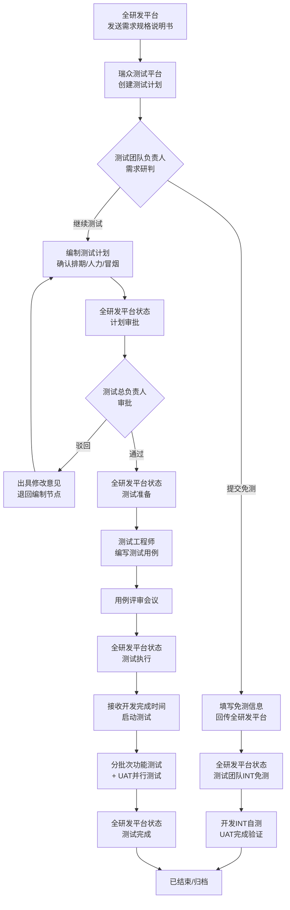

# 全流程平台对接功能需求说明书

**编制日期**：2026年7月8日
**编制方**：瑞众测试平台团队
**交付方**：研发全流程管理平台团队
**文档版本**：V2.0
**文档密级**：内部

## 目录

1. [引言](#1-引言)
2. [项目介绍](#2-项目介绍)
3. [项目背景](#3-项目背景)
4. [开发目标](#4-开发目标)
5. [业务流程规范](#5-业务流程规范)
    - 5.1 [需求研判与免测判定](#51-需求研判与免测判定)
    - 5.2 [测试计划编制](#52-测试计划编制)
    - 5.3 [测试计划审批](#53-测试计划审批)
    - 5.4 [测试用例编制与评审](#54-测试用例编制与评审)
    - 5.5 [测试执行](#55-测试执行)
6. [对接技术规范](#6-对接技术规范)
7. [最终效果](#7-最终效果)
8. [附录](#8-附录)

## 1 引言

本文档由瑞众测试平台团队编制，面向研发全流程管理平台开发团队，旨在明确研发全流程管理平台对接中需要完成的开发工作。

文档详细描述研发全流程管理平台应实现的功能、消息推送规范、回传消息接收规范及联调验收标准，作为研发全流程管理平台方开发的依据和双方联调的参考。

本文档不涉及瑞众测试平台内部的详细设计与实现细节，仅从对接视角描述研发全流程管理平台需交付的内容。

## 2 项目介绍

本项目实现研发全流程管理平台与瑞众测试平台的双向数据对接，通过 RocketMQ 消息队列建立异步通信通道。核心目标是打通需求到测试的数据链路，实现需求驱动的测试管理闭环。

| 项目 | 说明 |
|------|------|
| 项目名称 | 研发全流程管理平台对接（研发全流程管理平台 <-> 瑞众测试平台） |
| 对接方式 | RocketMQ 消息队列，双向异步通信 |
| 消息方向1 | 研发全流程管理平台 -> 瑞众测试平台：需求同步消息 |
| 消息方向2 | 瑞众测试平台 -> 研发全流程管理平台：测试状态回传消息 |
| 版本范围 | V1 最小可交付版本 |

## 3 项目背景

当前研发全流程管理平台与瑞众测试平台之间缺乏数据通道，测试人员需要手工从研发全流程管理平台抄写需求信息到瑞众测试平台，测试进度也无法自动反馈给研发全流程管理平台。这导致以下问题：

- **信息孤岛**：需求与测试数据分离，无法自动关联和追溯
- **重复录入**：测试人员需手工录入需求信息，效率低且易出错
- **状态脱节**：研发全流程管理平台无法实时感知测试进度，影响项目决策
- **追溯困难**：需求到测试的链路断裂，无法量化测试覆盖

通过建立双向数据通道，研发全流程管理平台自动推送需求数据，瑞众测试平台自动创建或更新测试计划，并回传测试状态，实现需求全生命周期的可追溯管理。

## 4 开发目标

### 4.1 功能目标

- 研发全流程管理平台能够将需求信息（新建/更新/取消）通过 RocketMQ 实时推送到瑞众测试平台
- 瑞众测试平台消费需求同步消息后，直接创建、更新或取消对应测试计划
- 研发全流程管理平台能够接收瑞众测试平台回传的测试计划状态信息
- 研发全流程管理平台在收到回传消息后，能够在需求详情中展示测试进度和报告链接
- 研发全流程管理平台能够接收免测申请，完成审批并将结果回传测试平台
- 研发全流程管理平台能够接收测试计划，完成审批并将结果回传测试平台
- 研发全流程管理平台能够接收用例评审结果并展示
- 通过 traceId 实现全链路追踪，便于问题排查

### 4.2 性能目标

| 指标 | 目标值 |
|------|--------|
| 消息推送延迟 | < 5秒（从需求变更到消息发出） |
| 消息消费延迟 | < 5秒（瑞众测试平台从收到消息到创建/更新测试计划） |
| 回传消息消费延迟 | < 5秒（研发全流程管理平台从收到回传到更新状态） |
| 消息可靠性 | 不丢失、不重复处理（幂等保障） |

### 4.3 安全目标

- RocketMQ 启用 ACL 权限控制（AccessKey/SecretKey）
- Topic 级别读写权限隔离
- 消息传输使用 TLS/SSL 加密通道
- 敏感字段按需加密

### 4.4 角色定义

| 角色 | 所属方 | 职责 |
|------|--------|------|
| 需求分析师 | 研发全流程管理平台 | 编写需求规格说明书，通过研发全流程管理平台发送至测试平台 |
| 测试团队负责人 | 瑞众测试平台 | 需求研判、免测判定、测试计划编制、用例评审组织 |
| 测试总负责人 | 瑞众测试平台 | 测试计划审批、争议协调 |
| 测试工程师 | 瑞众测试平台 | 测试用例编写、测试执行、缺陷跟踪 |
| 开发工程师 | 研发全流程管理平台 | INT 自测、缺陷修复、冒烟测试提测 |

## 5 业务流程规范

### 5.1 需求研判与免测判定

#### 5.1.1 流程说明

全研发平台由需求分析师发送《需求规格说明书》至测试平台。测试团队负责人在测试平台接收后，第一时间开展需求拆解与风险评估，对照免测判定标准综合研判。

> **说明**：原"需求池"中间环节已废弃。需求同步后直接创建测试计划，不再经过需求池手动分配。

#### 5.1.2 免测判定标准

满足以下任一类型即可申请免测。免测后全研发平台状态为"测试团队INT免测"，开发需进行 INT 自测并由 UAT 完成验证。

| 免测类型 | 判定标准 |
|----------|----------|
| 功能极简类 | 仅页面信息静态展示、纯文案调整、提示语优化、静态样式微调，无新增交互逻辑、业务审批或数据流转 |
| 无风险类 | 不涉及核心业务链路、数据库增删改、资金计算、账务流水或客户核心信息，变更出错不会引发业务中断或资金损失 |
| 资源不足协商类 | 测试团队现有人员排期饱和，经测试团队负责人与需求提交部门充分沟通并达成一致 |

#### 5.1.3 免测申请需填写信息

| 字段名 | 说明 |
|--------|------|
| 系统名称 | 与全研发平台系统名称保持一致 |
| 需求编号 | 与全研发平台需求编号保持一致 |
| 需求简述 | 简要描述需求内容 |
| 关联人员 | 姓名 |
| 免测类型 | 功能极简 / 无风险 / 资源不足协商 |
| 免测说明 | 详细阐述免测原因 |

#### 5.1.4 继续测试流程

如需测试团队介入，测试团队负责人选择"继续测试"，全研发平台状态同步为"测试计划"。

### 5.2 测试计划编制

#### 5.2.1 编制依据

- 《需求规格说明书》
- 全研发平台推送的开发计划完成时间

#### 5.2.2 同步与模块树

需求同步时，根据需求的 `systemName`（所属系统）匹配后续提供的"所属系统 -> MeterSphere 项目/模块/负责人"映射表，决定测试计划创建位置：

1. 根据 `systemName` 映射到对应的 MeterSphere 项目（projectId）
2. 在该项目下查找对应模块节点
3. 无同名模块则自动创建
4. 测试计划创建到对应模块树下

> **说明**：建议使用 `systemCode` 做稳定映射主键，`systemName` 仅用于界面展示。仅用中文名称会因为改名、空格、简称导致重复建模块。

#### 5.2.3 计划编制要求

测试团队负责人结合团队现有测试人力、并行项目排期、需求复杂度与工作量，完成：

| 编制项 | 说明 |
|--------|------|
| 测试排期 | 框架搭建，规划各阶段节点时间 |
| 测试人力分配 | 明确各阶段测试人员 |
| 冒烟测试判定 | 确认是否需要冒烟测试 |
| 计划开始时间 | 测试预计开始时间 |
| 计划结束时间 | 测试预计结束时间 |
| requirement_doc_url | 需求平台传入的需求规格说明书链接，存储于测试计划字段 |

编制完成后，全研发平台状态同步为"计划审批"。

#### 5.2.4 冒烟测试判定

需求满足以下任一场景，必须执行完整冒烟测试；多场景同步发生可合并执行 1 轮，无需重复多次。冒烟测试失败直接退回开发，不继续开展详细测试。

| 冒烟测试触发场景 |
|-------------------|
| 完整新版本交付、重大迭代补丁包交付（改动 >= 2 个业务模块、涉及底层依赖/核心流程/数据库表结构变更、跨模块代码合并） |
| 系统全新部署、版本大升级、跨环境应用/数据迁移（开发/测试/预发/生产任一环境） |
| 底层基础设施变更：数据库、中间件、服务器、网络、全局核心配置发生升级、替换、修改 |
| 生产环境完整版本发布、底层资源扩容迁移、全局性运维配置变更 |
| 多开发分支合并、多业务模块集成合并，存在集成兼容故障风险 |

### 5.3 测试计划审批

#### 5.3.1 审批流程

测试总负责人收到《测试计划》后，针对计划内的周期、人力安排及风险预案开展合理性审核，并在全研发平台完成审批。

| 审批结果 | 说明 | 全研发平台状态 | 测试平台处理 |
|----------|------|---------------|-------------|
| 审批通过 | 测试总负责人予以通过 | 测试准备 | 测试计划进入准备阶段，计划关键字段禁止编辑 |
| 审批驳回 | 出具书面修改意见 | 退回计划编制 | 测试计划重新开放编辑，测试团队负责人修订后重新报审 |

#### 5.3.2 审批状态说明

审批状态独立于测试计划执行状态，不覆盖 `Prepare`、`Underway`、`Completed` 等执行生命周期状态。审批状态仅控制测试计划是否可编辑，不阻塞测试人员后续正常执行测试。

| 审批状态 | 编辑权限 | 说明 |
|----------|----------|------|
| 待提交 | 可编辑 | 测试团队负责人编制计划期间 |
| 已提交 | 禁止编辑 | 等待测试总负责人审批 |
| 已通过 | 禁止编辑 | 审批通过，进入测试准备 |
| 已驳回 | 可编辑 | 需修改后重新提交 |

### 5.4 测试用例编制与评审

#### 5.4.1 用例编制标准

测试计划审批通过后，测试工程师依据测试计划和需求规格说明书，在测试平台完成用例编写。

单条测试用例须完整包含四项核心要素：

| 要素 | 要求 |
|------|------|
| 操作步骤 | 分步拆解，动作精准，明确前置环境、页面路径、按钮/字段操作 |
| 预期结果 | 区分页面展示、数据存储、接口返回、日志输出四类校验项，量化可判断 |
| 测试数据 | 明确预置基础数据、特殊测试账号、参数取值，统一复用测试数据集 |
| 风险点 | 标注执行阻塞点、数据污染风险、环境依赖风险、业务合规风险，同步配套规避说明 |

编制标准：

- 统一使用测试平台内置用例模板，字段必填项完整填写
- 全覆盖需求规格说明书中全部功能点、业务规则、交互逻辑
- 用例优先级按 P0（高）/ P1（一般）/ P2（低）划分
- 必须覆盖边界值、极值、空值、非法输入、多分支流程等异常场景
- 兼顾主流程正向操作、逆向回退、中断重试等反向操作场景

#### 5.4.2 用例评审流程

全部测试用例初稿完成后，由测试团队负责人组织评审会议。评审通过后，测试平台上传评审结果及评审后测试用例，全研发平台状态同步为"测试执行"。

| 评审角色 | 参与方式 |
|----------|----------|
| 测试团队负责人 | 组织者，必须参加 |
| 测试总负责人 | 按需参加 |
| 对应模块测试工程师 | 必须参加 |
| 相关开发骨干 | 按需参加 |
| 业务需求人员 | 按需参加 |

评审标准：

- 需求条目与用例一一对应，无功能点遗漏、分支场景缺失
- 边界、异常、反向流程均设计对应校验用例
- 业务流程顺序符合真实业务操作逻辑，步骤无矛盾、无冗余
- 预期结果与需求规则匹配，不存在逻辑冲突
- 风险点识别准确，影响范围与规避措施描述完整

评审闭环要求：

- 评审提出的修改问题逐条记录，明确整改责任人与完成时限
- 整改完成后二次复核，全部问题闭环方可通过评审
- 未通过评审的用例禁止进入测试执行阶段

### 5.5 测试执行

#### 5.5.1 启动条件

全研发平台发送开发实际完成时间至测试平台后，方可启动测试。

#### 5.5.2 执行方式

- 测试工程师依据评审定稿测试用例，分批次进行功能测试验证
- 功能验证通过后，同步通知业务方启动 UAT 并行测试
- UAT 测试完成后，测试工程师在测试平台报告统计点击分享
- 全研发平台状态同步为"测试完成"

#### 5.5.3 测试结束后操作

| 操作 | 说明 |
|------|------|
| 归档 | 测试计划电子资料统一保存至测试平台，保存期限不少于 3 年，全程可追溯 |
| 资料范围 | 测试计划、测试用例、缺陷台账、测试报告、复测记录 |

---

## 6 对接技术规范

### 6.1 总体架构

双方通过 RocketMQ 消息队列进行双向异步通信，架构如下：

```text
┌─────────────────┐         RocketMQ          ┌──────────────────┐
│ 研发全流程管理平台 │ ────────────────────────> │   瑞众测试平台     │
│                 │ topic-requirement-to-ms   │                  │
│                 │                           │  同步直接创建计划  │
│                 │ topic-ms-to-requirement   │                  │
│                 │ <──────────────────────── │                  │
└─────────────────┘         RocketMQ          └──────────────────┘
```

### 6.2 消息推送规范

#### 6.2.1 需求同步消息（研发全流程管理平台 -> 瑞众测试平台）

研发全流程管理平台在需求状态变更时，主动推送消息到 RocketMQ：

| 触发场景 | operationType | 说明 |
|----------|---------------|------|
| 新建需求 | CREATED | 需求首次创建，包含完整需求信息 |
| 更新需求 | UPDATED | 需求信息变更，包含最新完整信息 |
| 取消需求 | CANCELLED | 需求被取消/撤回，仅需 dmpNum |

消息格式为 JSON，UTF-8 编码。必须包含 `dmpNum`、`operationType`、`eventTime`。建议携带 `traceId` 用于全链路追踪。

#### 6.2.2 测试评估回传消息（瑞众测试平台 -> 研发全流程管理平台）

测试团队负责人完成免测判定后，瑞众测试平台向全研发平台回传评估结论：

| 评估结论 | 需回传字段 |
|----------|-----------|
| 继续测试 | dmpNum、planId、assessmentResult=CONTINUE_TEST、plannedStartTime、plannedEndTime、principalUsers、submitTime |
| 提交免测 | dmpNum、planId、assessmentResult=EXEMPT_TEST、systemName、requirementSummary、relatedUsers、exemptType、exemptReason、submitTime |

#### 6.2.3 审批结果回传消息（研发全流程管理平台 -> 瑞众测试平台）

全研发平台完成审批后，向瑞众测试平台回传审批结果：

| 审批结果 | 需回传字段 |
|----------|-----------|
| 审批通过 | dmpNum、planId、approvalStatus=APPROVED、approvalComment、approvalTime |
| 审批驳回 | dmpNum、planId、approvalStatus=REJECTED、approvalComment（含修改意见）、approvalTime |

#### 6.2.4 测试状态回传消息（瑞众测试平台 -> 研发全流程管理平台）

瑞众测试平台在测试计划状态变化时回传：

| 回传时机 | planStatus |
|----------|------------|
| 测试计划创建 | PENDING |
| 测试计划已准备 | PREPARED |
| 测试执行中 | RUNNING |
| 测试完成 | COMPLETED |
| 已结束 | FINISHED |
| 用例评审完成 | REVIEW_COMPLETED |

#### 6.2.5 测试报告回传

测试工程师在测试平台分享报告后，回传 `planShareUrl`（格式：`/track/share-plan-report?shareId={shareId}`），研发全流程管理平台拼接域名前缀即可直接访问。

### 6.3 平台状态对照

| 阶段 | 测试平台操作 | 全研发平台状态 | 消息方向 |
|------|------------|---------------|---------|
| 需求发送 | 接收需求规格说明书 | 需求已发送 | 研发->测试 |
| 免测判定 | 提交免测申请 | 测试团队INT免测 | 测试->研发 |
| 继续测试 | 选择继续测试 | 测试计划 | 测试->研发 |
| 计划编制 | 上传测试计划 | 计划审批 | 测试->研发 |
| 审批通过 | 接收审批结果 | 测试准备 | 研发->测试 |
| 审批驳回 | 接收驳回意见 | 退回编制 | 研发->测试 |
| 用例完成 | 上传评审结果 | 测试执行 | 测试->研发 |
| 测试完成 | 分享测试报告 | 测试完成 | 测试->研发 |

### 6.4 消费端要求

#### 6.4.1 研发全流程管理平台侧

研发全流程管理平台需要消费瑞众测试平台回传的消息，获取测试计划状态和报告链接。收到回传消息后，研发全流程管理平台应：

- 根据 `dmpNum` 找到对应需求
- 更新需求的测试状态（`planStatus`）
- 记录测试计划的计划起止时间、实际起止时间
- 记录测试负责人
- 记录测试报告分享链接（`planShareUrl`），并在需求详情页提供可点击的链接
- 基于 `syncTime` 和 `traceId` 记录回传日志

消费要求：

- 消费失败时不要确认消息，让 RocketMQ 重试
- 实现幂等消费：同一 `dmpNum + syncTime` 的消息不重复处理
- 回传消息不影响研发全流程管理平台主业务流程，消费异常应记录日志而非阻塞

#### 6.4.2 RocketMQ 环境准备

研发全流程管理平台需要准备以下 RocketMQ 环境：

| 配置项 | 要求 | 说明 |
|--------|------|------|
| NameServer 地址 | 需与测试平台网络互通 | 双方连接同一个 RocketMQ 集群 |
| Topic: 需求同步 | topic-requirement-to-metersphere | 研发全流程管理平台为 Producer，测试平台为 Consumer |
| Topic: 状态回传 | topic-metersphere-to-requirement | 测试平台为 Producer，研发全流程管理平台为 Consumer |
| Producer Group（需求 -> 测试） | producer-requirement-to-metersphere | 研发全流程管理平台发送同步消息的 Producer Group |
| Consumer Group（需求 -> 测试） | consumer-requirement-to-metersphere | 测试平台消费同步消息的 Consumer Group |
| Producer Group（测试 -> 需求） | producer-metersphere-to-requirement | 测试平台发送回传消息的 Producer Group |
| Consumer Group（测试 -> 需求） | consumer-metersphere-to-requirement | 研发全流程管理平台消费回传消息的 Consumer Group |
| ACL 权限 | AccessKey/SecretKey | 研发全流程管理平台需要有上述两个 Topic 的读写权限 |

### 6.5 消息格式详细定义

#### 6.5.1 需求同步消息

Topic: `topic-requirement-to-metersphere`

| 字段名 | 类型 | 必填 | 说明 |
|--------|------|------|------|
| dmpNum | String | 是 | 需求编号，唯一标识 |
| name1 | String | 是 | 需求名称 |
| operationType | String | 是 | 操作类型：CREATED / UPDATED / CANCELLED |
| reqManagerName | String | 否 | 需求负责人 |
| actName | String | 否 | 当前环节 |
| createTime | Long | 否 | 需求提出时间（毫秒时间戳） |
| systemName | String | 否 | 所属系统，建议用 systemCode 做稳定映射 |
| docUrl | String | 否 | 需求规格说明书链接 |
| upTime | Long | 否 | 预计上线时间（毫秒时间戳） |
| eventTime | Long | 是 | 消息事件时间戳，用于幂等和乱序判断 |
| traceId | String | 否 | UUID 去中划线 32 位 |

#### 6.5.2 测试评估回传消息

Topic: `topic-metersphere-to-requirement`

| 字段名 | 类型 | 说明 |
|--------|------|------|
| dmpNum | String | 需求编号 |
| planId | String | 测试计划ID |
| assessmentResult | String | 评估结论：CONTINUE_TEST / EXEMPT_TEST |
| plannedStartTime | Long | 计划开始时间，继续测试时必填 |
| plannedEndTime | Long | 计划结束时间，继续测试时必填 |
| principalUsers | String | 测试负责人，继续测试时必填 |
| systemName | String | 系统名称，免测时必填 |
| requirementSummary | String | 需求简述，免测时必填 |
| relatedUsers | String | 关联人员，免测时必填 |
| exemptType | String | 免测类型：FUNCTIONAL_SIMPLE / NO_RISK / RESOURCE_INSUFFICIENT |
| exemptReason | String | 免测说明，免测时必填 |
| submitTime | Long | 提交时间 |

#### 6.5.3 审批结果回传消息

Topic: `topic-requirement-to-metersphere`

| 字段名 | 类型 | 说明 |
|--------|------|------|
| dmpNum | String | 需求编号 |
| planId | String | 测试计划ID |
| approvalStatus | String | 审批结果：APPROVED / REJECTED |
| approvalComment | String | 审批意见（驳回时必填） |
| approvalTime | Long | 审批时间 |

#### 6.5.4 测试状态回传消息

Topic: `topic-metersphere-to-requirement`

| 字段名 | 类型 | 说明 |
|--------|------|------|
| dmpNum | String | 需求编号（关联主键） |
| planStatus | String | 测试计划状态 |
| plannedStartTime | Long | 计划开始时间 |
| plannedEndTime | Long | 计划结束时间 |
| actualStartTime | Long | 实际开始时间 |
| actualEndTime | Long | 实际结束时间 |
| principalUsers | String | 测试负责人 |
| planShareUrl | String | 测试报告分享链接 |
| syncTime | Long | 同步时间（毫秒时间戳） |

### 6.6 消息可靠性与安全

- 研发全流程管理平台发送消息时使用同步发送（syncSend）或事务消息，确保消息不丢失
- 消息消费失败时，由 RocketMQ 自动重试（默认 16 次），不要手动确认失败消息
- 双方实现幂等消费：基于 `dmpNum + eventTime/syncTime` 判断是否重复
- 乱序消息处理：收到 `eventTime` 早于已处理记录的消息时，直接丢弃
- RocketMQ 启用 ACL 权限控制，研发全流程管理平台和瑞众测试平台使用不同的 AccessKey
- Topic 级别权限隔离：研发全流程管理平台仅对同步 Topic 有写权限、对回传 Topic 有读权限
- 建议使用 TLS/SSL 加密通道传输
- `traceId` 贯穿全链路，便于审计追溯

---

## 7 最终效果

### 7.1 端到端闭环效果

对接完成后的完整数据流转：

1. 需求分析师在全研发平台创建需求
2. 全研发平台推送 CREATED 消息（含需求规格说明书链接）
3. 瑞众测试平台自动创建测试计划，根据系统映射确定项目/模块/负责人
4. 测试团队负责人研判：免测 or 继续测试
5. 继续测试：编制测试计划 -> 提交审批
6. 审批通过 -> 测试工程师编写用例
7. 用例评审 -> 全研发平台状态"测试执行"
8. 全研发平台发送开发实际完成时间 -> 启动测试
9. 测试执行 -> 功能验证 + UAT 并行测试
10. 测试完成 -> 分享报告链接 -> 全研发平台状态"测试完成"
11. 资料归档，保存不少于 3 年

### 7.2 全研发平台状态展示效果

- 需求详情页展示当前测试阶段状态（免测/测试计划/测试执行/测试完成）
- 需求详情页展示测试负责人
- 需求详情页展示测试计划起止时间
- 需求详情页提供可点击的测试报告链接
- 需求列表页可按测试状态筛选需求

### 7.3 状态流转图



---

## 8 附录

### 8.1 研发全流程管理平台推送字段清单

| 序号 | 字段名 | 类型 | 必填 | 说明 |
|------|--------|------|------|------|
| 1 | dmpNum | String | 是 | 需求编号（唯一主键） |
| 2 | name1 | String | 是 | 需求名称 |
| 3 | operationType | String | 是 | 操作类型：CREATED/UPDATED/CANCELLED |
| 4 | eventTime | Long | 是 | 消息事件时间戳（毫秒） |
| 5 | systemName | String | 否 | 所属系统，建议用 systemCode 做稳定映射 |
| 6 | docUrl | String | 否 | 需求规格说明书链接 |
| 7 | reqManagerName | String | 否 | 需求负责人 |
| 8 | actName | String | 否 | 当前环节 |
| 9 | createTime | Long | 否 | 需求提出时间戳（毫秒） |
| 10 | upTime | Long | 否 | 预计上线时间戳（毫秒） |
| 11 | createdept | String | 否 | 需求申请部门（注意：无下划线） |
| 12 | createUser1 | String | 否 | 需求申请人（注意：后缀为 1） |
| 13 | deptName | String | 否 | 需求负责人处室 |
| 14 | startUserName | String | 否 | 创建人 |
| 15 | traceId | String | 否 | 追踪 ID |

### 8.2 测试评估回传字段清单

| 序号 | 字段名 | 类型 | 说明 |
|------|--------|------|------|
| 1 | dmpNum | String | 需求编号 |
| 2 | planId | String | 测试计划ID |
| 3 | assessmentResult | String | 评估结论：CONTINUE_TEST / EXEMPT_TEST |
| 4 | plannedStartTime | Long | 计划开始时间，仅继续测试时填写 |
| 5 | plannedEndTime | Long | 计划结束时间，仅继续测试时填写 |
| 6 | principalUsers | String | 测试负责人，仅继续测试时填写 |
| 7 | systemName | String | 系统名称，仅免测时填写 |
| 8 | requirementSummary | String | 需求简述，仅免测时填写 |
| 9 | relatedUsers | String | 关联人员，仅免测时填写 |
| 10 | exemptType | String | 免测类型：FUNCTIONAL_SIMPLE / NO_RISK / RESOURCE_INSUFFICIENT |
| 11 | exemptReason | String | 免测说明，仅免测时填写 |
| 12 | submitTime | Long | 提交时间 |

### 8.3 审批结果回传字段清单

| 序号 | 字段名 | 类型 | 说明 |
|------|--------|------|------|
| 1 | dmpNum | String | 需求编号 |
| 2 | planId | String | 测试计划ID |
| 3 | approvalStatus | String | 审批结果：APPROVED / REJECTED |
| 4 | approvalComment | String | 审批意见 |
| 5 | approvalTime | Long | 审批时间 |

### 8.4 测试状态回传字段清单

| 序号 | 字段名 | 类型 | 说明 |
|------|--------|------|------|
| 1 | dmpNum | String | 需求编号（关联主键） |
| 2 | planStatus | String | 测试计划状态 |
| 3 | plannedStartTime | Long | 计划开始时间戳（毫秒） |
| 4 | plannedEndTime | Long | 计划结束时间戳（毫秒） |
| 5 | actualStartTime | Long | 实际开始时间戳（毫秒） |
| 6 | actualEndTime | Long | 实际结束时间戳（毫秒） |
| 7 | principalUsers | String | 测试负责人 |
| 8 | planShareUrl | String | 测试报告分享链接 |
| 9 | syncTime | Long | 同步时间戳（毫秒） |

### 8.5 消息样例

#### 8.5.1 需求同步消息样例

Topic: `topic-requirement-to-metersphere`

```json
{
  "dmpNum": "ICBS-POS-20260424-7371",
  "name1": "银保微投新产品-瑞众护身甲意外保险需求",
  "operationType": "CREATED",
  "reqManagerName": "张三",
  "actName": "测试待处理",
  "createTime": 1713945600000,
  "systemName": "瑞众保险个险核心业务系统-保全",
  "docUrl": "https://dmp.example.com/docs/ICBS-POS-20260424-7371",
  "upTime": 1718294400000,
  "createdept": "产品部",
  "createUser1": "王五",
  "deptName": "产品一部",
  "startUserName": "赵六",
  "eventTime": 1713945600000,
  "traceId": "trace-20260424-7371-001"
}
```

#### 8.5.2 测试评估回传消息样例（提交免测）

Topic: `topic-metersphere-to-requirement`

```json
{
  "dmpNum": "ICBS-POS-20260424-7371",
  "planId": "plan-20260424-001",
  "assessmentResult": "EXEMPT_TEST",
  "systemName": "瑞众保险个险核心业务系统-保全",
  "requirementSummary": "仅配置项调整，不涉及测试范围变更",
  "relatedUsers": "张三,李四",
  "exemptType": "FUNCTIONAL_SIMPLE",
  "exemptReason": "纯后台配置表新增字段，无页面交互、无业务逻辑变更",
  "submitTime": 1714550000000,
  "traceId": "trace-20260424-7371-assessment-002"
}
```

#### 8.5.3 测试评估回传消息样例（继续测试）

Topic: `topic-metersphere-to-requirement`

```json
{
  "dmpNum": "ICBS-POS-20260424-7371",
  "planId": "plan-20260424-002",
  "assessmentResult": "CONTINUE_TEST",
  "plannedStartTime": 1714560000000,
  "plannedEndTime": 1716230400000,
  "principalUsers": "张三,李四",
  "submitTime": 1714550000000,
  "traceId": "trace-20260424-7371-assessment-003"
}
```

#### 8.5.4 审批结果回传消息样例

Topic: `topic-requirement-to-metersphere`

```json
{
  "dmpNum": "ICBS-POS-20260424-7371",
  "planId": "plan-20260424-001",
  "approvalStatus": "APPROVED",
  "approvalComment": "同意",
  "approvalTime": 1714560000000
}
```

#### 8.5.5 状态回传消息样例

Topic: `topic-metersphere-to-requirement`

```json
{
  "dmpNum": "ICBS-POS-20260424-7371",
  "planStatus": "COMPLETED",
  "plannedStartTime": 1714560000000,
  "plannedEndTime": 1716230400000,
  "actualStartTime": 1714646400000,
  "actualEndTime": 1716144000000,
  "principalUsers": "张三,李四",
  "planShareUrl": "/track/share-plan-report?shareId=abc123def456",
  "syncTime": 1716230400000,
  "traceId": "trace-20260424-7371-callback-001"
}
```
